## 第三章：存储系统

### 一、存储系统基本概念

#### 1. 存储器的层次结构

 {style="max-width:600px; box-sizing:content-box;"}

- 外存、辅存：

  - 没有明显的层次划分

  - 辅存中的数据要调入主存后才能被 CPU 访问（读写）

  - 解决了主存容量不够的问题

- 主存：

  - 主存与辅存之间的数据交换需要硬件 + 操作系统（虚拟存储系统）

  - CPU 读写主存数据由硬件自动完成

- 高速缓冲存储器 Cache：缓解 CPU 与 主存之间的速度矛盾

- 寄存器：如 ACC、MQ

 {style="max-width:600px; box-sizing:content-box;"}

#### 2. 存储器的分类

- 按层次分类

  1. 高速缓存（Cache）

  2. 主存储器（主存、内存）

  3. 辅助存储器（辅存、外存）

  > Cache 和 主存可直接被 CPU 读写

- 按存储介质分类

  1. 半导体存储器（主存、Cache）：用半导体器件存储信息，读取速度较快

  2. 磁表面存储器（磁盘、磁带）：用磁性材料存储信息

  3. 光存储器（光盘）：以光介质存储信息

- 按存取方式分类：

  1. 随机存取存储器（Random Access Memory，RAM）：读写任何一个存储单元所需时间都相同，与存储单元所在的物理位置无关。如内存条

  2. 顺序存取存储器（Sequential Access Memory，SAM）：读写一个存储单元所需时间取决于存储单元所在的物理位置。如磁带

  3. 直接存取存储器（Direct Access Memory，DAM）：既有随机存取特性，也有顺序存取特性。先直接选取信息所在区域，然后按顺序方式存取。如机械硬盘

  4. 可寻址存储器（Content Addressable Memory，CAM）：也叫相联存储器（Associative Memory）：即可以按内容访问的存储器内容，可以按照内容检索到存储位置进行读写，“快表“ 就是一种相联存储器。

  > SAM 和 DAM 都属于串行访问存储器：读写某个存储单元所需时间与存储单元的物理位置有关

- 按信息的可更改性分类：

  1. 读写存储器（Read / Write Memory）：如磁盘、内存、Cache，即可读也可写

  2. 只读存储器（Read Only Memory）：如 Bios，只能读不能写

- 按信息的可保存性分类：

  1. 易失性存储器：如主存、Cache，断电后，存储信息消失的存储器

  2. 非易失性存储器：如磁盘、光盘，断电后，存储信息依然保存的存储器

  > 破坏性读出：如 DRAM 芯片，读出数据后，原存储信息被破坏，需要进行重写。
  > 非破坏性读出：如 SRAM 芯片、磁盘，信息读出后，原存储信息不被破坏

#### 3. 存储器的性能指标

1. 存储容量：存储字数 × 字长

   - 存储字数：可理解为存储单元个数

   - 字长：理解为存储字长，存储字长在制造时规定

   > 如果一个存储器的地址为 3 bit，那么存储字数就有 $2^3=8$ 个
   > 假设该存储器规定存储字长为 8 bit，则总容量 $=2^3×8 \text{ bit}=8 \text{ B}
   > $ 
   > 其他的常见描述：
   > 
   > - 8 K × 8 位，即 $2^{13} \times 8 \text{ bit}
   >   $
   > 
   > - 8 K × 1 位，即 $2^{13} \times 1 \text{ bit}
   >   $
   > 
   > - 64 K × 16 位，即 $2^{16} \times 16 \text{ bit}
   >   $
   > 
   >

2. 单位成本：每位价格 = 总成本 / 总容量

3. 存储速度：数据传输率 = 数据的宽度 / 存取周期

   - 数据传输率：又称主存带宽，表示每秒从主存进出信息的最大数量，单位为 字/秒、字节/秒（B/s）、位/秒（bit/s）

   - 数据的宽度：存储字长

   - 存取时间：从启动一次存储器操作到完成该操作所经历的时间，分为读出时间和写入时间

   - 存取周期：

     - 又称读写周期、存储周期、访问周期。

     - 是存储器进行一次完整的读写操作所需的全部时间，即连续两次独立地访问存储器操作（读或写操作）之间所需的最小时间间隔

     - 存储周期 = 存取时间 + 恢复时间
        {style="max-width:600px; box-sizing:content-box;"}

### 二、主存储器

#### 1. 基本组成

##### Ⅰ. 半导体元件的原理

- 一个主存逻辑上分为存储体、MAR、MDR，三者在时序控制逻辑的电路控制下有条不紊地相互配合着工作
   {style="max-width:500px; box-sizing:content-box;"}

- 一个存储体（存储矩阵）由多个存储单元构成，一个存储单元由多个存储元构成

  - 存储元由接地、电容、MOS 管构成
      

    - MOS 管：可理解为一种电控开关，输入电压达到某个阈值时，MOS 管就可以接通

    - 电容：可存储电荷，即存储二进制 0、1

  > 读出 1：MOS 管接通，电容放电，数据线上产生电流
  > 读出 0：MOS 管接通，数据线上无电流

- 假设存储体结构设定一个存储字长为 8 bit

  - 则一次能够读出 8 bit 数据，即读写电路每次读 / 写一个存储字

  - 存储字是存储体结构规定的（可 8 可 16），字节是固定单位
     {style="max-width:700px; box-sizing:content-box;"}

##### Ⅱ. 存储芯片的基本原理

- 先上封装后的图示
   {style="max-width:700px; box-sizing:content-box;"}

- 译码器：根据地址决定要读写哪个存储字

  - $n$ 位地址对应 $2^n$ 个存储单元

  - 译码驱动电路根据 MAR 给的地址信号转化为字选通线的高低电平

> 前情提要：头上划线表示该信号低电平有效

 

- 控制电路：

  - 片选线（ $‾\overline{\text{CS}}$ 或 $‾\overline{\text{CE}}$ ，Chip Select / Chip Enable）：一个内存条可能包含多块存储芯片，片选线控制选择哪块芯片

  - 读控制线、写控制线：

    - 当使用两根线时，即一根读一根写， $‾\overline{\text{WE}}$ 允许写， $‾\overline{\text{OE}}$ 允许读

    - 当使用一根线时，即读写合并到一根线上， $‾\overline{\text{WE}}$ 低电平写、高电平读

  - 其他电路控制 MAR、译码器、MDR 是否工作

- 地址线：

  - 即地址总线，外部件（如 CPU）通过地址总线将地址信息传输到 MAR

  - 若地址长度为 3 bit，则需要 3 根引脚用于传输地址

- 数据线：

  - 即数据总线，将 MDR 中的数据传出内存或写入内存

  - 若存储字长为 8 bit，则需要 8 根引脚用于传输数据

- 另外还有供电引脚、接地引脚

##### Ⅲ. 寻址方法

- 现代计算机通常按字节编址，即每个字节对应一个地址

- 设字长为 4 B，总容量 1 KB，因此总共会有 256 个字| 寻址方式 | 单元个数 | 每个单元数据量 | 地址线根数 | 数据线根数 |
  |:---:|:---:|:---:|:---:|:---:|
  | 按字节寻址 | 1024 | 1 B | 10 | 8 |
  | 按字寻址 | 256 | 4 B | 8 | 32 |
  | 按半字寻址 | 512 | 2 B | 9 | 16 |
  | 按双字寻址 | 128 | 8 B | 7 | 64 |

#### 2. RAM 芯片

##### Ⅰ. SRAM 和 DRAM 概述

- DRAM：

  - 动态 RAM，Dynamic Random Access Memory，主要用于主存（就是上面说的那种）

  - DRAM 芯片：使用栅极电容存储信息
      

- SRAM：

  - 静态 RAM，Static Random Access Memory，主要用于 Cache

  - SRAM 芯片：使用双稳态触发器存储信息

    - 双稳态：A 高 B 低表示 1，A 低 B 高表示 0
       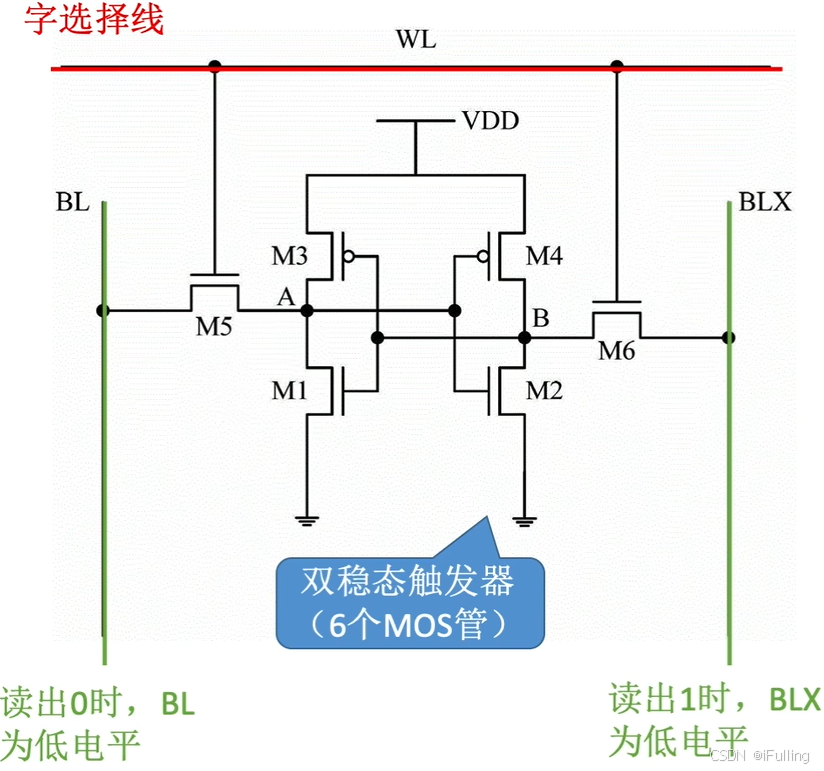

- SRAM 和 DRAM 都现在都过时了，现在的主存通常采用 SDRAM（同步动态随机存取内存） 芯片

  - DDR SDRAM：双倍速率同步动态随机存储器，Double Data Rate Synchronous Dynamic Random Access Memory

##### Ⅱ. SRAM 和 DRAM 区别

- 破坏性读出：

  - DRAM 的电容放电信息被破坏，是破坏性读出。读出后应有重写操作，也称 “再生”，因此读写速度更慢

  - SRAM 读出数据，触发器状态保持稳定，是非破坏性读出，无需重写。因此重写速度更快

- 刷新：

  - DRAM 的电容内电荷只能维持 2 ms。即便不断电，2 ms 后信息也会消失。因此 2 ms 内必须 “刷新” 一次（给电容充电）

  - SRAM 只要不断电，触发器的状态就不会改变

| 类型特点 | SRAM | DRAM |
|:---:|:---:|:---:|
| 存储信息 | 触发器 | 电容 |
| 破坏性读出 | 否 | 是 |
| 读出后需要重写？（再生） | 否 | 需要 |
| 运行速度 | 快 | 慢 |
| 集成度 | 低 | 高 |
| 发热量 | 大 | 小 |
| 存储成本 | 高 | 低 |
| 是否易失 | 易失 | 易失 |
| 需要 “刷新” | 否 | 需要（分散、集中、异步} |
| 送行列地址 | 同时送 | 分两次送（地址复用技术） |
| 常用作 | Cache | 主存 |


##### Ⅲ. DRAM 的刷新

- 刷新周期：一般为 2 ms

- 刷新方式：

  1. 分散刷新：每次读写完都刷新一行，则系统的存取周期会增加一倍

  2. 集中刷新：2 ms 内集中安排时间全部刷新，在这段时间内无法访问存储器，称为访存 ”死区“

  3. 异步刷新：2 ms 内每行刷新一次即可，可在译码阶段刷新

  > 设 DRAM 内部结构排列成 $128 \times 128$ 的形式，存取周期 $0.5μs$ ，2 ms 内共 $2ms÷0.5μs=4000$ 个周期
  > 
  > 1. 分散刷新：会让系统的存取周期变为 $1μs$ ，前 $0.5μs$ 用于正常读写，后 $0.5μs$ 用于刷新某行
  > 
  > 2. 集中刷新：128 个周期总共耗时 $64μs$ ，因此这 $64μs$ 无法访问存储器
  > 
  > 3. 异步刷新：2 ms 内需要产生 128 次刷新请求，因此每隔 $2ms÷128=15.6μs$ 刷新一次，每 $15.6μs$ 内有 $0.5μs$ 的 ”死时间“
  > 
  >

- 每次刷新一行存储单元，即以行为单位

  - 一个存储单元由多个存储元构成

  - 为了减少选通线的数量，因此使用行列地址

- 刷新方式：有硬件支持，读出一行的信息后重新写入，占用 1 个存取周期

> 存储器的简单模型，若地址位数有 $n$ 位，则会有 $2^n$ 根选通线
> 
> - {style="max-width:400px; box-sizing:content-box;"}
> 
> 存储单元矩阵，将地址拆分为 $\frac{n}{2}
> $ 位行地址和 $\frac{n}{2}
> $ 位列地址（行、列地址等长）
> 
> - {style="max-width:600px; box-sizing:content-box;"}
> 
> 

##### Ⅳ. DRAM 的地址线复用技术

- 若地址位数较长，则引脚和线路会增加，为了简化电路，通常采用地址线复用技术

- 把行地址、列地址分前后两次传输，就会使地址线减半，因此地址线更少、芯片引脚更少

#### 3. ROM 芯片

##### Ⅰ. 概述

- ROM 芯片：非易失性，断电后数据不会丢失

- 虽然名字是 Read-Only，但很多 ROM 也可以 “写”，也有很多 ROM 具有 ”随机存取“ 的特性

- 主板上的 ROM 芯片也是 “主存” 的一部分（比如 BIOS 芯片）

##### Ⅱ. 常见 ROM 芯片

1. BIOS 芯片（Basic Input Output System）

   - 存储了 “自举装入程序”，负责引导装入操作系统（开机）

   - CPU 根据自举装入程序的指引，指挥 IO 系统将辅存中存储的操作系统相关数据放到主存

2. MROM（Mask Read-Only Memory）：掩模式只读存储器

   - 厂家按照客户需求，在芯片生产过程中直接写入信息，之后任何人不可重写（只能读出）

   - 特点：可靠性高、灵活性高、生产周期长、只适合批量定制

3. PROM（Programmable Read-Only Memory）：可编程只读存储器

   - 用户可用专门的 PROM 写入器写入信息，写一次之后就不可更改

4. EPROM（Erasable Programmable Read-Only Memory）：可擦除可编程只读存储器

   - 允许用户写入信息，之后用某种方法擦除数据，可进行多次重写

5. UVEPROM（ultraviolet rays）：紫外线可擦除可编程只读存储器

   - 用紫外线照射 8 ~ 20 分钟，擦除所有信息

6. EEPROM（Electrically）：带电可擦除可编程只读存储器

   - 可用 ”电擦除“ 的方式，擦除特定的字

7. Flash Memory：闪速存储器

   - 如 U 盘、SD 卡

   - 在 EEPROM 基础上发展而来，断电后也能保存信息，且可进行多次快速擦除重写

   - 由于闪存需要先擦除再写入，因此闪存的 ”写“ 速度要比 “读” 速度更慢

   - 闪存每个存储元只需单个 MOS 管，位密度比 RAM 高，即相同的体积可以保存比 RAM 更多的位

8. SSD（Solid State Drives）：固态硬盘

   - 由控制单元 + 存储单元（Flash 芯片）构成

   - 与闪存的核心区别在于控制单元不一样，但存储介质都类似，可进行多次快速擦除重写。

   - 特点：速度快、功耗低、价格高

#### 4. 多模块存储器

> **前情提要** 
> 
> - 存取周期：可以连续读 / 写的最短时间间隔
> 
> - DRAM 芯片的恢复时间比较长（因为要刷新），有可能是存取时间的几倍
>    {style="max-width:400px; box-sizing:content-box;"}
> 
> 

##### Ⅰ. 单体多字存储器

- 单体多字存储器只有一套读写电路、MAR、MDR。

- 每个存储单元存储 $m$ 个字，总线带宽也要扩展为 $m$ 个字，每次并行读出 $m$ 个连续的字

- 指令和数据在主存内必须是连续粗放的，因此灵活性较差

##### Ⅱ. 多体并行存储器

- 多提并行存储器：

  - 每个模块都有相同的容量和存取速度

  - 各模块都有独立的读写控制电路、地址寄存器和数据寄存器。它们既能并行工作，又能交叉工作。

> 假设有四根内存条，每根内存条容量一致。
> 记每个存储体存取周期为 $T$ ，存取时间为 $r$ ，假设 $T=4r$ 。

- 高位交叉编址

  - 用地址的高比特位区分存储体

  - 编址是同一内存条连续编址

  - 连续取 $n$ 个存储字，耗时 $n×T$

  - 理论上多个存储体可以被并行访问，但是由于通常会连续访问，因此实际效果相当于单纯的扩容
     {style="max-width:500px; box-sizing:content-box;"}

- <mark>低位交叉编址</mark> 👍‼️

  - 用地址的低比特位区分存储体

  - 编址是不同内存条横向编址（看图中的地址）

  - 连续取 $n$ 个存储字，在流水线完美衔接的情况下，耗时 $T+(n-1) \times r$ —— 由此可见低位交叉编址比高位交叉编址存取速度更快
     {style="max-width:500px; box-sizing:content-box;"}

- <mark>流水线</mark> 并行存取

  - 宏观上并行，微观上串行：宏观上每个存取周期内所有模块被并行访问，微观上 $m$ 个模块被串行访问

  - 宏观上，一个存取周期内， $m$ 体交叉存储器可以提供的数据量为单个模块的 $m$ 倍。

    - 说人话：如果有 4 个存储体交叉存储，工作效率是一个存储体的 4 倍

  - 记存取周期为 $T$ ，存取时间为 $r$ ，为了使流水线不间断，应保证模块数 $m≥T/r$ ，每个存取周期内可读写地址连续的 $m$ 个字

    - 若 $m<T/r$ ，不能完全发挥流水线的作用，在存取周期未结束前 CPU 需等待一段时间

    - 若 $m>T/r$ ，性能会过剩，导致存储器不能发挥到各自的极限

    - 若 $m=T/r$ ，存储体与存取周期完美衔接，能够使流水线效率达到顶峰，成本最低，

  - 记存取周期为 $T$ ，总线传输周期为 $r$ ，为了使流水线不间断，应保证模块数 $m≥T/r$ 

    - 虽然和上面一样的描述，但是总线传输周期与存取时间不一样

    - 总线传输周期：通过数据总线把数据传给 CPU 至少需要 $r$ 时间

### 三、主存储器与 CPU 的连接

#### 1. 前情提要

- 现在的计算机 MAR、MDR 通常集成在 CPU 内部。主存中包含多块存储芯片，存储芯片内只需一个普通的寄存器（暂存输入、输出数据）
   {style="max-width:400px; box-sizing:content-box;"}

- 存储器芯片的输入输出信号

  - 地址线： $A_7 ... \,A_0$

  - 数据线： $D_7 ... \,D_0$

  - 片选线：

    - 低电平有效： $‾\overline{\text{CS}}$ 或 $‾\overline{\text{CE}}$

    - 高电平有效： ${\text{CS}}$ 或 ${\text{CE}}$

  - 读写控制线：

    - 一根线：低电平写，高电平读 $‾\overline{\text{WE}}$ 或 $‾\overline{\text{WR}}$ ；高电平写，低电平读 ${\text{WE}}$ 或 ${\text{WR}}$

    - 两根线：低电平有效 $‾\overline{\text{WE}}$ 和 $‾\overline{\text{OE}}$

#### 2. 位扩展

- 位扩展可以使存储器的字长变得更长，从而更好地发挥数据总线的数据传输能力

- 假设有一个 $8K \times 1$ 位的存储芯片，连接到 CPU。每次只能读或写一位数据，此时存储芯片的存储字长为 1 bit，数据总线没有被充分利用。
   {style="max-width:400px; box-sizing:content-box;"}

- 将 2 片 $8K \times 1$ 位的存储芯片（上面提到的存储芯片）连接至 CPU
   {style="max-width:500px; box-sizing:content-box;"}

- 将 8 片存储芯片连接组合成 1 个 $8K \times 8$ 位的存储器，总容量为 8 KB
   {style="max-width:600px; box-sizing:content-box;"}

#### 3. 字扩展

- 字扩展可以增加存储器的存储容量，可以更好地利用 CPU 和地址总线的寻址能力

- 如果存储芯片的位数和 CPU 的位数一样（假设都是 8 位），数据总线的传输能力就能完全发挥，不需要位扩展。但是地址总线仍未充分利用，如下图
   {style="max-width:400px; box-sizing:content-box;"}

  - 线选法：

    - 用一个专门的地址线作为片选信号，来选中其他的某一块芯片。

    - 如果 CPU 有 $n$ 条多余的地址线就能有 $n$ 个片选信号

    - 特点：电路简单，但地址空间不连续（比如不能是 00、11）
       {style="max-width:600px; box-sizing:content-box;"}

  - 片选法：

    - 如果 CPU 有 $n$ 条多余的地址线就能有 $2^n$ 个片选信号

    - 特点：电路复杂，但地址空间连续

    - 1 - 2 译码器：使用非门就能实现 1 - 2 译码器，输入 1 位地址信息，这一位地址信息有可能呈现出两种不同的状态，这两种不同的状态会被译码器翻译为要么是上面高电平，要么是下面高电平。下图是 1 - 2 译码器
       {style="max-width:400px; box-sizing:content-box;"}

    - 2 - 4 译码器：输入 2 位地址信息，对应为 $2^2=4$ 种不同的状态。注意这里的存储芯片上有一个 〇 表示低电平有效（与非门区分开）；译码器右边的 〇 表示非门
       {style="max-width:500px; box-sizing:content-box;"}

    - 同理，也有 3 - 8 译码器，输入 3 位地址信息，对应为 $2^3=8$ 种不同的状态
       {style="max-width:200px; box-sizing:content-box;"}

#### 4. 字位同时扩展

- 假设有 8 个 $16K \times 4$ 位的存储芯片，两两一组位扩展，一共四组，用 2 - 4 译码器进行字扩展

  - 每一组总共有 16 K 个存储单元，每个单元可以存 8 位数据

  - 总共 4 组，组合在一起可以得到 $64K \times 8$ 位的存储器
     

#### 5. 译码器补充

- 高电平有效
   {style="max-height:250px; box-sizing:content-box;"}

   {style="max-height:250px; box-sizing:content-box;"}

- 低电平有效，有 〇，适合与低电平有效芯片配合使用
   {style="max-height:250px; box-sizing:content-box;"}

   {style="max-height:250px; box-sizing:content-box;"}

- 使能信号：CPU 可以使用译码器的使能端 控制 片选信号的生效时间。这里参照 74LS138 译码器

  - 74LS138 译码器具有多个使能端，更多地了解该译码器去看《数字电路》

  - 只有当 $\text{G}_1$ 为高电平，同时 $\text{G}_{2A}、\text{G}_{2B}$ 为低电平，译码器才开始工作（Gate，门控）

  - $‾\overline{\text{MREQ}}$ ：存储器请求信号（Memory Request），当 CPU 正式访问主存时，就将该信号置为有效，这里上面有一横线所以是低电平有效。

  - CPU 通过地址总线送出地址信号，刚开始送出时电信号可能不稳定，因此送出信息后等待电流稳定后再发出 $‾\overline{\text{MREQ}}$ ，让译码器的某个选通线有效，这样就能保证当一块存储芯片被选通时，这块存储芯片所接收到的地址电信号一定是稳定的
     {style="max-width:600px; box-sizing:content-box;"}

  - 配合 RAM 的读周期时序图（这个图不重要，看看就行）
     {style="max-width:600px; box-sizing:content-box;"}

### 四、外部存储器

- 计算机的外存储器又称为辅助存储器，外存储器既可以作为输入设备，也可以作为输出设备

#### 1. 磁表面存储器

- 磁表面存储器：是指把某些磁性材料薄薄地涂在金属铝或塑料表面上作为载磁体来存储信息。磁盘存储器、磁带存储器、磁鼓存储器均属于磁表面存储器。

- 优点：

  1. 存储容量大，位价格低

  2. 记录介质可以重复使用

  3. 记录信息可以长期保存而不丢失，甚至可以脱机存档

  4. 非破坏性读出，读出时不需要再生

- 缺点：

  - 存取速度慢：磁表面存储器每次只能读写 1 bit，且读写不可同时进行

  - 机械结构复杂

  - 对工作环境要求较高

#### 2. 磁盘存储器

##### Ⅰ. 构成

- 磁盘存储器由磁盘驱动器、磁盘控制器和盘片组成。

- 磁盘驱动器：即机械部分，核心部件是磁头组件和盘片组件，温彻斯特盘是一种可移动头固定盘片的硬盘存储器
    

- 磁盘控制器：即电子部分，是磁盘存储器和主机的接口，主流的标准有 IDE、SCSI、SATA 等
   {style="max-width:600px; box-sizing:content-box;"}

- 盘片：一块磁盘存储器含有若干个记录面，每个记录面划分为若干条磁道，每条磁道由划分为若干个扇区。

  - 磁头数（Heads）：即记录面数，表示硬盘总共有多少个磁头，磁头用于读取 / 写入盘片上记录面的信息，一个记录面对应一个磁头。

  - 柱面数（Cylinders）：表示硬盘每一面盘片上有多少条磁道。在一个盘组中，不同记录面的相同编号（位置）的诸磁道构成一个圆柱面。

  - 扇区数（Sectors）：表示每一条磁道上有多少个扇区。
     {style="max-width:400px; box-sizing:content-box;"}

##### Ⅱ. 性能指标

- 磁盘的容量：一个磁盘所能存储的字节总数称为磁盘容量。

  - 磁盘容量有非格式化容量和格式化容量之分，非格式化容量 > 格式化容量 。

  - 非格式化容量：磁记录表面可以利用的磁化单元总数。

  - 格式化容量：按照某种特定的记录格式所能存储信息的总量。

- 记录密度：盘片单位面积上记录的二进制的信息量。

  - 道密度：沿磁道半径方向单位长度上的磁道数。如：60 道 / cm

  - 位密度：磁道单位长度上能记录的二进制代码位数。如：600 bit / cm

    - 磁盘所有磁道记录的信息量一定是相等的，并不是圆越大信息越多，所以每个磁道的位密度都不同。

    - 越内侧的磁道位密度越大

  - 面密度：是位密度和道密度的乘积。
     {style="max-width:500px; box-sizing:content-box;"}

- 平均存取时间 = 寻道时间 + 旋转延迟时间 + 传输时间

  - 寻道时间：磁头移动到目的磁道

  - 旋转延迟时间：磁头定位到所在扇区，平均为转半圈所需时间

  - 传输时间：传输数据所花费的时间

- 数据传输率：磁盘存储器在单位时间内向主机传送数据的字节数。

  - 假设磁盘转数为 $r$ 转 / 秒，每条磁道容量为 $N$ 个字节，则数据传输率为 $D_r=rN$

##### Ⅲ. 磁盘地址

- 计算机内部可以连接多个磁盘，主机向磁盘控制器发送寻址信息，磁盘地址包括： <mark>驱动器号、柱面（磁道）号、盘面号、扇区号</mark>

- 驱动器号：一台电脑可能有多个磁盘，驱动器号用于选中一个硬盘驱动器

- 柱面（磁道）号：指明移动磁头臂到什么位置（寻道）

- 盘面号：选择激活哪个磁头

- 扇区号：通过旋转将特定扇区划过磁头下方

> 若系统中有 4 个驱动器，每个驱动器带一个磁盘，每个磁盘 256 个磁道、16 个盘面，每个盘面划分为 16 个扇区，则每个扇区地址要 18 位二进制代码。
> 
> - 驱动器号 2 bit
> 
> - 柱面（磁道）号 8 bit
> 
> - 盘面号 4 bit
> 
> - 扇区号 4 bit
> 
> 

##### Ⅳ. 工作过程

- 磁盘的主要操作是寻址、读盘、写盘。

- 每个操作都对应一个控制字，磁盘工作时，第一步是取控制字，第二步是执行控制字

- 磁盘属于机械式部件，其读写操作是串行的，不可能在同一时刻既读又写，也不可能在同一时刻读两组数据或写两组数据。

##### Ⅴ. 磁盘阵列 RAID

- RAID（Redundant Array of Inexpensive Disks，廉价冗余磁盘阵列）：是将多个独立的物理磁盘组成一个独立的逻辑盘，数据在多个物理盘上分割交叉存储、并行访问，具有更好的存储性能、可靠性和安全性。

  - 通过同时使用多个磁盘，提高了传输率

  - 通过在多个磁盘上并行存取来大幅提高存储系统的数据吞吐量

  - 通过镜像功能，可以提高安全可靠性

  - 通过数据检验，可以提高容错能力

- 在 RAID 1 ~ RAID 5 的几种方案中，无论何时有磁盘损坏，都可以随时拔出受损的磁盘再插入好的磁盘，而数据不会损坏。

  1. RAID 0：无冗余和无校验的磁盘阵列。

     - 逻辑上相邻的两个扇区在物理上存到两个磁盘，类似 “低位交叉编址的多体存储器”

     - RAID 0 没有容错能力
        {style="max-width:150px; box-sizing:content-box;"}

  2. RAID 1：镜像磁盘阵列

     - 很粗暴，存两份数据

     - RAID 1 容量减少一半，存储利用率低
        {style="max-width:150px; box-sizing:content-box;"}

  3. RAID 2：采用纠错的海明码的磁盘阵列

     - 逻辑上连续的几个 bit 物理上分散存储在各个盘中，再增加若干磁盘保存海明校验码

     - 4 bit 信息位 + 3 bit 海明校验位可纠错一位，检错两位
        {style="max-width:500px; box-sizing:content-box;"}

  4. RAID 3：位交叉奇偶校验的磁盘阵列

  5. RAID 4：块交叉奇偶校验的磁盘阵列

  6. RAID 5：无独立校验的奇偶校验磁盘阵列

#### 3. 固态硬盘

- 原理：基于闪存技术 Flash Memory，属于电可擦除 ROM，即 EEPROM

- 组成：

  1. 闪存翻译层：负责翻译逻辑块号，找到对应页（Page），即地址变换

  2. 存储介质：多个闪存芯片（Flash Chip），每个芯片包含多个块（Block），每个块包含多个页（Page）
      

- 读写性能特性：

  - 以页（Page）为单位读写，相当于磁盘的 “扇区”

  - 以块（Block）为单位 “擦除”，擦干净的块，其中的每页都可以写一次，读无限次

  - 读快，写慢。要写的页如果有数据，则不能写入，需要将块内其它页全部复制到一个新的（擦出过的）块中，再写入新的页

  - 支持随机访问，系统给定一个逻辑地址，闪存翻译层可通过电路迅速定位到对应的物理地址

- 与机械硬盘对比：

  - SSD 读写速度快，随机访问性能高，用电路控制访问位置；机械硬盘通过移动磁臂旋转磁盘控制访问位置，有寻道时间和旋转延迟

  - SSD 安静无噪音、耐摔抗震、能耗低、造价更贵

  - SSD 的一个 “块” 被擦除次数过多（重复写同一个块）可能会坏掉，而机械硬盘的扇区不会因为写的次数太多而坏掉

- SSD磨损均衡技术：

  - 思想：将 “擦除” 平均分布在各个块上，以提升使用寿命

  - 动态磨损均衡：写入数据时，优先选择累计擦除次数少的新闪存块

  - 静态磨损均衡：SSD 监测并自动进行数据分配、迁移，让老旧的闪存块承担以读为主的储存任务，让较新的闪存块承担更多的写任务

### 五、高速缓冲存储器 Cache

#### 1. 基本概念

- 局部性原理：

  - 空间局部性：在最近的未来要用到的信息（指令和数据），很可能与现在正在使用的信息在存储空间上是临近的。如：数组元素、顺序执行的指令代码

  - 时间局部性：在最近的未来要用到的信息，很可能是现在正在使用的信息。如：循环结构的指令代码

- 基于程序访问的局部性原理

  - 增加 ”Cache - 主存“ 层，可以把 CPU 目前访问的地址 “周围” 的部分数据放到 Cache 中，用于缓和 CPU 与主存之间的速度矛盾

  - 将主存的 <mark>存储空间分块</mark> （如：每 1 KB 为一块）， <mark>主存与 Cache 之间以 “块” 为单位进行数据交换</mark> 

    - 操作系统中，通常将主存中的 “一个块” 称为 “一个页 / 页面 / 页框”

    - Cache 中的 “块” 也称为 “行”

    > 假设主存容量 4 MB，每 1 KB 为一块，则
    > 
    > - 主存地址有 22 位： $4\text{ MB}=2^{22}\text{ B}
    >   $
    > 
    > - 主存被分为 4096 块： $1\text{ KB}=2^{10}\text{ B}，4\text{ MB}÷1\text{ KB}=2^{12} 块
    >   $
    > 
    > - 综上，主存地址可分为：12 位块号 + 10 位块内地址
    > 
    >

  - <mark>每次被访问的主存块，一定会被立即调入 Cache</mark>

- Cache 被集成在 CPU 内部，用 SRAM 实现，速度快，成本高，集成度低

- 设访问一次 Cache 所需时间 $t_c$ ，访问一次主存所需时间 $t_m$ ，“Cache - 主存” 系统的平均访问时间 $t$ 

  - 命中率 $H$ ：CPU 欲访问的信息已在 Cache 中的比率

  - 缺失（未命中）率 $M=1-H$

  1. 访问方式一：CPU 先访问 Cache，若 Cache 未命中再访问主存，平均访问时间

     $$
     t=Ht_c+(1-H)(t_c+t_m)
     $$

  2. 访问方式而二：同时访问 Cache 和主存，若 Cache 命中则立即停止访问主存，平均访问时间

     $$
     t=Ht_c+(1-H)t_m
     $$

#### 2. Cache 和主存的映射方式

- 用于区分 Cache 与主存的数据块对应关系

  - 三种映射方式：全相联映射、直接映射、组相联映射

  - Cache 中存储：有效位（0/1）+ 标记 + 整块数据。初始值为 0

  - “标记” 用于指明对应的内存块，不同映射方式，“标记” 的位数不同

1. <mark>全相联映射</mark> ：主存块可以放在 Cache 的任意位置
    {style="max-width:200px; box-sizing:content-box;"}

   - 主存地址结构：标记（整个主存块号）+ 块内地址

   - 优点：Cache 存储空间利用充分，命中率高

   - 缺点：查找 “标记” 最慢，有可能需要对比所有行的标记

2. <mark>直接映射</mark> ：每个主存块只能放到特定的某个 Cache 行

   $$
   \text{Cache 行号 = 主存块号 \% Cache 总行数}
   $$

    {style="max-width:200px; box-sizing:content-box;"}

   - 主存地址结构：标记（主存块号前几位）+ 行号（主存块号末 $n$ 位）+ 块内地址

   - 若 Cache 总行数为 $2^n$ ，则主存块号末尾 $n$ 位直接反映它在 Cache 中的位置

   - 优点：对于任意一个地址，只需对比一次 “标记”，速度最快

   - 缺点：Cache 存储空间利用不充分，命中率低

3. <mark>组相联映射</mark> ：Cache 块分为若干组，每个主存块可放到特定分组中的任意位置

   $$
   \text{组号 = 主存块号 \% 分组数}
   $$

    {style="max-width:250px; box-sizing:content-box;"}

   - 主存地址结构：标记（主存块号前几位）+ 组号（主存块号末 $n$ 位）+ 块内地址

   - $n$ 路组相联映射：每 $n$ 个Cache 行为一组

   - 若 Cache 分为 $n$ 组，则主存块号末尾 $n$ 位反映它在 Cache 中的所属分组，然后再依次对比分组中的标记

   - 优点：另外两种方式的这种，综合效果较好

- CPU 访问主存地址步骤：

  1. 确定所处位置

     - 全相联映射：主存块号对比 Cache 中所有块的标记

     - 直接映射：根据主存块号的后 $n$ 位确定 Cache 行

     - 组相联映射：根据主存块号的后 $n$ 位确定所属分组号

  2. 命中规则：

     - 全相联映射：若标记完全匹配，且有效位为 1，则 Cache 命中，访问块内地址单元

     - 直接映射：若主存块号排除末尾 $n$ 位后（ $n$ 为 Cache 中块数）与 Cache 标记匹配，且有效位为 1，则 Cache 命中，访问块内地址单元

     - 组相联映射：若主存块号排除末尾 $n$ 位后（ $n$ 为 Cache 分组数）与分组内的某个标记匹配，且有效位为 1，则 Cache 名字，访问块内地址单元

  3. 若未命中，则正常访问主存

#### 3. Cache 替换算法

- Cache 很小，主存很大，因此 Cache 很容易装满。只有全相联映射和组相联映射需要替换算法，直接映射不需要：

  - 全相联映射：Cache 完全满了才需要替换，需要在全局选择替换哪一块

  - 直接映射：如果对应位置非空，则毫无选择地直接替换

  - 组相联映射：分组内满了才需要替换，需要在分组内选择替换哪一块

> 抖动现象：频繁的换入换出现象，刚被替换的块很快又被调入。

- 随机算法（RAND，Random）：

  - 若 Cache 已满，则随机选择一块替换

  - 实现简单，但完全没有考虑局部性原理，命中率低，实际效果很不稳定

- 先进先出算法（FIFO，First In First Out）：

  - 若 Cache 已满，则替换最先被调入 Cache 的块

  - 实现简单，最开始按行号递增的次序依次放入初始的内存块，之后按先后顺序轮流替换

  - 没有考虑局部性原理，最先被调入 Cache 的块也有可能是被频繁访问的

- 近期最少使用算法（LRU，Least Recently Used）

  - 为每个 Cache 块设置一个 “计数器”，用于记录每个 Cache 块已经有多久没被访问了。当 Cache 满后替换 “计数器” 最大的

    - Cache 块的总数为 $2^n$ ，则计数器只需 $n$ 位。且 Cache 装满后所有计数器的值一定不重复。

  - 实现过程：

    1. 命中时，所命中的行的计数器清零，比其低的计数器 +1，比其高的计数器不变

    2. 未命中且还有空闲行时，新装入的行的计数器置为 0，其余非空闲行全 +1

    3. 未命中且无空闲行时，计数值最大的行的信息块被淘汰，新装行的块的计数器置为 0，其余全 +1

  - 基于局部性原理，因此实际运行效果优秀，Cache 命中率高

  - 若被频繁访问的主存块数量 > Cache 行的数量，则有可能发生 ”抖动“

- 最不经常使用算法（LFU，Least Frequently Used）

  - 为每个 Cache 块设置一个 ”计数器“，用于记录每个 Cache 块被访问过几次。当 Cache 满后替换 ”计数器“ 最小的

    - 若有多个计数器最小的行，可按照行号递增、FIFO 策略进行选择

  - 曾经被经常访问的主存块在未来不一定会用到，并没有很好地遵循局部性原理，因此实际运行效果不如 LRU

#### 4. Cache 写策略

- CPU 修改了 Cache 中的数据副本，如何确保主存中数据母本的一致性

- 写命中：

  - 写回法（write-back）：当 CPU 对 Cache 写命中时，只修改 Cache 的内容，而不立即写入主存，只有当此块被换出时才写回主存，未被修改的块不必写回

    - 脏位：新增脏位信息，表示是否被修改过

    - 减少了访存次数，但存在数据不一致的隐患

  - 全写法（写直通法，write-through）：当 CPU 对 Cache 写命中时，必须把数据同时写入 Cache 和主存，一般使用写缓冲（write buffer）

    - 写缓冲：是一个 SRAM 实现的 FIFO 队列，CPU 写完后，在专门的控制电路控制下逐一写回主存

    - 使用写缓冲，CPU 写的速度很快，若写操作不频繁，则效果很好。若写操作很频繁，可能会因为写缓冲饱和而发生阻塞

    - 访存次数增加，速度变慢，但更能保证数据一致性

- 写不命中：

  - 写分配法（write-allocate）：当 CPU 对 Cache 写不命中时，把主存中的块调入 Cache，在 Cache 中修改，通常搭配写回法使用

  - 非写分配法（not-write-allocate）：当 CPU 对 Cache 写不命中时，只写入主存，不调入 Cache。搭配全写法使用，只有 “读” 未命中时才调入 Cache

- 多级 Cache：

  - 现在计算机通常采用多级 Cache 结构

  - 离 CPU 越近速度越快容量越小，离 CPU 越远速度越慢容量越大

  - 各级 Cache 间常采用 “全写法 + 非写分配法”；Cache 和主存间常采用 “写回法 + 写分配法”

## 第四章：指令系统

### 一、指令系统基础

#### 1. 指令格式

- 指令：又称机器指令。是指示计算机执行某种操作的命令，是计算机运行的最小功能单位。

  - 一台计算机的所有指令的集合构成该机的指令系统，也称为指令集。

  - 一台计算机只能执行自己指令系统中的指令，不能执行其他系统的指令。如：x86 架构、ARM 架构

- 一条指令就是机器语言的一个语句，它是一组有意义的二进制代码。通常要包括操作码字段和地址码字段两部分：

  - 操作码（OP）

    - 指明指令应该执行什么性质的操作和具有何种功能

    - 操作码是识别指令、了解指令功能和区分操作数地址内容的组成和使用方法等的关键信息。如：停机中断、算术逻辑运算、程序转移等

  - 地址码（A）

    - 指明对谁进行操作，地址码可能有 0 ~ 4 个

    - $n$ 位地址码的直接寻址范围是 $2^n$ ，即如果指令总长度不变，则地址码数量越多，寻址能力越差

---

- **按地址码数目分类** ：根据地址码数目不同，可以将指令分为

  1. 零地址指令：

     - 不需要操作数，如空操作、停机、关中断等指令

     - 堆栈计算机，两个操作数隐含存放在栈顶或次栈顶，计算结果压回栈顶，如后缀表达式

  2. 一地址指令：

     - 只需要单操作数，如 +1、-1、取反、求补等。

       - 指令含义： `OP(A₁)→A₁`

       - 完成一条指令需要 3 次访存：取指 → 读 A<sub>1</sub>→ 写 A<sub>1</sub>

     - 需要两个操作数，但其中一个操作数隐含在某个寄存器（如隐含在 ACC）

       - 指令含义： `(ACC)OP(A₁)→ACC`

       - 完成一条指令需要 2 次访存：取指 → 读 A<sub>1</sub>

     > A<sub>1</sub>指某个主存地址，（A<sub>1</sub>）表示 A<sub>1</sub>所指向的地址中的内容

  3. 二地址指令：OP | A<sub>1</sub>（目标操作数） | A<sub>2</sub>（源操作数）

     - 常用于需要两个操作数的算术运算、逻辑运算相关指令

     - 指令含义： `(A₁)OP(A₂)→A₁`

     - 完成一条指令需要 4 次访存：取指 → 读 A<sub>1</sub>→ 读 A<sub>2</sub>→ 写 A<sub>1</sub>

  4. 三地址指令：OP | A<sub>1</sub>| A<sub>2</sub>| A<sub>3</sub>（结果）

     - 常用于需要两个操作数的算术运算、逻辑运算相关指令，并将结果写回 A<sub>3</sub>

     - 指令含义： `(A₁)OP(A₂)→A₃`

     - 完成一条指令需要 4 次访存：取指 → 读 A<sub>1</sub>→ 读 A<sub>2</sub>→ 写 A<sub>3</sub>

  5. 四地址指令：OP | A<sub>1</sub>| A<sub>2</sub>| A<sub>3</sub>（结果）| A<sub>4</sub>（下一条要执行指令的地址）

     - 指令含义同三地址指令

     - 访存次数和顺序同三地址指令

     - 执行指令后，将 PC 的值修改为 A<sub>4</sub>所指的地址

---

- 指令字长：

  - 表示一条指令的总长度（可能会变）

  - 机器字长：CPU 进行依次整数运算所能处理的二进制数据的位数（通常和 ALU 直接相关）

  - 存储字长：一个存储单元中的二进制代码位数（通常和 MDR 位数相同）

- 半字长指令、单字长指令、双字长指令，是说指令字长是机器字长的多少倍

  - 指令字长会影响取指令所需时间。如：机器字长 = 存储字长 = 16 bit，则取一条双字长指令需要 2 次访存

- **按指令长度分类** ：

  1. 定长指令字结构：指令系统中所有指令的长度都相等

  2. 变长指令字结构：指令系统中各种指令的长度不等

---

- 操作码位数反映系统中最多可以支持多少种指令

  - 对于 $n$ 位操作码可支持 $2^n$ 种指令

- **按操作码长度分类** ：

  1. 定长操作码：指令系统中所有指令的操作码长度都相同

     - $n$ 位操作码字段的指令系统最大能够表示 $2^n$ 条指令

     - 优点：简化计算机硬件设计，提高指令译码和识别速度

     - 缺点：指令数量增加时会占用更多固定位，留给表示操作数地址的位数受限，灵活度较低

  2. 可变长操作码：全部指令的操作码字段位数不固定，且分散地放在指令字的不同位置上

     - 最常见的可变长操作码方法是扩展操作码，使操作码的长度随地址码的减少而增加，不同地址数的指令可以具有不同长度的操作码，从而在满足需要的前提下，有效地缩短指令长度

     - 优点：在指令长度有限的前提下仍保持比较丰富的指令种类

     - 缺点：增加了指令译码和分析的难度，使控制器的设计复杂化

     - 扩展操作码指令格式：定长指令字结构 + 可变长操作码

---

- **按操作类型分类** ：

  1. 数据传送类：CPU 与主存之间的数据传送

     - LOAD：把存储器（源）中的数据放到寄存器（目的）中

     - STORE：把寄存器（源）中的数据放到存储器（目的）中

  2. 运算类：算术逻辑操作、移位操作

     - 算术操作：加减乘除、增 1、减 1、求补、浮点运算、十进制运算等

     - 逻辑操作：与或非、异或、位操作、位测试、位清除、位求反等

     - 移位操作：算术移位、逻辑移位、循环移位（带进位和不带进位）等

  3. 程序控制类：改变程序执行流

     - 转移操作：

       - 无条件转移：JMP

       - 条件转义：JZ 结果为 0、JO 结果溢出、JC 结果有进位

       - 调用 CALL、返回 RETURN

       - 陷入（TRAP）

  4. 输入输出类：进行 CPU 和 I/O 设备之间的数据传送

     - CPU 寄存器与 IO 端口（IO 接口中的寄存器）之间的数据传送

#### 2. 扩展操作码

- 扩展操作码指令格式：

  - 不同地址数指令使用不同长度的操作码

  - 定长指令字结构 + 可变长操作码

- 注意两点：

  1. <mark>不允许短码是长码的前缀</mark> ，即短操作码不能与长操作码的前面部分的代码相同

  2. 各指令的操作码一定不能重复

- 设地址长度为 $n$ ，上一层留出 $m$ 种状态，下一层可扩展出 $m \times 2^n$ 种状态。

  - 设指令字长固定为 16 位，地址长度为 4 位，设计一套指令系统满足：
     

- 通常情况下，对使用频率较高的指令，分配较短的操作码；对使用频率较低的指令，分配较长的操作码，从而尽可能减少指令译码和分析的时间。

### 二、寻址

#### 1. 指令寻址

- 每一条指令的执行都分为 “取指令”、“执行指令” 两个阶段

  - 指令寻址：确定下一条欲执行指令的存放地址

  - 不管如何寻址，每次取指令结束后，程序计数器PC 始终指向下一条指令的地址

  - 在 x86 处理器中，程序计数器 PC（Program Counter）通常被称为IP（指令指针，Instruction Pointer）

- 顺序寻址

  - `(PC) + n → PC` ： $n$ 表示指令字长，指令字长会因指令长度、编址方式而不同

    - 若系统采用定长指令字（设指令字长 = 存储字长 = 16 bit）结构，主存按字编址，则 PC 每次 `+1`

    - 指令系统同上，但主存按字节编址，则 PC 每次 `+2`

    - 若系统采用变长指令字结构，主存按字节编址，CPU 会先读入一个字，根据操作码判断这条指令的总字数 $n$ ，然后 PC `+n`

- 跳跃寻址

  - 由转移指令指出

  - 如无条件转移 JMP，将 PC 中的内容更变为指令所指向的地址

#### 2. 数据寻址

- 数据寻址：确定本条指令的地址码指明的真实地址

- 在每一条指令中通过寻址特征，表示用什么方式寻址。

  - 根据形式地址（A）求出操作数的真实地址，称为有效地址（EA，Effective Address）

  - 每一个形式地址都会配上寻址特征（一对一）

  - 有 10 种数据寻址方式，因此可用 4 bit 表示寻址特征：隐含寻址、立即寻址、直接寻址、间接寻址、寄存器寻址、寄存器间接寻址、偏移寻址（相对寻址、基址寻址、变址寻址）、堆栈寻址

- 小结：| 序号 | 寻址方式 | 有效地址 | 执行指令访存次数 | 优点 | 缺点 |
  |:---:|:---:|:---:|:---:|:---|:---|
  | 1 | 直接寻址 | EA = A | 1 | 简单，不需专门计算操作数的地址 | 操作数的地址不易修改，灵活性较差 |
  | 2 | 一次间接寻址 | EA = (A) | 2 | 可扩大寻址范围、便于编制程序 | 指令在执行阶段要多次访存 |
  | 3 | 寄存器寻址 | EA = R<sub>i</sub> | 0 | 指令执行阶段只访问寄存器；指令字短、执行速度快；支持向量 / 矩阵运算 | 寄存器价格昂贵，计算机中寄存器个数有限 |
  | 4 | 寄存器间接一次寻址 | EA = (R<sub>i</sub>) | 1 | 比一般间接寻址相比速度更快 | 与寄存器寻址相比指令的执行阶段需要访问主存 |
  | 5 | 隐含寻址 | 程序指定 | 0 | 有利于缩短指令字长 | 需增加存储操作数或隐含地址的硬件 |
  | 6 | 立即寻址 | A 即是操作数 | 0 | 指令执行阶段不访问主存，指令执行时间最短 | A 的位数限制了立即数的范围 |
  | 7 | 基址寻址 | EA = (BR) + A | 1 | 可扩大寻址范围，有利于多道程序设计，可用于编制浮动程序（内存里浮动） | \ |
  | 8 | 变址寻址 | EA = (IX) + A | 1 | 便于处理数组问题，适合编制循环程序 | \ |
  | 9 | 相对寻址 | EA = (PC) + A | 1 | 广泛用于转移指令，便于程序浮动（程序内部浮动） | \ |
  | 10 | 堆栈寻址 | 入栈 / 出栈时 EA 的确定方式不同 | 硬堆栈不访存，软堆栈访存 1 次 | 硬堆栈速度快，软堆栈成本低 | 软堆栈速度慢、硬堆栈成本高 |

---

> 前情提要：
> 
> - 假设指令字长 = 机器字长 = 存储字长
> 
> - 假设操作数为 3
> 
> - 以一地址指令为例
> 
> - A 表示地址（类似指针）、（A）表示数据（类似指针指向的值）
> 
> 

1. 直接寻址
    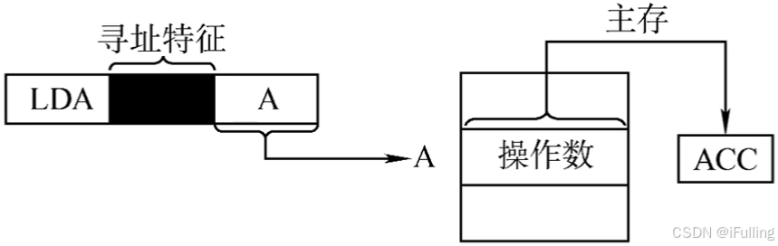{style="max-width:500px; box-sizing:content-box;"}

   - 指令字中的形式地址 A 就是操作数的真实地址 EA，即 EA = A

   - 访存次数：2 次 —— 取指令 1 次、执行指令 1 次

   - 优点：简单，指令执行阶段仅访问一次主存，不需专门计算操作数的地址

   - 缺点：A 的位数决定了该指令操作数的寻址范围，操作数的地址不易修改，灵活性较差

2. 间接寻址
    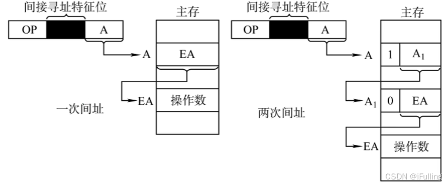{style="max-width:600px; box-sizing:content-box;"}

   - 指令的地址字段给出的形式地址不是操作数的真正地址，而是操作数有效地址所在的存储单元的地址，也就是操作数地址的地址。即 EA = (A)

   - 访存次数：至少 3 次 —— 取指令 1 次、执行指令至少 2 次

   - 优点：可扩大寻址范围（有效地址 EA 的位数大于形式地址 A 的位数）、便于编制程序（方便地完成子程序返回）

   - 缺点：指令在执行阶段要多次访存（一次间接寻址需两次访存，多次寻址需根据存储字的最高位确定几次访存）

3. 寄存器寻址
    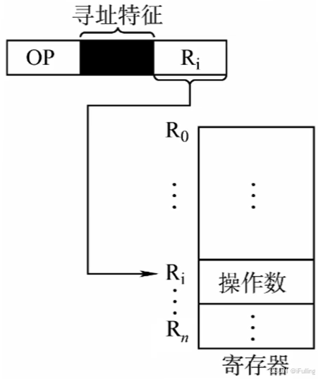 

   - CPU 内部有很多寄存器，每个寄存器有自己的编号，记为 $R_i$

   - 在指令字中直接给出操作数所在的寄存器编号，即 EA = R<sub>i</sub>，其操作数在 R<sub>i</sub>所指的寄存器内。

   - 访存次数：1 次 —— 取指令 1 次、执行指令 0 次

   - 优点：指令在执行阶段不访问主存，只访问寄存器；指令字短且执行速度快；支持向量 / 矩阵运算

   - 缺点：寄存器价格昂贵，计算机中寄存器个数有限

4. 寄存器间接寻址
    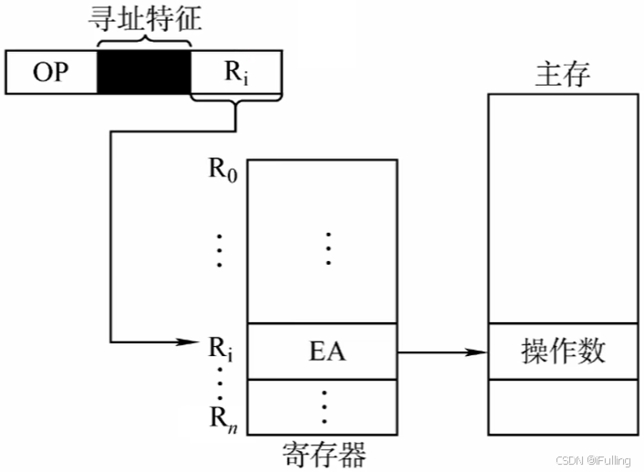{style="max-width:500px; box-sizing:content-box;"}

   - 寄存器 R<sub>i</sub>中给出的不是一个操作数，而是操作数所在主存单元的地址，即 EA = (R<sub>i</sub>)

   - 访存次数：2 次 —— 取指令 1 次、执行指令 1 次

   - 特点：比一般间接寻址相比速度更快，但指令的执行阶段需要访问主存（因为操作数在主存中）

5. 隐含寻址
    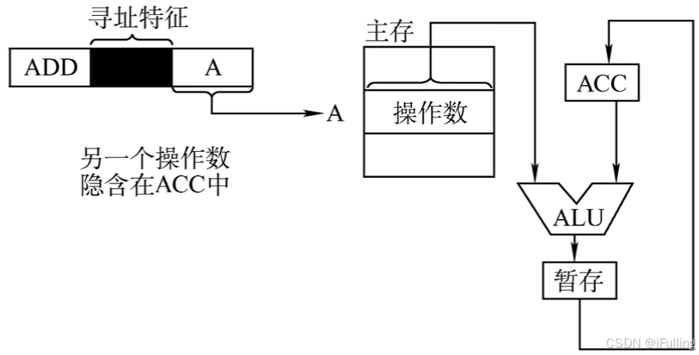{style="max-width:500px; box-sizing:content-box;"}

   - 不是明显地给出操作数的地址，而是在指令中隐含着操作数的地址

   - 优点：有利于缩短指令字长

   - 缺点：需增加存储操作数或隐含地址的硬件

6. 立即寻址

   - 形式地址 A 就是操作数本身，又称为立即数，一般采用补码形式。 `#` 表示立即寻址特征，如： `LOAD ## 666`

   - 访存次数：1 次 —— 取指令 1 次、执行指令 0 次

   - 优点：指令执行阶段不访问主存，指令执行时间最短

   - 缺点：A 的位数限制了立即数的范围。若 A 的位数为 $n$ ，则立即数采用补码时的表示范围是 $-2^{n-1}$ ~ $2^{n-1}-1$

---

> 以某个地址作为起点形式地址视为 “偏移量”，以下 3 种寻址方式都属于偏移寻址。

1. 基址寻址
    

   - 以程序的起始存放地址作为 “起点”

   - 将 CPU 中 <mark>基址寄存器（BR</mark> ，Base Address Register）的内容加上指令格式中的形式地址 A，而形成操作数的有效地址，即 <mark>EA = (BR) + A</mark> 

     - 程序运行前，CPU 将 BR 的值修改为该程序的起始地址（存在操作系统 PCB 中）

     - BR 是面向操作系统的，其内容由操作系统或管理程序确定。在程序运行过程中，BR 的内容不变（作为基地址），形式地址可变（作为偏移量）

   - 如果不采用专门的 BR，而是将通用寄存器作为基址寄存器使用，则根据通用寄存器总数判断地址所需位数。如：8 个寄存器用 3 bit 表示

     - 若采用通用寄存器作为基址寄存器，可由用户决定哪个寄存器作为基址寄存器，但其内容仍由操作系统确定。

   - 优点：可扩大寻址范围（寄存寄存器的位数大于形式地址 A 的位数）；用户不必考虑自己的程序存于主存的哪一空间区域，因此有利于多道程序设计，以及可用于编制浮动程序（整个程序在内存里的浮动）

2. 变址寻址
    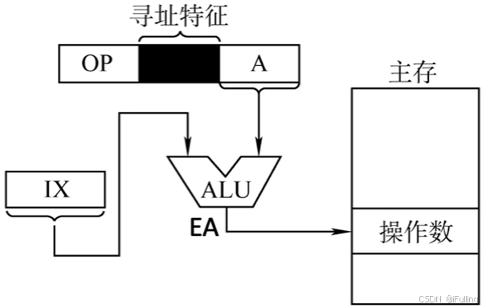{style="max-width:400px; box-sizing:content-box;"}

   - 程序员自己决定从哪里作为 “起点”

   - 有效地址 EA 等于指令字中的形式地址 A 与 <mark>变址寄存器（IX</mark> ，Index Register）的内容相加之和，即 <mark>EA = (IA) + A</mark> 

     - IX 可为专用变址寄存器，也可用通用寄存器作为变址寄存器

     - 变址寄存器是面向用户的，在程序执行过程中，变址寄存器的内容可由用户改变（IX 作为偏移量），形式地址 A 不变（作为基地址），正好与基址寻址相反

   - 优点：在数组处理过程中，可设定 A 为数组的首地址，不断改变变址寄存器 IX 的内容，便可很容易形成数组中任一数据的地址，特别适合编制循环程序

   - 实际应用中往往需要多种寻址方式复合使用（可理解为复合函数）：

     - 先基址后变址寻址：EA = (IX) + ((BR) + A)

3. 相对寻址
    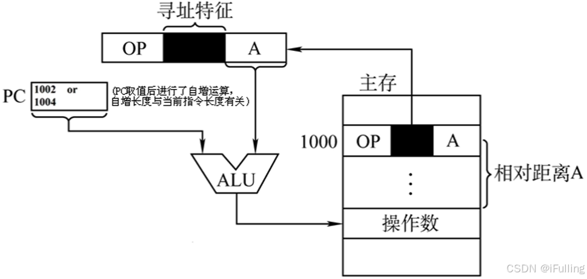{style="max-width:600px; box-sizing:content-box;"}

   - 以程序计数器 PC 所指地址作为 “起点”

   - 把程序计数器 PC 的内容加上指令格式中的形式地址 A 而形成操作数的有效地址，即 <mark>EA = (PC) + A</mark> ，其中 A 是相对于 PC（下一条指令地址）所指地址的偏移量，可正可负，补码表示。

   - 优点：操作数的地址不是固定的，它随着 PC 值得变化而变化，并且与指令地址之间总是相差一个固定值，因此便于程序浮动（一段代码在程序内部的浮动），相对地址广泛用于转移指令

---

1. 堆栈寻址

   - 堆栈是存储器（或专用寄存器组）中一块特定的按 “先进先出（FIFO）” 原则管理的存储区，该存储区中被读 / 写单元的地址是用一个特定的寄存器给出的，该寄存器称为堆栈指针（SP，Stack Pointer）

   - 操作数存放在堆栈中，隐含是用堆栈指针 SP 作为操作数地址。

   - 堆栈分为硬堆栈、软堆栈

     1. 硬堆栈：用专门的寄存器实现堆栈，不用访存，速度快，成本高

     2. 软堆栈：在主存中划分一片区域作为堆栈，速度慢，成本低

   - 记栈顶单元为 $M_{sp}$ ， $Y$ 是寄存器

     - 出栈指令 POP、入栈指令 PUSH

     - 如果栈顶在小地址方向：

       - 出栈 `PUSH ACC` ：(M<sub>sp</sub>) → ACC; (SP) + 1 → SP;

       - 入栈 `PUSH Y` ： (SP) -1 → SP; (Y) → M<sub>sp</sub>;

     - 如果栈顶在大地址方向：

       - 出栈 `PUSH ACC` ：(M<sub>sp</sub>) → ACC; (SP) - 1 → SP;

       - 入栈 `PUSH Y` ： (SP) +1 → SP; (Y) → M<sub>sp</sub>;

### 三、x86 指令基础

#### 1. x86汇编语言指令说明

- 已知高级语言可通过编译器（编译程序）编译成汇编语言，汇编语言通过汇编器（汇编程序）翻译为与之对等的机器语言

  - 一条高级语言代码可编译成多条汇编语言（一对多）

  - 一条汇编语言可翻译成一条机器语言（一对一）

  - 汇编语言和机器语言都属于机器级代码

> 前情提要： `mov` 指令将源操作数复制到目的操作数所指的位置

- 记源操作数为 $\text{s}$ （source），目的操作数 $\text{d}$ （destination）。如： `mov d,s`

- 指明内存的读写长度：

  - `dword ptr` ：double word pointer，双字，32 bit

  - `word ptr` ：单字，16 bit

  - `byte ptr` ：字节，8 bit

- 指明内存地址：

  - 使用 `[]` 表示一个地址，内存地址通常用十六进制表示，结尾通常会写 h，比如 `[af996h]`

  - 地址前通常还会指明此次要读 / 写的数据长度。比如： `move byte ptr [af996h], 5`

- 在 x86 架构中，寄存器名称以 E（Extended，扩展）开头时，其长度通常为 32 位。x86 架构 CPU 的常见寄存器：

  - 通用寄存器：以 X 结尾，表未知。

    - 扩展（E = Extended = 32 bit）通用寄存器：EAX、EBX、ECX、EDX

    - 基础通用寄存器（使用低 16 bit）：AX、BC、CX、DX

    - 只使用基础的高 8 位：AH、BH、CH、DH

    - 只使用基础的低 8 位：AL、BL、CL、DL

  - 变址寄存器：用于线性表、字符串的处理，以 I 结尾，表变址 Index

    - ESI（Source）、EDI（Destination）

  - 堆栈寄存器：用于实现函数调用，以 P 结尾，表指针 Pointer。

    - EBP：堆栈基指针，Extended Base Pointer

    - ESP：堆栈顶指针，Extended Stack Pointer

| 汇编指令 | 功能说明 | 源操作数寻址方式 | 目的操作数寻址方式 |
|:---|:---|:---|:---|
| `mov eax, dword ptr [ebx]` | 将 `ebx` 所指主存地址的 32bit 复制到 `eax` 寄存器中 | 寄存器间接寻址 | 寄存器寻址 |
| `mov dword ptr [ebx], eax` | 将 `eax` 的内容复制到 `ebx` 所指主存地址的 32bit | 寄存器寻址 | 寄存器间接寻址 |
| `mov eax, byte ptr [ebx]` | 将 `ebx` 所指的主存地址的 8bit 复制到 `eax` | 寄存器间接寻址 | 寄存器寻址 |
| `mov eax, [ebx]` | 若未指明主存读写长度，默认 32 bit，与第一条指令等价 | 寄存器间接寻址 | 寄存器寻址 |
| `mov [af996h], eax` | 将 `eax` 的内容复制到 `af996h` 所指的地址（未指明长度默认 32bit ） | 寄存器寻址 | 直接寻址 |
| `mov eax, dword ptr [ebx+8]` | 将 `ebx+8` 所指主存地址的 32bit 复制到 `eax` 寄存器中 | 相对寻址 | 寄存器寻址 |
| `mov eax, dword ptr [af996-12h]` | 将 `af996-12h` 所指主存地址的 32bit 复制到 `eax` 寄存器中 | 直接寻址 | 寄存器寻址 |


#### 2. 常用的 x86 汇编指令

- 单词缩写：

  - <reg>：寄存器 register

  - <mem>：内存 memory

  - <con>：常数 constant

- 规定：

  - 目的操作数 d 不能是常量，只能是寄存器或主存单元

  - 源操作数 s 可以是常量、寄存器、主存单元

  - x86 中不允许两个操作数同时来自主存

- 算术运算指令| 功能 | 英文 | 汇编指令 | 注释 |
  |:---:|:---:|:---:|:---|
  | 加 | add | add d,s | 计算 d + s，结果存入 d |
  | 减 | subtract | sub d,s | 计算 d - s，结果存入 d |
  | 乘 | multiply | mul d,s | 无符号数 d * s，乘积存入 d |
  |   |   | imul d,s | 有符号数 d * s，乘积存入 d |
  | 除 | divide | div s | 无符号数除法 edx:eax/s，商存入 eax，余数存入 edx |
  |   |   | idiv s | 有符号数除法 edx:eax/s，商存入 eax，余数存入 edx |
  | 取负数 | negative | neg d | 将 d 取负数，结果存入 d |
  | 自增++ | increase | inc d | 将 d ++，结果存入 d |
  | 自减– | decrease | dec d | 将 d - -，结果存入 d |

  - 除法运算默认被除数已存入 `edx:eax` 寄存器，两个寄存器合并拓展为 64 bit 再进行除法运算（看第二章的除法器）

  - 乘法和除法的 `i` 可理解为 integer —— 带符号的整数

- 逻辑运算指令| 功能 | 英文 | 汇编指令 | 注释 |
  |:---:|:---:|:---:|:---|
  | 与 | and | and d,s | 将 d、s 逐位相与，结果放回d |
  | 或 | or | or d,s | 将 d、s 逐位相或，结果放回d |
  | 非 | not | not d | 将 d 逐位取反，结果放回d |
  | 异或 | exclusive or | xor d,s | 将 d、s 逐位异或，结果放回d |
  | 左移 | shift left | shl d,s | 将d逻辑左移s位，结果放回d（通常s是常量） |
  | 右移 | shift right | shr d,s | 将d逻辑右移s位，结果放回d（通常s是常量） |

- 其他指令

  - 用于实现分支结构、循环结构的指令：cmp、test、jmp、jxxx

  - 用于实现函数调用的指令：push、pop、call、ret

  - 用于实现数据转移的指令：mov

#### 3. AT&T 汇编语言格式

- x86 架构由 intel 首创，在 x86 架构下汇编语言有两大主流语法体系，分别是 AT&T 格式 和 intel 格式。

- AT&T 格式 和 intel 格式对比|   | AT&T 格式 | Intel 格式 |
  |:---:|:---:|:---:|
  | 常用于 | Unix、Linux | Windows |
  | 目的操作数d、源操作数s | ops, d<br/>注：源操作数在左，目的操作数在右 | opd, s<br/>注：源操作数在右，目的操作数在左 |
  | 寄存器的表示 | mov %ebx, %eax<br/>注：寄存器名之前必须加"%" | moveax, ebx<br/>注：直接写寄存器名即可 |
  | 立即数的表示 | mov$985, %eax<br/>注：立即数之前必须加“$” | moveax, 985<br/>注：直接写数字即可 |
  | 主存地址的表示 | mov %eax, (af996h)<br/>注：用“小括号” | mov[af996h], eax<br/>注：用“中括号” |
  | 读写长度的表示 | movb$5, (af996h)<br/>movw$5, (af996h)<br/>movl$5, (af996h)<br/>addb$4, (af996h)<br/>注：指令后加 b、w、l 分别表示读写长度为 byte、word、dword | mov byte ptr[af996h], 5<br/>mov word ptr[af996h], 5<br/>mov dword ptr[af996h], 5<br/>add byte ptr[af996h], 4<br/>注：在主存地址前说明读写长度byte、word、dword |
  | 主存地址偏移量的表示 | movl-8(%ebx), %eax<br/>注： **偏移量(基址)** <br/><br/>movl4(%ebx, %ecx, 32), %eax<br/>注： **偏移量(基址,变址,比例因子)** | moveax, [ebx - 8]<br/>注： **[基址+偏移量]** <br/><br/>moveax, [ebx + ecx*32 + 4]<br/>注： **[基址+变址*比例因子+偏移量]** |

### 四、语句的机器级表示

#### 1. 选择语句

- 选择语句即分支结构，分支结构可能改变程序的执行流

- 无条件转移指令 `jmp` 

  - 格式： `jmp <地址>`

  - 作用：PC 无条件转移至 <地址>，类似 C 语言中的 goto 语句，但无法实现 `if...else...` 这种复杂功能

  - 地址可来自常量 `jmp 996` 、寄存器 `jmp eax` 、主存单元 `jmp [999h]`

  - 地址还可以用“标号” 锚定，标号要有冒号，名字自己取。如： `jmp NEXT` 、 `jmp iFulling` 
     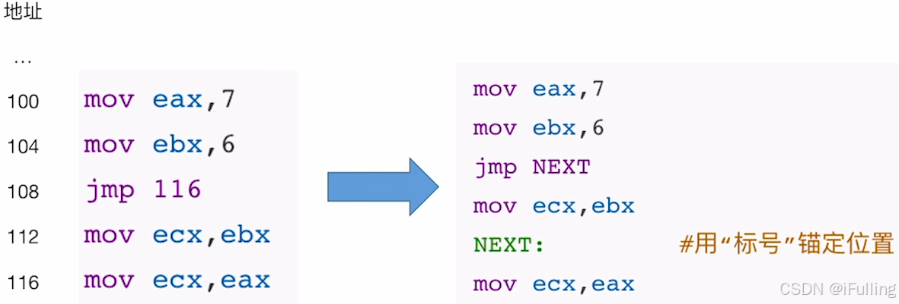{style="max-width:600px; box-sizing:content-box;"}

- 比较指令 `cmp` 

  - 格式： `cmp a,b` （compare，比较）

  - $a,b$ 可能来自常数、寄存器、主存单元

  - 比较过程跳转 [第二章：数据的表示和运算（下）—— 数的比较](https://blog.csdn.net/realoser/article/details/149813741#_277) ```asm
    cmp eax,ebx		## 比较寄存器 eax 和 ebx 中的值
    jg NEXT			## 若 eax > ebx，则跳转到 NEXT:
    ```

- 条件转移指令 `j...` 

  - 条件转移指令通常要和 cmp 指令一起使用。如上| 指令 | 英文（完整含义） | 注释 |
    |:---:|:---:|:---:|
    | `je <地址>` | jump when equal | 若 a==b 则跳转 |
    | `jne <地址>` | jump when not equal | 若 a!=b 则跳转 |
    | `jg <地址>` | jump when greater than | 若 a>b 则跳转 |
    | `jge <地址>` | jump when greater than or equal to | 若 a>=b 则跳转 |
    | `jl <地址>` | jump when less than | 若 a<b 则跳转 |
    | `jle <地址>` | jump when less than or equal to | 若 a<=b 则跳转 |

- if 语句转汇编```c
  if (a > b) {
      c = a;
  } else {
      c = b;
  }
  ```
  
  写法一：比较用大于，但是 if 和 else 的逻辑会反过来```asm
  mov eax,7       ; 假设变量 a = 7，存入 eax
  mov ebx,6       ; 假设变量 b = 6，存入 ebx
  cmp eax,ebx     ; 比较变量 a 和 b
  jg NEXT         ; 若 a > b，转移到 NEXT:
  mov ecx,ebx     ; 假设用 ecx 存储变量 c，令c=b
  jmp END         ; 无条件转移到 END:
  NEXT:
  mov ecx,eax     ; 假设用 ecx 存储变量c，令c=a
  END:
  ```

  写法二：比较反着来，if 和 else 的顺序就会一致```asm
  mov eax,7       ; 假设变量 a = 7,存入 eax
  mov ebx,6       ; 假设变量 b = 6,存入 ebx
  cmp eax,ebx     ; 比较变量 a 和 b
  jle NEXT        ; 若 a ≤ b，转移到 NEXT:
  mov ecx,eax     ; 假设用 ecx 存储变量 c，令c=a
  jmp END         ; 无条件转移到 END:
  NEXT:
  mov ecx,ebx     ; 假设用 ecx 存储变量 c，令c=b
  END:
  ```

#### 2. 循环语句

- loop 指令

  - ecx 专门作为循环的计数器，loop 指令只能用 ecx 进行循环

  - 会对 ecx 寄存器里的值自减，然后判断 ecx 的值是否等于零，如果不等于零继续循环

  - `loop Looptop` 等价于```asm
    dec ecx
    cmp ecx,0
    jne Looptop
    ```

  - loop 指令可能会使代码更清晰简洁，理论上，能用 loop 指令实现的功能一定能用条件转移指令实现

  - loop 扩充指令 `loopxx` 。如 loopnz、loopz

    - loopnz：当 `ecx != 0 && ZF == 0` 时，继续循环

    - loopz：当 `ecx != 0 && ZF == 1` 时，继续循环

- 循环语句转 loop 指令```c
  for (int i = 500; i > 0; i--) {
  	做某些处理;
  }	// 循环 500 轮
  ```
  
  loop 指令```asm
  mov ecx, 500	; 用 ecx 作为循环计数器
  Looptop:		; 循环的开始
  ...
  做某些处理
  ...
  loop Looptop	; ecx--，若 ecx != 0，跳转到 Looptop
  ```

---

- 条件转移指令实现循环需要 4 个部分构成：

  1. 循环前的初始化

  2. 是否直接跳过循环？

  3. 循环主体

  4. 是否继续循环？

- 循环语句转条件转移指令```c
  // for 写法
  int result = 0;
  for(int i = 1; i <= 100;i++) {
    result += i;
  } // 求 1+2+3+...+100

  // while 写法
  int i = 1;
  int result = 0;
  while (i <= 100) {
    result += i;
    i++;
  } // 求 1+2+3+...+100
  ```
  
  条件转移指令```asm
  ## 1、循环前的初始化
  mov eax,0    ; 用 eax 保存 result，初值为0
  mov edx,1    ; 用 edx 保存 i，初始值为 1
  ## 2、是否跳出循环
  cmp edx,100  ; 比较 i 和 100
  jg L2        ; 若 i > 100，转跳到 L2 执行
  L1:          ; 循环主体
  ## 3、循环主体
  add eax,edx  ; 实现 result += i
  inc edx      ; inc 自增指令，实现 i++
  ## 4、是否继续循环
  cmp edx,100  ; 比较 i 和 100
  jle L1       ; 若 i <= 100，转跳到 L1 执行
  L2:          ; 跳出循环主体
  ```

### 五、函数调用的机器级表示

> 前情提要：
> 
> - 程序计数器 PC 通常也被称为指令指针寄存器 IP
> 
> 

#### 1. 小结

- 本节内容较多，先做一个小结，后面分点笔记

---

- 栈帧内部可能包含的内容（自底向上）：| 层次 | 内容 | 是否存在 | 备注 |
  |:---:|:---:|:---:|:---|
  | 底部 | 上一层栈帧基址 | 一定存在 | 用于恢复上一层函数的栈帧 |
  | 二层 | 若干个局部变量 | 不一定存在 | 有些函数可能不定义局部变量 |
  | 三层 | 未使用区域 | 不一定存在 | 如果其他部分刚好是 16 B 整数倍，则不会剩下 “零头” |
  | 四层 | 部分寄存器值 | 不一定存在 | 如果这些寄存器值不是运算的中间结果，则可以不保存 |
  | 五层 | 若干个调用参数 | 不一定存在 | 有些函数调用不需要传参数 |
  | 顶部 | IP（返回地址） | 一定存在（发生调用时） | 单反调用其他函数，就必须记录返回地址 |

- 函数调用的机器级表示分析框架：
   

#### 2. Call 和 Ret 指令

- 操作系统在内存中开辟一片区域用作函数调用栈，执行函数时，用于存储函数的区域称为函数的栈帧（Stack Frame）

  - 函数的栈帧：一个栈帧对应一层函数，用于保存函数大括号内定义的局部变量、保存函数调用相关的信息

  - x86 系统中，默认以4 字节为栈的操作单位

- 函数调用指令： `call <函数名>` 

  - 通常用函数名作为函数起始地址的 <标号>

  - 作用：将 <mark>IP 旧值</mark> 压栈保存（保存在函数的栈帧顶部，效果相当于 `push IP` ）；设置 <mark>IP 新值</mark> ，无条件转移至被调用函数的第一条指令（效果相当于 `jmp <标号>` ）

- 函数返回指令： `ret` 

  - 作用：从函数的栈帧顶部找到 <mark>IP 旧值</mark> ，将其出栈并恢复 IP 寄存器

- 函数调用转汇编```c
  int caller() {
      int temp1 = 125;
      int temp2 = 80;
      int sum = add(temp1, temp2);
      return sum;
  }

  int add(int x, int y) {
  	return x + y;
  }
  ```
  
  intel 格式```asm
  ; caller 函数实现
  caller:
      push ebp           ; 保存旧的ebp（栈帧基址）
      mov ebp, esp       ; 新的ebp = 旧的esp
      sub esp, 24        ; 分配24字节栈空间（局部变量等）
  
      mov dword [ebp-12], 125  ; [ebp-12] = 125 （对应C代码 temp1=125）
      mov dword [ebp-8], 80   ; [ebp-8]  = 80   （对应C代码 temp2=80）
  
      mov eax, [ebp-8]   ; eax = [ebp-8]（temp2的值）
      mov [esp+4], eax   ; esp+4 = temp2（准备add的第二个参数）
      mov eax, [ebp-12]  ; eax = [ebp-12]（temp1的值）
      mov [esp], eax     ; esp = temp1（准备add的第一个参数）
  
      call add           ; 调用add函数，返回值存在eax
  
      mov [ebp-4], eax   ; 保存add返回值到[ebp-4]
      mov eax, [ebp-4]   ; 准备返回值（eax作为返回寄存器）
  
      leave              ; 等价于 mov esp, ebp / pop ebp
      ret                ; 返回caller的调用者


  ; add 函数实现
  add:
      push ebp           ; 保存旧的ebp
      mov ebp, esp       ; 新的ebp = 旧的esp

      mov eax, [ebp+12]  ; eax = [ebp+12]（第一个参数，temp1）
      mov edx, [ebp+8]   ; edx = [ebp+8] （第二个参数，temp2）
      add eax, edx       ; eax = temp1 + temp2（计算结果）
    
      leave              ; 恢复栈帧
      ret                ; 返回caller，eax携带返回值
  ```

#### 3. 访问栈帧

- 高地址为栈底，低地址为栈顶。因此计组中通常栈底在上，栈顶在下（与数据结构区别开来）
   

- 标记栈帧范围寄存器：

  - ebp：堆栈基地址，Base Pointer。指向当前栈帧的“底部”

  - esp：堆栈顶地址，Stack Pointer。指向当前栈帧的“顶部”
     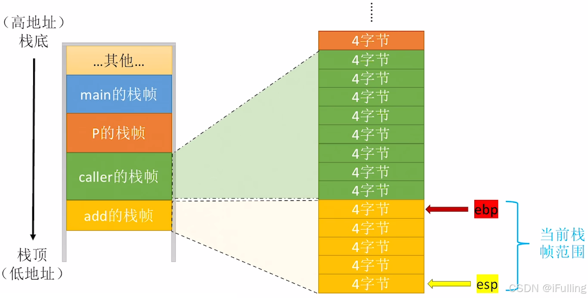{style="max-width:700px; box-sizing:content-box;"}

---

1. 访问栈帧数据方式一： `push` 、 `pop` 指令

   - `push 🐂` ：入栈

     - 🐂 可以是立即数、寄存器、主存地址

     - 已知 x86 默认以 4 字节为单位，先让 esp - 4，再将 🐂 压入栈顶

   - `pop 🐎` ：出栈

     - 🐎 可以是寄存器、主存地址

     - 栈顶元素出栈，写入 🐎，再让 esp + 4

   - 如```asm
     push eax       		; 将寄存器 eax 的值压栈
     push 985       		; 将立即数 985 压栈
     push dword [ebp+8]  ; 将主存地址 [ebp+8] 里的数据压栈

     pop eax         	; 栈顶元素出栈，写入寄存器 eax
     pop dword [ebp+8]   ; 栈顶元素出栈，写入主存地址 [ebp+8]
  ```

2. 访问栈帧数据方式二： `mov` 指令结合 esp、ebp 指针

   - `mov` 指令 + `sub` 减指令、 `add` 加指令修改栈顶指针 esp 的值
      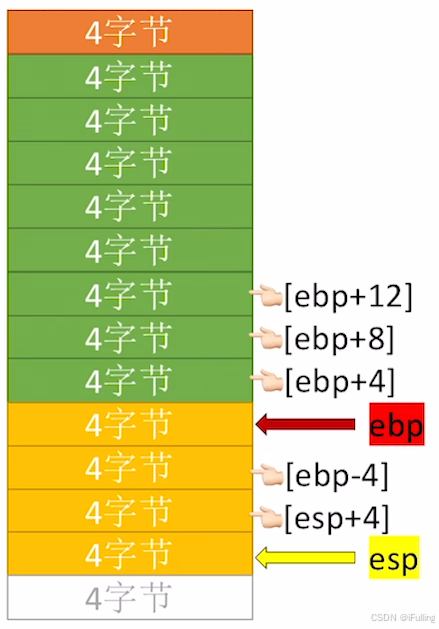 

   - 如```asm
     sub esp, 12        		; 栈顶指针 -12
     mov [esp+8], eax   		; 将 eax 的值复制到主存 [esp+8]
     mov dword [esp+4], 985  ; 将 985 复制到主存 [esp+4]
     mov eax, [ebp+8]   		; 将主存 [ebp+8] 的值复制到 eax
     mov [esp], eax     		; 将 eax 的值复制到主存 [esp]
     add esp, 8         		; 栈顶指针 +8
     ```

#### 4. 切换栈帧

- 当发生函数调用时，需要修改 ebp 和 esp，让他们指向新的函数栈帧。当函数执行完毕后，需要让 ebp 和 esp 重新指回上一层函数栈帧

- 已知执行 `call` 指令后，IP 旧值压入栈顶，IP 新值指向被调用函数的第一条指令

- 函数被调用时，每个函数开头例行执行指令：```asm
  ; 将栈帧切换为被调用函数栈帧
  push ebp		; 保存上一层函数的栈帧基址（ebp 旧值）
  mov ebp,esp		; 设置当前函数的栈帧基址（ebp 新值）
  ```
  
  - 由上面代码可知：每个函数栈帧底部一定存放上一层函数的栈帧基址（利于函数结束时返回）
  
  - 以上两行代码等价于 `enter` 指令（零地址指令）

- 函数返回时，每个函数结尾例行执行：```bash
  ; 将栈帧切换为上一个函数栈帧
  mov esp,ebp		; 让 esp 指向当前栈帧的底部
  pop ebp			; 将 esp 所指元素出栈，写入寄存器 ebp
  ```
  
  - 已知 `pop` 指令会让出栈元素写入寄存器，且 esp + 4，此计可谓是一箭双雕
  
  - 以上两行代码等价于 `leave` 指令（零地址指令）

- `ret` 指令：

  - 从函数的栈帧顶部（执行 `call` 时压入的）找到 IP 旧值，将其出栈并恢复 IP 寄存器（即让程序执行流回到 `call` 指令后面）

#### 5. 传递参数和返回值

> 已知：
> 
> - 栈帧最底部一定是上一层栈帧基址（ebp 旧值）
> 
> - 栈帧最顶部一定是返回地址（当前函数的栈帧除外）
> 
> 

- gcc 编译器将每个栈帧大小设置为 16 B 的整数倍（当前函数的栈帧除外），因此栈帧内可能出现空闲未使用的区域

- 通常将局部变量集中存储在栈帧底部区域

  - C 语言中越靠前定义的局部变量越靠近栈顶，

  - 如 `[ebp - 4]` 、 `[ebp - 8]` 等通常是访问本函数局部变量

- 通常将调用参数集中存储再栈帧顶部区域

  - C 语言中越靠前的参数越靠近栈顶。

  - 如 `[ebp + 8]` 、 `[ebp + 12]` 等通常是访问上一层函数传过来的参数

  - `[ebp + 4]` 是上一层函数的返回地址（IP 旧值）

- 返回值：

  - 在 `ret` 指令前，将函数返回值写入 eax 寄存器

  - eax 是通用寄存器，存在数据丢失风险，因此可以把部分寄存器值保存在栈帧中防止丢失

- 依旧是这块代码：```c
  int caller() {
      int temp1 = 125;
      int temp2 = 80;
      int sum = add(temp1, temp2);
      return sum;
  }

  int add(int x, int y) {
  	return x + y;
  }
  ```
  
   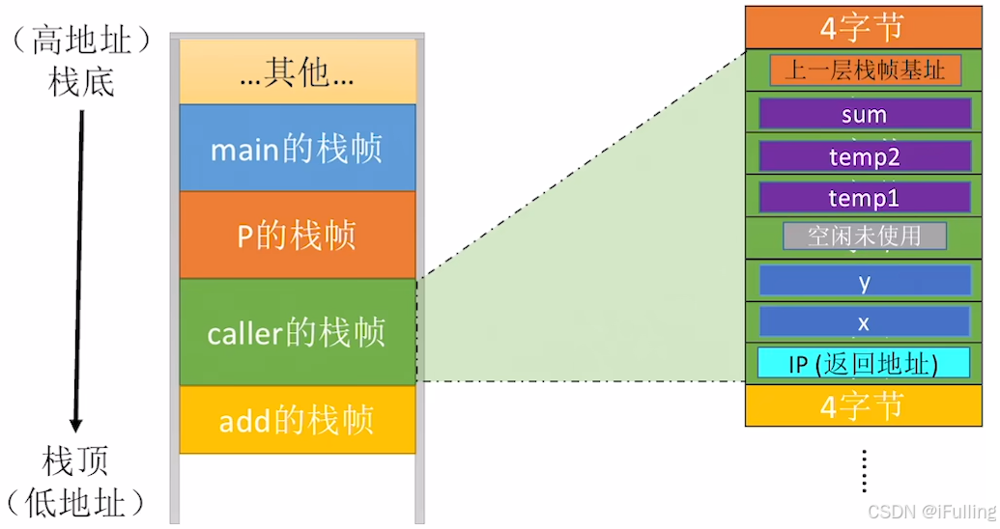{style="max-width:800px; box-sizing:content-box;"}

### 六、CISC 和 RISC

- CISC 和 RISC 是指令系统的两种设计方向

#### 1. 基本概念

- 指令系统的 80-20 规律：典型程序中 80% 的语句仅仅使用处理机中 20% 的指令

- CISC：复杂指令集计算机，Complex Instruction Set Computer

  - 设计思路：一条指令完成一个复杂的基本功能，一条指令可以由一个专门的电路完成

  - 代表：x86 架构

  - 主要用于：笔记本、台式机等

  - 有的复杂指令用纯硬件实现很困难，于是采用 “存储程序” 的设计思想，由一个比较通用的电路配合存储部件完成一条指令，于是就有了微指令

- RISC：精简指令集计算机，Reduced Instruction Set Computer

  - 设计思想：一条指令完成一个基本 “动作”；多条指令组合完成一个复杂的基本功能

  - 代表：arm 架构

  - 主要用于：手机、平板等

#### 2. 对比

| 对比项目 | CISC | RISC |
|:---:|:---:|:---:|
| 指令系统 | 复杂，庞大 | 简单，精简 |
| 指令数目 | 一般大于200条 | 一般小于100条 |
| 指令字长 | 不固定 | 定长 |
| 可访存指令 | 不加限制（如乘法指令可访存） | 只有 Load / Store 指令（乘法指令不能访存） |
| 各种指令执行时间 | 相差较大 | 绝大多数在一个周期内完成 |
| 各种指令使用频度 | 相差很大（80-20 规律） | 都比较常用 |
| 通用寄存器数量 | 较少 | 多 |
| 目标代码 | 难以用优化编译生成高效的目标代码程序 | 采用优化的编译程序，生成代码较为高效 |
| 控制方式 | 绝大多数为微程序控制（效率更低） | 绝大多数为组合逻辑控制（效率更高） |
| 指令流水线 | 可以通过一定方式实现 | 必须实现 |


## 第五章：中央处理器

### 一、CPU 的功能和结构

#### 1. CPU 的功能

- CPU 的功能包括：

  1. 指令控制：完成取指令、分析指令和执行指令的操作，即程序的顺序控制。

  2. 操作控制：一条指令的功能往往是由若干操作信号的组合来实现的。CPU 管理并产生由内存取出的每条指令的操作信号，把各种操作信号送往相应的部件，从而控制这些部件按指令的要求进行动作。

  3. 时间控制：对各种操作加以时间上的控制。时间控制要为每条指令按时间顺序提供应有的控制信号。

  4. 数据加工：对数据进行算术和逻辑运算。

  5. 中断处理：对计算机运行过程中出现的异常情况和特殊请求进行处理。

- CPU 由运算器和控制器组成

  - 运算器：对数据进行加工

  - 控制器：协调并控制计算机各部件执行程序的指令序列。基本包括：

    - 取指令：自动形成指令地址；自动发出取指令的命令

    - 分析指令：操作码译码（分析本条指令要完成什么操作）；产生操作数的有效地址

    - 执行指令：根据分析指令得到的 “操作命令” 和 ”操作数地址“，形成操作信号控制序列，控制运算器、存储器以及 I/O 设备完成相应的操作

    - 中断处理：管理总线及输入输出；处理异常情况（如掉电）和特殊请求（如打印机请求打印一行字符）

#### 2. 运算器的基本结构

- 基本结构：

  1. 算术逻辑单元 ALU：主要功能是进行算术、逻辑运算

  2. 通用寄存器组：如 AX、BX、CX、DX、SP（堆栈指针）、ACC（累加寄存器）等，用于存放操作数（包括源操作数、目的操作数及中间结果）和各种地址信息等；SP 用于指示栈顶的地址；ACC 用于暂时存放 ALU 运算的结果信息，用于实现加法运算。

  3. 暂存寄存器：用于暂存从主存读来的数据，这个数据不能存放在通用寄存器中，否则会破坏其原有内容

  4. 程序状态字寄存器 PSW：保存由算术逻辑运算指令或测试指令的结果而建立的各种状态信息，如 OP、SF、ZF、CF 等。PSW 中的这些位参与并决定微操作的形成。

  5. 移位器：对运算结果进行移位运算

  6. 计数器：控制乘除运算的操作步数

---

- 各部件之间的连接方式可分为：专用数据通路方式、CPU 内部单总线方式。这里简单了解，第三节会进一步研究。

- 专用数据通路方式：

  - 根据指令执行过程中的数据和地址的流动方向安排连接线路。

  - 特点：性能较高，基本不存在数据冲突现象；但结构复杂，硬件量大，不易实现。

  - 如果直接用导线连接，相当于多个寄存器同时并且一直向 ALU 传输数据。

    - 解决方法 1：使用多路选择器 MUX，根据控制信号选择一路输出
       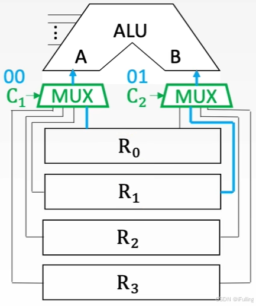{style="max-width:200px; box-sizing:content-box;"}

    - 解决方法 2：使用三态门，可以控制每一路是否输出。如：R0<sub>out</sub>为 1 时 R<sub>0</sub>中的数据输出到 A 端，R0<sub>out</sub>为 0 时 R<sub>0</sub>中的数据无法输出到 B 端
       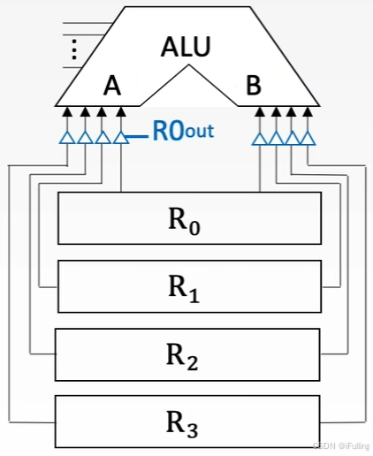{style="max-width:200px; box-sizing:content-box;"}

- CPU 内部单总线方式：

  - 将所有寄存器的输入端和输出端都连接到一条公共的通路上。通过 Rn<sub>out</sub>控制输出信号，Rn<sub>in</sub>控制输入信号

  - 特点：结构简单，容易实现，但数据传输存在较多冲突的现象，性能较低
     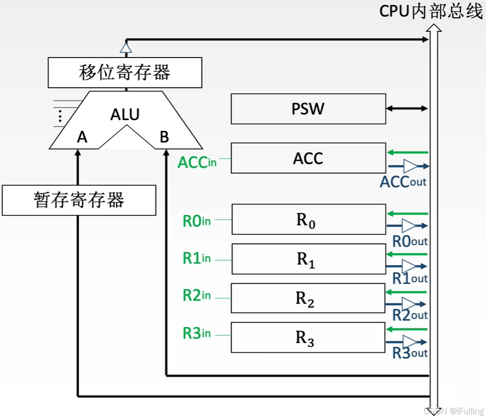{style="max-width:500px; box-sizing:content-box;"}

  - 当同时有两个输出信号，会导致总线冲突，因此可在其中一端设置一个暂存寄存器，当一端输出存储到暂存寄存器后，再让另端输出

    - 暂存寄存器：用于暂存从主存读来的数据，这个数据不能存放在通用寄存器中，否则会破坏其原有内容

    - 如：两个操作数分别来自主存和 R<sub>0</sub>，最后结果存回 R<sub>0</sub>，那么从主存中取来的操作数直接放入寄存器，就不会破坏运算前 R<sub>0</sub>的内容

  - 如果 ALU 和寄存器同时输出信号，会导致两个部件信号冲突。解决方法：

    1. 在 ALU 的输出端设置一个暂存寄存器，当寄存器送到总线上的输入信号稳定后，ALU 会把计算的结果先放到暂存寄存器中

    2. 寄存器的上面再加一个三态门，等 ALU 输出结果稳定之后，再让三态门导通，从而把运算结果送到内部总线上，再把 R0<sub>in</sub>接上有效的电信号，就可以把运算结果返回给 R<sub>0</sub>寄存器

    3. 暂存寄存器还可以增加一些功能比如移位、累加。

#### 3. 控制器的基本结构

1. 程序计数器 PC（Program Counter）：用于指出下一条指令在主存中的存放地址。CPU 就是根据 PC 的内容去主存中取指令的。因程序中指令（通常）是顺序执行的，所以 PC 有自增功能。

2. 指令寄存器 IR（Instruction Register）：用于保存当前正在执行的那条指令。

   - 一条指令包括操作码 OP 和地址码 Ad

   - 操作码经过 ID 译码后送给控制单元 CU，地址码输出到内部总线上

3. 指令译码器 ID（Instruction Decoder）：仅对操作码字段（OP）进行移译码，向控制器提供特定的操作信号

   - 操作码作为译码器的输入，然后译码器对应的某一个输出端会被选通，根据选通线路判断当前执行的是什么指令

   - 根据译码器的输出信号决定接下来要执行的是哪些微操作

4. 微操作信号发生器：根据 IR 的内容（指令）、PSW 的内容（状态信息）及 时序信号，产生控制整个计算机系统所需的各种控制信号，其结构有组合逻辑型和存储逻辑型两种。

   - 译码器的输出信号作为微操作信号发生器的输入信号，用来判断这条指令所对应的微操作序列

   - 除了指令的操作码外，还需要根据 PSW 中存放的某些标志信息来决定接下来的微操作序列

5. 时序系统：用于产生各种时序信号，它们都是由统一时钟（CLOCK）分频得到。

   - 微操作信号发生器每接收到一个时序信号，就会执行下一个微操作，发出下一个微操作所对应的操作信号

6. 存储器地址寄存器 MAR：用于存放所要访问的主存单元的地址。现代计算机中 MAR 通常被集成在 CPU 内部

7. 存储器数据寄存器 MDR：用于存放向主存写入的信息或从主存中读出的信息。现代计算机中 MDR 通常被集成在 CPU 内部

   - $\text{MDR}_{in}\text{E}$ 表示从外部的数据总线输入数据的通路是否有效， $\text{MDR}_{out}\text{E}$ 同理

   - $\text{MDR}_{in}$ 表示从 CPU 内部输入数据的通路是否有效， $\text{MDR}_{out}$ 同理

8. CPU 内部总线：CPU 内部部件之间进行数据传送的公共通路。
   外部总线：CPU 和其他部件之间数据传送的公共通路。

> CU（Control Unit，控制单元）包括 指令译码器 ID、时序系统、微操作信号发生器

 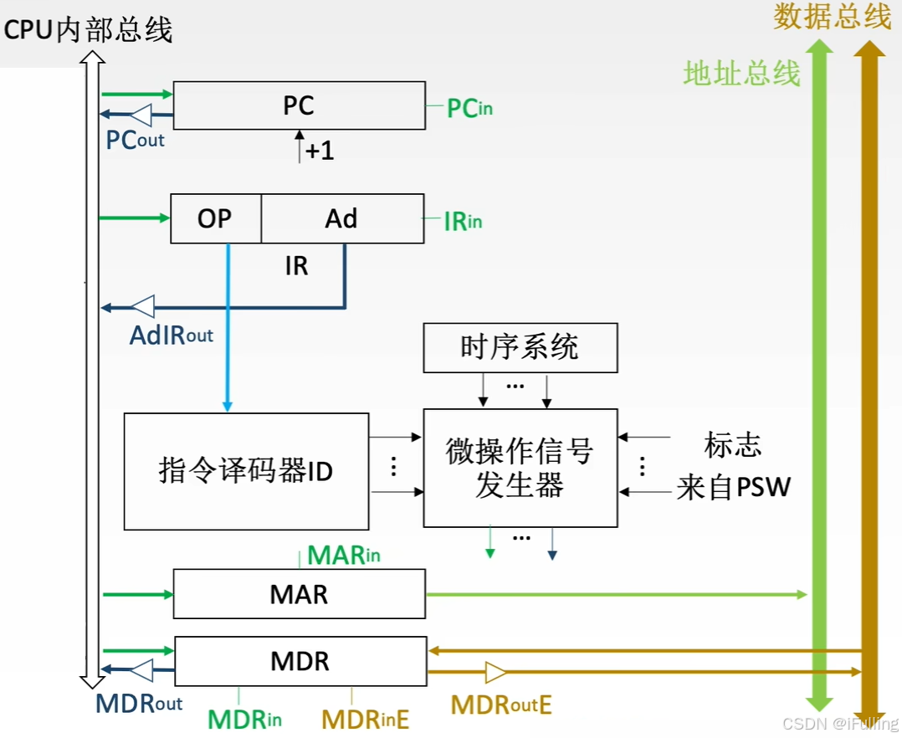{style="max-width:600px; box-sizing:content-box;"}

#### 4. CPU 的基本结构

- CPU 由 ALU、寄存器、CU、中断系统组成

- 用户可见的寄存器（可编程）：通用寄存器组、程序状态字寄存器 PSW、程序计数器 PC

- 用户不可见的寄存器：MAR、MDR、IR、暂存寄存器

 

### 二、指令执行过程

#### 1. 指令周期的概念

- 指令周期：CPU 从主存中每取出并执行一条指令所需的全部时间

- 一个指令周期可被分为取指周期和执行周期
   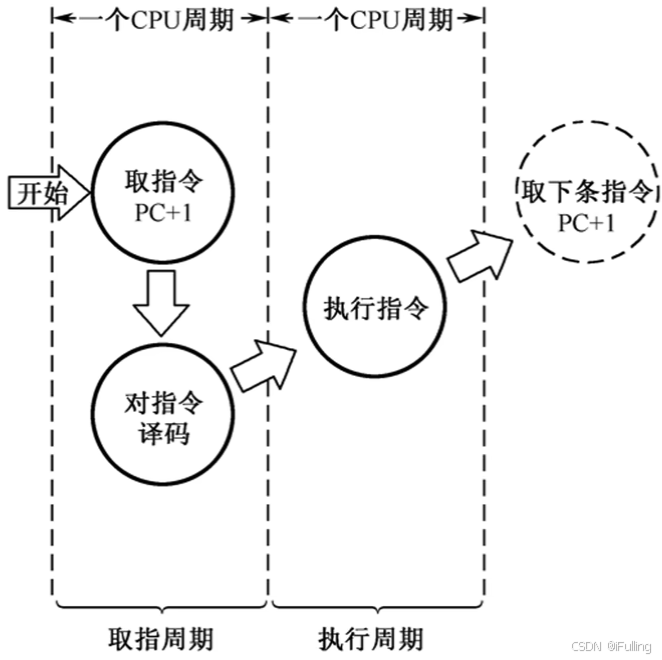{style="max-width:400px; box-sizing:content-box;"}

- **指令周期** 常常用若干 **机器周期** 来表示，机器周期又叫 **CPU 周期**

- 一个 **机器周期** 包含若干个 **时钟周期** （也称为节 **拍、T 周期** 或 **CPU 时钟周期** ，它是 CPU 操作的最基本单位）

  $$
  时钟周期⊂机器周期⊂指令周期
  $$

  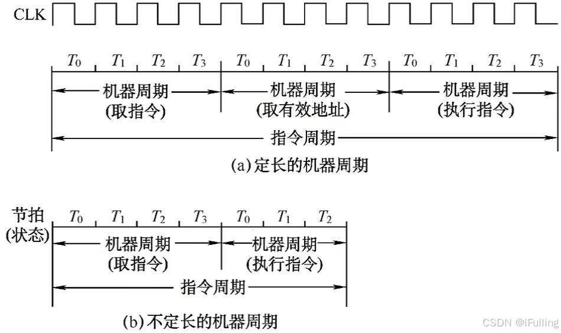{style="max-width:600px; box-sizing:content-box;"}

  - CLK 指时钟脉冲，一个脉冲就是一个时钟周期（周期顾名思义，联想三角函数的周期）

  - 主频 3.0 GHz 表示 1 秒可以发出 3.0G 次节拍（时钟周期）

  - 一个机器周期是指完成一个完整子工作所需要的时间，一个机器周期需要由多个时钟周期组成

  - 每个指令周期内机器周期数可以不等，每个机器周期内的节拍数也可以不等。

    - 定长的机器周期：每个机器周期所需时钟周期都相同。

    - 不定长的机器周期：每个机器周期所需时钟周期不同。

- 一些常见指令的指令周期| 指令 | 指令周期数 | 图示 |
  |:---:|:---:|:---:|
  | 空指令 NOP | 1 | 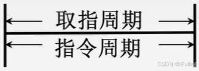{style="max-height:50px; box-sizing:content-box;"} |
  | 加法指令 ADD | 2 | 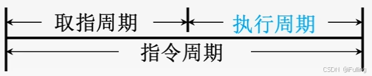{style="max-height:50px; box-sizing:content-box;"} |
  | 乘法指令 MUL | 2 | 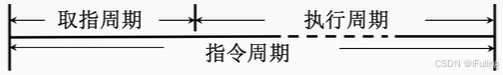{style="max-height:50px; box-sizing:content-box;"} |
  | 具有间接寻址的指令 | ≥ 3 | 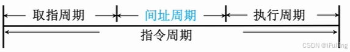{style="max-height:50px; box-sizing:content-box;"} |
  | 带有中断周期的指令 | ≥ 2 | 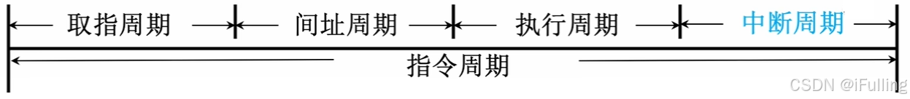{style="max-height:50px; box-sizing:content-box;"} |

#### 2. 指令周期流程

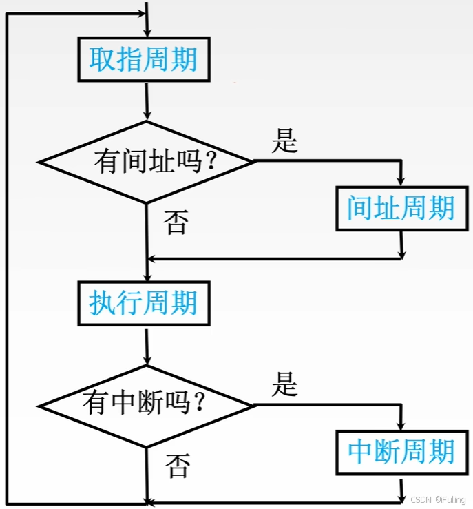{style="max-width:400px; box-sizing:content-box;"}

- 四个工作周期都可能有 CPU 访存操作，只是访存的目的不同。| 工作周期 | 标志触发器 | 访存目的 |
  |:---:|:---:|:---:|
  | 取指周期 | FE（Fetch） | 取指令 |
  | 间址周期 | IND（Indirect） | 取有效地址 |
  | 执行周期 | EX（Execute） | 取操作数 |
  | 终端周期 | INT（Interrupt） | 保存程序断点 |

#### 3. 指令周期的数据流

- 数据流动分为三类：

  1. 寄存器与寄存器之间的流动

  2. 寄存器与主存之间的流动

  3. 寄存器与 ALU 之间的流动

- 取指阶段：根据 PC 中的内容取出指令代码并存放在 IR 中

  1. 当前指令地址送至存储器地址寄存器，记作： $\text{(PC) → MAR}$

  2. CU 发出控制信号，经控制总线传到主存。如读信号记作： $\text{1 → R}$

  3. 将 MAR 所指主存中的内容经数据总线送入 MDR，记作： $\text{M(MAR) → MDR}$ 或 $\text{MEM(MAR) → MDR}$

  4. 将 MDR 中的内容（此时是指令）送入 IR，记作： $\text{(MDR) → IR}$

  5. CU 发出控制信号，形成下一条指令地址，记作： $\text{(PC) + n → PC}$ 
      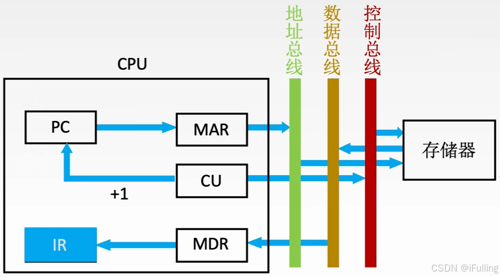{style="max-width:600px; box-sizing:content-box;"}

- 间址周期：根据 IR 中指令地址取操作数有效地址

  1. 将指令的地址码（形式地址）送入 MAR，记作： $\text{Ad(IR) → MAR}$ 或 $\text{Ad(MDR) → MAR}$

  2. CU 发出控制信号，启动主存做 **读操作** ，记作： $\text{1 → R}$

  3. 将 MAR 所指主存中的内容经数据总线送入 MDR，记作： $\text{M(MAR) → MDR}$

  4. 可选：将有效地址送至指令的地址码字段，记作： $\text{(MDR) → Ad(IR)}$ 
      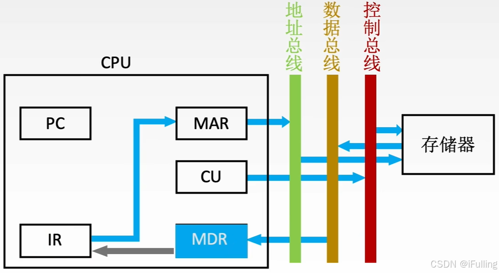{style="max-width:600px; box-sizing:content-box;"}

- 执行周期：根据指令字的操作码和操作数进行相应的操作

  - 该阶段的任务是根据 IR 中的指令字的操作码和操作数通过 ALU 操作产生执行结果。

  - 不同指令的执行周期操作不同，因此没有统一的数据流向。

- 中断周期：保存断点，送中断向量，处理中断信号

  - 该阶段暂停当前任务区完成其他任务（如鼠标单击）。为了能够恢复当前任务，需要保存断点。

  - 断点信息一般使用堆栈保存。假设 SP 表示栈顶指针，进栈操作是先修改指针，后存入数据。

  1. CU 控制将 SP -1，修改后的地址送入 MAR。

     - 记作： $\text{(SP) - 1 → SP，(SP) → MAR}$

     - 本质上是将断点存入某个存储单元，假设其地址为 $a$ ，故可记作： $\text{a → MAR}$

  2. CU 发出控制信号，启动主存做 **写操作** ，记作： $\text{1 → W}$

  3. 将断点（PC 内容）送入 MDR，记作： $\text{(PC) → MDR}$

  4. CU 控制将中断服务程序的入口地址（由向量地址形成部件产生）送入 PC，记作： $\text{向量地址 → PC}$ 
      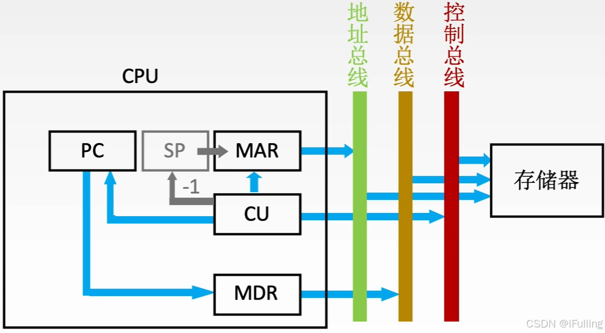{style="max-width:600px; box-sizing:content-box;"}

#### 4. 指令执行方案

- 一个指令周期通常要包括几个时间段（执行步骤），每个步骤完成指令的一部分功能，几个依次执行的步骤完成这条指令的全部功能。

1. 方案一：单指令周期

   - 对所有指令都选用相同的执行时间来完成。

   - 特点：指令之间串行执行；指令周期取决于执行时间最长的指令的执行时间。

   - 优点：只需要根据节拍数确定一条指令的执行是否结束，控制电路设计简单

   - 缺点：对于那些本来可以在更短时间内完成的指令，要使用这个较长的周期来完成，会降低整个系统的运行速度。

2. 方案二：多指令周期

   - 对不同类型的指令选用不同的执行步骤来完成。

   - 特点：指令之间串行执行；可选用不同个数的时钟周期来完成不同指令的执行过程。

   - 优点：执行快的指令只需要很短的周期就能执行结束

   - 缺点：需要更复杂的硬件设计，成本会增加

3. 方案三：流水线方案

   - 在每一个时钟周期启动一条指令，尽量让多条指令同时运行，但各自处在不同的执行步骤中。

   - 特点：指令之间并行执行

### 三、数据通路的功能和基本结构

#### 1. 数据通路概述

- 数据通路：数据在功能部件之间传送的路径。

  - 信息从哪开始、中间经过了哪些部件、最后传到哪里

  - 控制信号由控制部件（CU）产生，根据控制信号建立数据通路。

- 对于各种类型的寄存器来说，有两种控制信号：

  1. 控制数据输入路径是否畅通

  2. 控制数据输出路径是否畅通

- 数据通路的基本结构：

  1. CPU 内部单总线方式：同一时间只允许两个部件之间进行数据交换，它们对总线的使用是独占的

  2. CPU 内部多总线方式：比如有三个总线就可以同时支持三组部件的数据交换

  3. 专用数据通路方式：只要两个寄存器之间需要有数据流动，就会单独在这两个寄存器之间专门的建立一个数据通路

#### 2. 单总线结构

> 
> 
> - **内部总线** ：是指同一部件，如 CPU 内部连接各寄存器及运算部件之间的总线
> 
> - **系统总线** ：是指同一台计算机系统的各部件，如 CPU、内存、通道和各类 I/O 接口间互相连接的总线
> 
> 

##### Ⅰ.寄存器与寄存器

- **寄存器与寄存器** 之间的数据传送：比如把 PC 内容送至 MAR，实现传送操作的流程及控制信号为：

  1. $\text{(PC) → Bus}$ ：PC<sub>out</sub>有效，PC 内容送总线

  2. $\text{Bus → MAR}$ ：MAR<sub>in</sub>有效，总线内容送 MAR

  - 可以合在一起写为： $\text{(PC) → Bus → MAR}$ 
     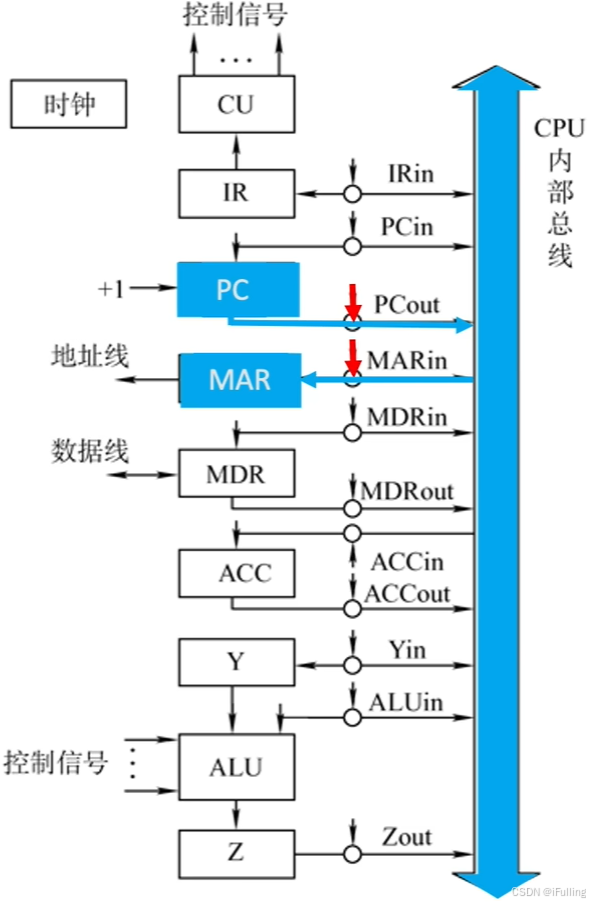 

##### Ⅱ. 主存与 CPU（寄存器）

- **主存与 CPU（寄存器）** 之间的数据传送：比如 CPU 从主存读取指令，实现传送操作的流程及控制信号为：

  1. $\text{(PC) → Bus → MAR}$ ：PC<sub>out</sub>和 MAR<sub>in</sub>有效，现行指令地址 → MAR

  2. $\text{1 → R}$ ：CU 发出读命令（通过控制总线发出）

     - 地址现在存在 MAR 中，因此要注意此时 MAR<sub>out</sub>应有效

  3. $\text{MEM(MAR) → MDR}$ ：MDR<sub>in</sub>E 有效

     - MDR<sub>in</sub>E 表示数据从外部流入 CPU 的通路是否有效

     - MDR<sub>in</sub>表示数据从内部总线流入 MDR 的通路是否有效

  4. $\text{MDR → Bus → IR}$ ：MDR<sub>out</sub>和 IR<sub>in</sub>有效，现行指令 → IR
      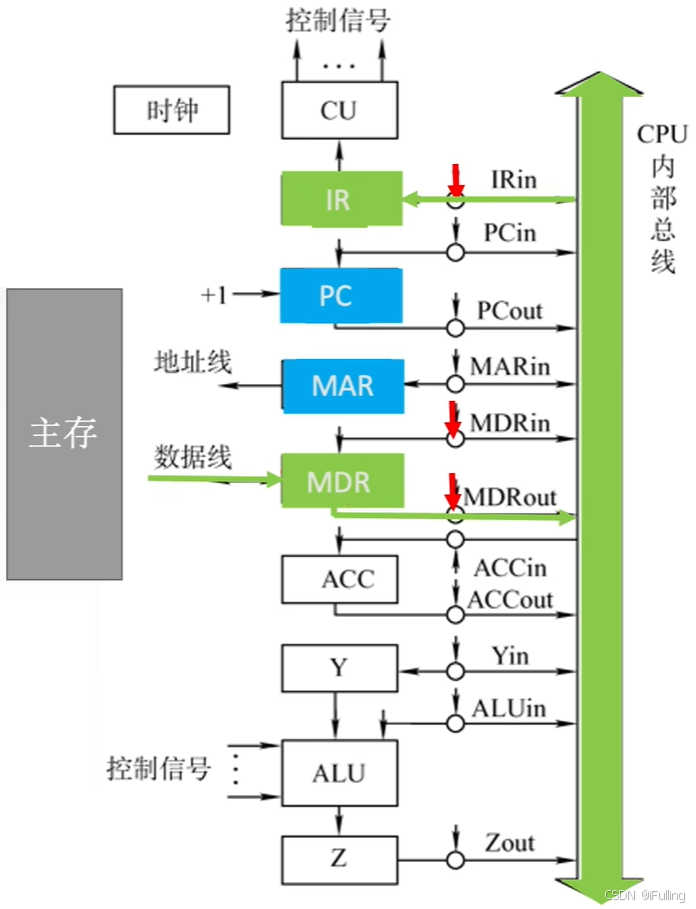{style="max-width:400px; box-sizing:content-box;"}

##### Ⅲ. ALU 与寄存器

- 执行算术或逻辑运算 **ALU 与寄存器** 之间的数据传送：比如一条加法指令（假设其中一个操作数已被存入 ACC），微操作序列及控制信号为：

  1. 获取另一个操作数的地址

     - 方式一： $\text{Ad(IR) → Bus → MAR}$ ：根据指令的地址码部分读取出参与加法的另一个操作数，IR<sub>out</sub>和 MAR<sub>in</sub>有效

     - 方式二： $\text{Ad(MDR) → MAR}$ ：若取指令时已经把指令存放到 MDR 中，然后再把 MDR 值复制到 IR。因此取指结束后，MDR 也存放了这条指令的完整信息。MDR<sub>out</sub>和 MAR<sub>in</sub>有效

  2. $\text{1 → R}$ ：CU 发出读命令

  3. $\text{MEM(MAR) → 外部数据总线 → MDR}$ ：MDR<sub>in</sub>E 有效

  4. $\text{MDR → Bus → Y}$ ：MDR<sub>out</sub>和 Y<sub>in</sub>有效，操作数 → 暂存寄存器 Y
      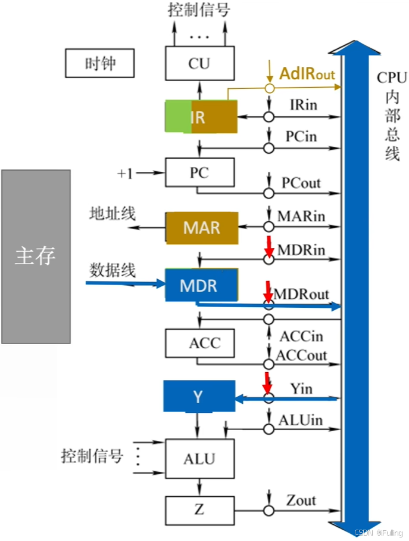{style="max-width:400px; box-sizing:content-box;"}

  5. $\text{(ACC) + (Y) → Z}$ ：ACC<sub>out</sub>和 ALU<sub>in</sub>有效，CU 向 ALU 发送加命令，加法结果输出到暂存寄存器 Z 中
      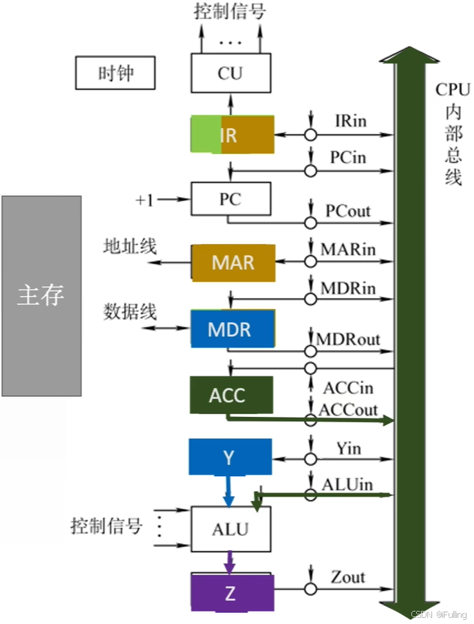{style="max-width:400px; box-sizing:content-box;"}

  6. $\text{Z → ACC}$ ：Z<sub>out</sub>和 ACC<sub>in</sub>有效，结果 → ACC
      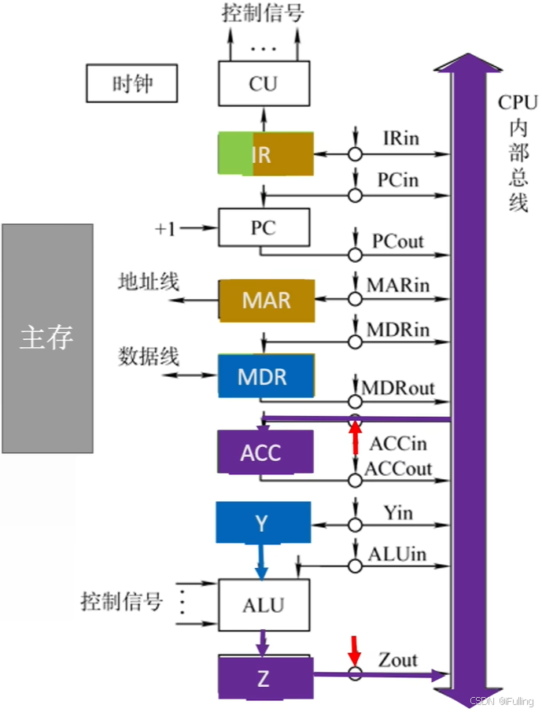{style="max-width:400px; box-sizing:content-box;"}

#### 3. 专用通路结构

 

- 取指周期：

  1. $\text{(PC) → MAR}$ ：PC 值传送到 MAR，C<sub>0</sub>有效

  2. $\text{(MAR) → 主存}$ ：MAR 将地址传送给主存，C<sub>1</sub>有效

  3. $\text{1 → R}$ ：控制单元向主存发送读命令

  4. $\text{M(MAR) → MDR}$ ：主存通过外部总线将指令传送给 MDR，C<sub>2</sub>有效

  5. $\text{(MDR) → IR}$ ：指令从 MDR 复制到 IR，C<sub>3</sub>有效

  6. $\text{(PC) + 1 → PC}$ ：每取出一条指令，PC +1

  7. $\text{Op(IR) → CU}$ ：指令发送给 CU 进行译码，C<sub>4</sub>有效

### 四、控制器的功能和工作原理

#### 1. 硬布线控制器

- 硬布线控制器的特点

  - 指令越多，设计和实现就越复杂，因此一般用于 RISC（精简指令集系统）

  - 如果扩充一条新的指令，则控制器的设计就需要大改，因此扩充指令较困难

  - 由于使用纯硬件实现控制，因此执行速度很快。微操作控制信号由组合逻辑电路即时产生

##### Ⅰ. 微命令和微操作的概念

- CU 发出一个微命令（控制信号），可完成对应微操作（一对一）

  - 如：微命令1 使得 PC<sub>out</sub>、MAR<sub>in</sub>有效，完成对应的微操作1 $\text{(PC) → MAR}$

- 微操作更多的是描述要做的细分的工作，这个工作要完成一个什么样的功能

- 微命令指要完成这个细分的工作，所需要发出的一些有效的控制信号

- 一个节拍内可以并行完成多个“相容的” 微操作（比如专用通路结构）

- 同一个微操作可能在不同指令的不同阶段（阶段即指令周期流程）被使用（比如间接寻址）

##### Ⅱ. 控制单元电路

> **前情提要：** 
> 
> - 为了让电路设计更简单，故假设采用定长机器周期的策略，以可能出现的最大节拍数为准，通常以访存所需节拍数作为参考（访存最慢）
> 
> - 若实际所需节拍数较少，可将微操作安排在机器周期末尾几个节拍上进行
> 
> 

- 根据指令操作码、目前的机器周期、节拍信号、机器状态条件，即可确定现在这个节拍下应该发出哪些 “微命令”：

  - 指令操作码：首先把指令寄存器 IR 中的 n 位操作码送到操作码译码器，这 n 位操作码对应 $2^n$ 种不一样的指令。译码器的不同线对应 CU 中不同的部件

  - 目前的机器周期：CU 根据四个触发器中（FE、IND、EX、INT，集成在 CU 内部）哪个触发器的值为 1 判断目前处于哪个机器周期

  - 节拍信号：通过节拍发生器循环发出脉冲，每一个脉冲信号就是一个时钟周期（即节拍），CU 根据与节拍发生器的导通信号判断当前处于第几个节拍

  - 机器状态条件：统称为标志，标志来自执行单元的反馈信息（如来自运算器的 PSW、ACC 的符号位等，或来自 I/O 设备、主存），这些标志可能会影响到接下来的微操作序列执行流

  - 应该发出哪些 “微命令”：CU 每一条输出线对应一个微命令。举个简单例子：

    - 如要让 C<sub>1</sub>对应微操作（PC）→ MAR，则将其接到 PC<sub>out</sub>、MAR<sub>in</sub>即可

    - 如所有指令的取指周期、T<sub>0</sub>节拍下（T<sub>0</sub>指当前周期第 1 个节拍）一定要完成（PC）→ MAR。则可知 C<sub>1</sub>= FE · T<sub>0</sub>（与门）

  - 

- 举个复杂的例子，了解即可。

  - $\text{M(MAR) → MDR}$ 微操作命令的逻辑表达式：

    $$
    \text{FE }·\text{ T}_1+\text{IND }·\text{ T}_1\text{(ADD + STA + LDA + JMP + BAN) + EX }·\text{ T}_1\text{ADD + LDA}
$$
    
 

##### Ⅲ. 硬布线控制器的设计（了解即可）

- 设计步骤，了解即可：

  1. 分析每个阶段的微操作序列（取指、间址、执行、中断四个阶段），确定哪些命令在什么阶段、在什么条件下会使用到的微操作

  2. 选择 CPU 的控制方式，确定采用定长机器周期还是不定长机器周期、每个机器周期安排几个节拍等

  3. 安排微操作时序，假设采用同步控制方式（定长机器周期），一个机器周期内安排 3 个节拍，如何用 3 个节拍完成整个机器周期内的所有微操作

  4. 电路设计，确定每个微操作命令的逻辑表达式，并用电路实现

---

1. 分析每个阶段的微操作序列，罗列出所有指令在各个阶段的微操作序列，就可以知道在什么情况下使用这个微操作。已知取指、间址、中断这三个周期的所有指令都一样

   - 取指周期```plaintext
     PC → MAR             // 程序计数器值送地址寄存器
     1 → R                // 发出读命令
     M (MAR) → MDR        // 按地址读内存到数据寄存器
     MDR → IR             // 数据寄存器值送指令寄存器
     OP (IR) → ID         // 指令操作码送译码器
     (PC) + 1 → PC        // 程序计数器自增，指向下一条指令
     ```

   - 间址周期```plaintext
     Ad(IR) → MAR   		// 指令寄存器中地址段送地址寄存器
     1 → R          		// 发读命令，启动内存读操作 
     M (MAR) → MDR  		// 内存按地址读数据到数据寄存器
     MDR → Ad(IR)   		// 数据寄存器内容送回指令寄存器地址段 
     ```

   - 执行周期，不同指令各不相同。如

     - `CLA` （clear ACC）：将 ACC 寄存器清零，0 → AC

     - `LDA X` ：取数指令，把 X 所指内容取到 ACC。微操作序列同间址周期，但最后一步 MDR → AC

     - `JMP X` ：无条件跳转，Ad (IR) → PC

     - `BAN X` （Branch ACC Negative）：条件转移，当 ACC 为负时转移。

       - 设 A<sub>0</sub>代表负数符号位，当 ACC 为负时 A<sub>0</sub>= 1

       - $\text{A}_0\,·\,\text{Ad(IR) + }\overline{\text{A}_0}\,·\,\text{(PC) → PC}
         $

   - 中断周期：```plaintext
     (SP) - 1 → SP        // 栈指针减1，指向新的栈顶位置
     (SP) → MAR           // 将栈指针的值送到地址寄存器，确定写入内存的地址
     1 → W                // 发出写命令，通知存储器准备写入数据
     (PC) → MDR           // 将程序计数器的值（返回地址）存入数据寄存器
     向量地址 → PC         // 将中断向量地址送入程序计数器，准备跳转到中断服务程序
     ```

2. 选择 CPU 控制方式：为了电路简单，采用定长机器周期，每个机器周期 3 个节拍

3. 安排微操作时序，遵循以下原则：

   - 原则一：微操作的先后顺序不得随意更改

   - 原则二：被控对象不同的微操作，尽量安排在一个节拍内完成

   - 原则三：占用时间较短的微操作，尽量安排在一个节拍内完成，并允许有先后顺序（如 CPU 中寄存器之间的数据传送）

4. 电路设计，设计步骤：

   5. 列出操作时间表：列出在取指、间址、执行、中断周期，T<sub>0</sub>、T<sub>1</sub>、T<sub>2</sub>节拍内有可能用到的所有微操作

   6. 写出微操作命令的最简表达式

   7. 画出逻辑图

#### 2. 微程序控制器

##### Ⅰ. 基本概念

- 程序和微程序：

  - 程序：由指令序列组成

  - 微程序：由微指令序列组成，每一种指令对应一个微程序

- 指令和微指令：

  - 指令是对程序执行步骤的描述，指令是对微指令功能的 “封装”

  - 微指令是对指令执行步骤的描述

- 微命令和微操作：

  - 微命令与微操作一一对应，微指令中可能包含多个微命令

- 其他补充：

  - 采用 “存储程序” 的思想，CPU 出厂前将所有指令的 “微程序” 存入 “控制器存储器” 中，然后 CPU 根据当前要执行的指令类型，找到与这条机器指令所对应的微程序，然后逐条地执行这个微程序中所包含的微指令序列

  - 微程序控制器中可能出现多种微指令，每一种微指令会对应一系列相应的微操作，因此每一条微指令需要有操作控制字段，用若干比特表示当前微指令所对应的微操作是哪几个；还需要有顺序控制字段，用若干比特指明下一条微指令的地址

| 层次 | 概念 | 核心定义 | 与上一层的关系 | 类比（便于理解） |
|:---:|:---:|:---|:---|:---|
| 1 | **程序（Program）** | 为完成特定任务（如计算1+1、播放视频），由 **一系列指令** 按逻辑顺序组成的集合 | 程序、软件任务 **（顶层）** | 菜谱（整本书，指导完成一道菜的全部步骤） |
| 2 | **指令（Instruction）** | 计算机硬件能直接识别的 **基本操作命令** （如“加法”“数据从内存读入CPU”），是程序的基本单位 | 由若干 **指令（硬件基本命令）** 组成 | 菜谱中的一个步骤（如“将鸡蛋打散”） |
| 3 | **微程序（Microprogram）** | 为实现一条 **指令** 的功能，由 **一系列微指令** 按逻辑顺序组成的集合 | 每条指令由 **微程序（指令的子步骤）** 实现 | 拆解“打鸡蛋”的子步骤清单（拿鸡蛋→磕碗→搅拌） |
| 4 | **微指令（Microinstruction）** | 控制CPU内部 **一组相关微操作同步执行** 的命令，是微程序的基本单位 | 每个微程序由若干 **微指令（同步动作控制）** 组成 | 拆解后的一个子步骤（如“磕碗”） |
| 5 | **微命令（Microcommand）** | 直接驱动硬件部件动作的 **最小控制信号** （如“打开CPU内部某个门电路”“启动寄存器读写”），是微指令的组成部分 | 每条微指令包含若干 **微命令（硬件控制信号）** | 驱动“磕碗”的具体动作信号（“手指用力按压蛋壳”） |
| 6 | **微操作（Microoperation）** | 计算机硬件在 **微命令驱动下完成的最小、不可再分的物理动作** （如“寄存器A的数据传送到寄存器B”“ALU执行加法”） | 每个微命令驱动一个 **微操作（硬件最小动作）** | 硬件实际完成的动作（“蛋壳裂开”） |


##### Ⅱ. 基本结构

- 控制存储器 CM（Control Memory）：用于存放各指令对应的微程序，CM 内按地址寻访，可由只读存储器ROM构成

- 微地址寄存器：CMAR，别名 μPC（可理解为 MAR 和 PC 的结合体），接收微地址形成部件送来的微地址，为在 CM 中读取微指令做准备

- 地址译码器：将地址码转化为 CM 中对应的存储单元控制信号

- 微指令寄存器：CMDR，别名 μIR，用于存储从 CM 中取出的微指令，它的位数同微指令字长相同

  - 控制码部分：操作控制字段，向 CPU 内部和系统总线发出控制信号

  - 下地址部分：顺序控制字段，用于控制顺序逻辑

- 微地址形成部件：根据机器指令的操作码来确定所对应的微指令序列的首地址，产生初始微地址和后继微地址，以保证微指令的连续执行

- 顺序逻辑：一个逻辑电路，用于控制微指令的执行顺序

 

> 所有指令的取指周期、间址周期、中断周期所对应的微指令序列都一样，因此可以共享使用

##### Ⅲ. 工作原理

- 指令周期 = 取指周期 → 间址周期 → 执行周期 → 中断周期。

  - 取指周期的微指令序列固定从 0 号单元开始存放

  - 执行周期的位置了序列的存放根据指令操作码确定

  - 间址、中断周期可有可无

  - 根据指令地址码的寻址特征位判断是否需要跳过间址周期

  - 根据中断信号判断是否进入中断周期

  - 间址周期的最后一条微指令执行结束后，会直接转到执行周期

  - 终端周期的最后一条位置了执行结束后，会直接转到取指周期

- 取指周期、间址周期、中断周期内的微指令都是一样的，因此微程序段通常是公用的。

  - 如果某指令系统中有 $n$ 条机器指令，则 CM 中微程序（段）的个数至少是 $n+1$ 个

  - 这 $n$ 条机器指令所对应的执行周期微程序段都不一样，因此需要设计 $n$ 个微程序来分别描述这 $n$ 条机器指令的执行周期所需要做的事情

  - $+1$ 是因为要加上公用的 取指周期 微程序

  - “ 至少 ” 是因为早期的一些 CPU、物联网设备的 CPU 可以不提供间址个中断功能，因此这类 CPU 可以不包含间址周期、中断周期的微程序段

> Tips：
> 
> - 物理上，取指周期、执行周期看起来像是两个微程序，但逻辑上应该把他们看作一个整体。
> 
> - 因此，一条指令对应一个微程序的说法是正确的
> 
> 

##### Ⅳ. 微指令的设计

- 微指令的格式：水平型微指令、垂直型微指令、混合型微指令> 相容性微命令：可以并行完成的微命令。
  > 互斥性微命令：不允许并行完成的微命令。

  1. 水平型微指令：一条微指令能定义多个可并行的微命令。

     - 优点：微程序短，执行速度快。

     - 缺点：微指令长，编写微程序较麻烦。
        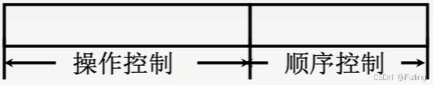{style="max-width:400px; box-sizing:content-box;"}

  2. 垂直型微指令：一条微指令只能定义一个微命令，由微操作码字段规定具体功能

     - 优点：微指令短、简单、规整，便于编写微程序

     - 缺点：微程序长，执行速度较慢，工作效率低
        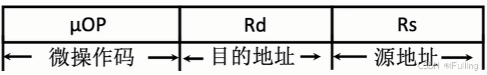{style="max-width:400px; box-sizing:content-box;"}

  3. 混合型微指令：

     - 在垂直型的基础上增加一些不太复杂的并行操作。

     - 微指令较短，仍便于编写；微程序也不长，执行速度加快。

---

- 微指令的编码方式，又称为微指令的控制方式。

  - 它是指如何对微指令的控制字段进行编码，以形成控制信号。

  - 编码的目标是在保证速度的情况下，尽量缩短微指令字长。

> 以水平型微指令为例。

1. 直接编码（直接控制）方式：

   - 在微指令的操作控制字段中，每一位代表一个微操作命令。如规定某位为 1 表示该控制信号有效

   - 优点：简单、直观、执行速度快，操作并行性好

   - 缺点：微指令字长过长， $n$ 个微命令就要求微指令的操作字段有 $n$ 位，造成控存（CM）容量极大
      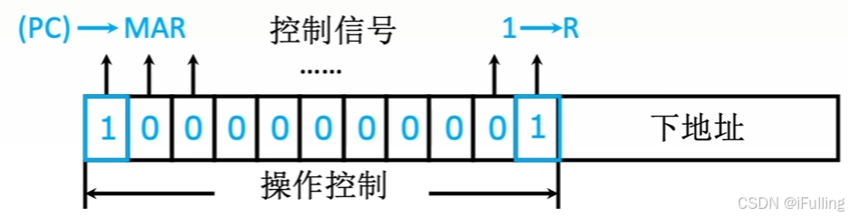{style="max-width:500px; box-sizing:content-box;"}

2. 字段直接编码方式

   - 将微指令的控制字段分成若干个 ”段“，每段经编译后发出控制信号

   - 微命令字段分段原则：

     1. 互斥性微命令分在同一段内，相容性微命令分在不同段内

     2. 每个小段中包含的信息位不能太多，否则将增加译码线路的复杂性和译码时间

     3. 一般每个小段还要留出一个状态，表示本字段不发出任何微命令。因此，当某字段的长度为 3 位时，最多只能表示 7 个互斥的微命令，通常用 000 表示不操作。

   - 优点：可以缩短微指令字长

   - 缺点：要通过译码电路后再发出微命令，因此比直接编码方式慢。
      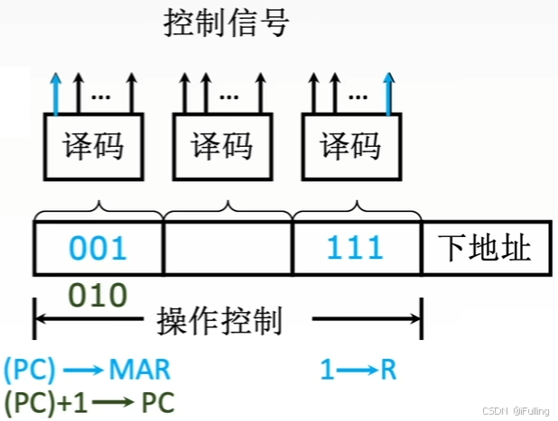{style="max-width:500px; box-sizing:content-box;"}

3. 字段间接编码方式

   - 一个字段的某些微命令需由另一个字段中的某些微命令来解释，由于不是靠字段直接译码发出的微命令，故称为字段间接编码，又称隐式编码。

   - 优点：可进一步缩短微指令字长。

   - 缺点：削弱了微指令的并行控制能力，故通常作为字段直接编码方式的一种辅助手段。
      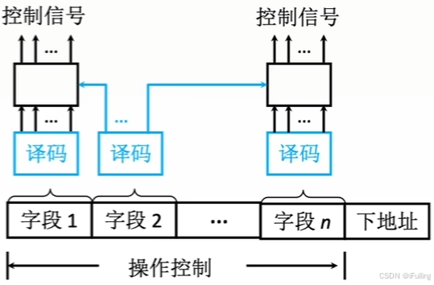{style="max-width:500px; box-sizing:content-box;"}

---

- 微指令的地址形成方式

  1. 微指令的下地址字段指出：微指令格式中设置一个下地址字段，由微指令的下地址字段直接指出后继微指令的地址，这种方式又称为 **断定方式** 。

  2. 根据机器指令的操作码形成：当机器指令取至指令寄存器后，微指令的地址由操作码经为地址形成部件形成。

  3. 增量 **计数器法** ：在当前微指令执行结束后，把地址信息加一。 $\text{(CMAR)}+1 \rightarrow \text{CMAR}$

  4. 分支转移

     - 转移方式：指明判别条件

     - 转移地址：指明转移成功后的去向
        {style="max-width:500px; box-sizing:content-box;"}

  5. 通过测试网络：即顺序逻辑，当前执行的微指令结合标志信息决定接下来应该执行的微指令的存放地址。如根据间址标志信息决定是否需要进入间址周期。
      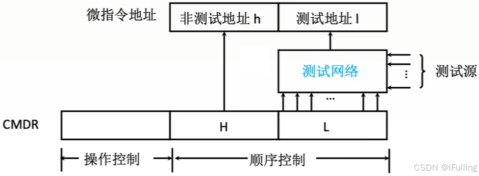{style="max-width:600px; box-sizing:content-box;"}

  6. 由硬件产生微程序入口地址

     - 第一条微指令地址：由专门硬件产生（用专门的硬件记录取指周期微程序首地址）

     - 中断周期：由硬件产生中断周期微程序首地址（用专门的硬件记录）

##### Ⅴ. 微程序控制单元的设计

- 设计步骤：

  1. 分析每个阶段的微操作序列

  2. 写出对应机器指令的微操作命令及节拍安排

     1. 写出每个周期所需要的微操作（参考硬布线）

     2. 补充微程序控制器特有的微操作：```plaintext
        ## --------------------- 取指周期 ---------------------
         // 需要用一个节拍确定下一条微指令的地址，每条微指令结束之后都需要进行
        Ad(CMDR) → CMAR		
        // 取指周期的最后一条微指令完成后，要根据指令操作码确定其执行周期微指令序列的首地址
        OP (IR) → 微地址形成部件 → CMAR         

        ## --------------------- 执行周期 ---------------------
        // 和取指周期一样
        Ad(CMDR) → CMAR		
        ```

     - 每执行完一条微指令后，都需要再用一个节拍指明下一条微指令的存放地址。因此，微程序控制器的速度比硬布线控制器更慢。以取指周期为例。```plaintext
       ## --------------------- T0 微指令a ---------------------
       PC → MAR             // 程序计数器值送地址寄存器
       1 → R                // 发出读命令

       ## --------------------- T1 ---------------------
       Ad(CMDR) → CMAR		 // 需要用 T1 节拍确定下一条微指令的地址

       ## --------------------- T2 微指令 b ---------------------
       M (MAR) → MDR        // 按地址读内存到数据寄存器
       (PC) + 1 → PC        // 程序计数器自增，指向下一条指令


       ## --------------------- T3 ---------------------
       Ad(CMDR) → CMAR		 // 需要用 T3 节拍确定下一条微指令的地址
    
       ## --------------------- T4 微指令 c ---------------------
       MDR → IR             			// 数据寄存器值送指令寄存器
       OP (IR) → 微地址形成部件         // 指令操作码送微地址形成部件
    
       ## --------------------- T5 ---------------------
       微地址形成部件 → CMAR		 // 根据指令操作码确定其执行周期微指令序列的首地址
       ```

  3. 确定微指令格式

     - 根据微操作个数决定采用何种编码方式（直接编码、字段直接编码、字段间接编码），以确定微指令的操作控制字段的位数。

     - 根据 CM 中存储的微指令总数，确定微指令的顺序控制字段的位数。

     - 最后按操作控制字段位数和顺序控制字段位数就可确定微指令字长。

  4. 编写微指令码点

     - 根据操作控制字段每一位代表的微操作命令，编写每一条微指令的码点。

- 微程序设计分类

  1. 静态微程序设计和动态微程序设计

     - 静态：微程序无需改变，采用 ROM

     - 动态：通过改变微指令和微程序改变机器指令，有利于仿真，采用 EPROM

  2. 毫微程序设计

     - 微程序设计：用微程序解释机器指令

     - 毫微程序设计：用毫微程序解释微程序

     - 豪微指令与微指令的关系好比微指令与机器指令的关系。

#### 3. 硬布线与微程序的比较

| 对比项目 | 微程序控制器 | 硬布线控制器 |
|:---:|:---:|:---:|
| 工作原理 | 微操作控制信号以微程序的形式存放在控制存储器中，执行指令时读出即可 | 微操作控制信号由组合逻辑电路根据当前的指令码、状态和时序，即时产生 |
| 执行速度 | 慢 | 快 |
| 规整性 | 较规整 | 繁琐、不规整 |
| 应用场合 | CISC CPU | RISC CPU |
| 易扩充性 | 易扩充修改 | 困难 |


### 五、指令流水线

#### 1. 基本概念

- 指令执行过程划分为不同阶段，占用不同资源没就能使多条指令同时执行。

- 根据计算机的不同，具体的分法页不同。常见的分法是【取值、分析、执行】

1. 顺序执行方式：

   - 传统冯诺依曼机采用顺序执行方式，又称串行执行方式。

   - 设取值、分析、执行 3 个阶段的时间都相同，用 $t$ 表示，则分析 $n$ 条指令的执行时间总耗时 $T=n × 3t=3nt$

   - 优点：控制简单，硬件代价小

   - 缺点：执行指令的速度较慢，在任何时刻，处理及中只有一条指令在执行，各功能部件的利用率很低
      {style="max-width:600px; box-sizing:content-box;"}

2. 一次重叠执行方式

   - 第二条指令的第一个阶段和上一条指令的最后一个阶段在时间上重叠。则 $n$ 条指令的执行时间总耗时 $T=3t+(n-1)×2t=(1+2n)t$

   - 优点：程序的执行时间缩短了 $\frac{1}{3}
     $ ，各功能部件的利用率明显提高

   - 缺点：需要付出硬件上较大开销的代价，控制过程也比顺序执行复杂。
      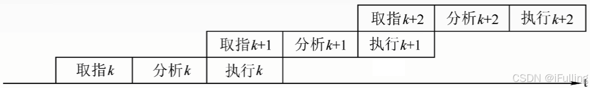{style="max-width:600px; box-sizing:content-box;"}

3. 二次重叠执行方式

   - 与顺序执行方式相比，指令的执行时间缩短近 $\frac{2}{3}
     $ 。这是较理想的指令执行方式，在正常情况下，处理机中同时有 3 条指令在执行。

   - $n$ 条指令的执行时间总耗时 $T=3t+(n-1)×t=(2+n)t$

   - 也可以把每条指令的执行过程分为 4 个或 5 个阶段，分成 5 个阶段是比较常见的做法。
      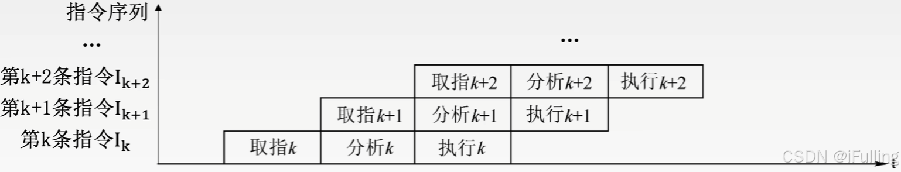{style="max-width:600px; box-sizing:content-box;"}

---

- 流水线的表示方式

  1. 指令执行过程图：

     - 即二次重叠执行方式的示例图，横轴表时间，纵轴表指令序列。每个纵坐标表示一条指令的执行

     - 主要用于分析指令执行过程以及影响流水线的因素

  2. 时空图

     - 横轴表时间，纵坐标表不同阶段所对应的不同的硬件资源（空间）

     - 主要用于分析流水线的性能
        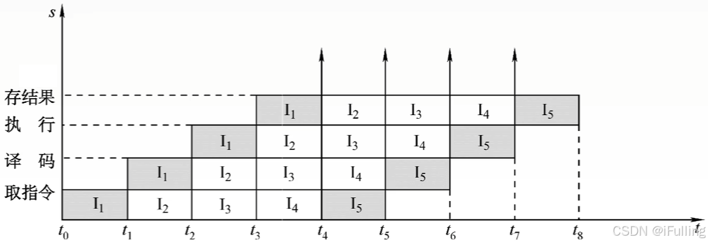{style="max-width:600px; box-sizing:content-box;"}

#### 2. 性能指标

1. 吞吐率

   - 吞吐率是指单位时间内流水线所完成的任务数量，或是输出结构的数量

   - 装入时间：第一条指令从取值到结束这一段时间

   - 排空时间：最后一条指令从取值到结束这一段时间

   - 设任务数为 $n$ ，处理完成 $n$ 个任务所用的时间为 $T_k$ ，则计算流水线吞吐率 $TP$ 的最基本公式为

     $$
     TP=\frac{n}{T_k}
   $$
   
   > 理想情况下，流水线的时空图如下：
   >  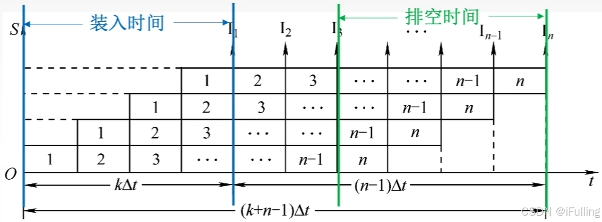{style="max-width:600px; box-sizing:content-box;"}
   > 
   > 一条指令的执行分为 $k$ 个阶段，每个阶段耗时 $Δt$ ，一般取 $Δt$ = 一个时钟周期
   > 
   > - $T_k=(k+n-1)Δt$
   > 
   > - 流水线的实际吞吐率为 $TP=n / (k+n-1)Δt$
   > 
   > - 当连续输入的任务 $n→∞$ 时，得最大吞吐率为 $\text{TP}_{max}=1/Δt$
   > 
   >
   
2. 加速比

   - 完成同样一批任务，不使用流水线的时间与使用流水线所用的时间之比。

   - 设 $T_0$ 表示不使用流水线的执行时间，即顺序执行所用的时间； $T_k$ 表示使用流水线时的执行时间，则计算流水线加速比 $S$ 的基本公式为

     $$
     S=\frac{T_0}{T_k}
   $$
   
   > 
   > 
   > - 依旧是理想情况下，单独完成一个任务耗时为 $kΔt$ ，则顺序完成 $n$ 个任务耗时 $T_0=nkΔt$ 。
   > 
   > - 实际加速比为 $S=\frac{knΔt}{(k+n-1)Δt}=\frac{kn}{k+n-1}
   >   $ 。
   > 
   > - 当连续输入的任务 $n→∞$ 时，最大加速比 $S_{max}=k$
   > 
   >
   
3. 效率

   - 流水线的效率是指流水线的设备利用率（硬件设备处于忙碌的时间占总时间的比例）。

   - 在时空图上，流水线的效率定义为完成 $n$ 个任务占用的时空区有效面积与 $n$ 个任务所用的时间与 $k$ 个流水段所围成的时空区总面积之比。则流水线效率 $E$ 的一般公式为

     $$
     E=\frac{n个任务占用 k时空区有效面积}{n 个任务所用的时间与k个流水段所围成的时空区总面积}=\frac{T_0}{kT_k}
   $$
   
   > 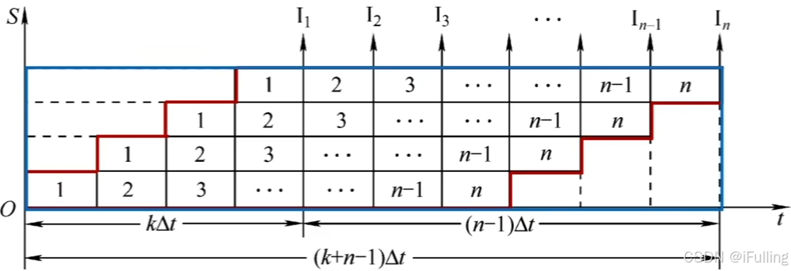{style="max-width:600px; box-sizing:content-box;"}
   > 
   > - 当连续输入的任务 $n→∞$ 时，最高效率 $E_{max}=1$
   > 
   >

#### 3. 五段式指令流水线

##### Ⅰ. 基本概念

- 对于大部分五段式指令流水线，所有指令一定是五个机器周期，可以在某个阶段什么都不做，但是时间一定要跑满

- 为方便流水线的设计，将每个阶段的耗时取成一样，以最长耗时为准。此处将机器周期设置为 100ns。

- 流水线每一个功能段部件后面都要有一个缓冲存储器，或称为锁存器，其作用是保存本流水段的执行结果，提供给下一流水段使用。有了锁存器，就能统一每个阶段的时间开销。

 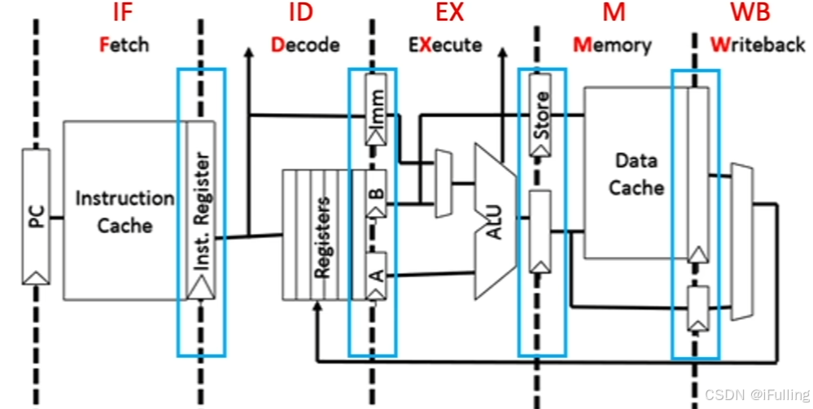{style="max-width:700px; box-sizing:content-box;"}

- 参考上图，一条指令的执行分为五个阶段：

  1. 取指阶段（IF）：根据 PC 所指向的位置去 Instruction Cache 找出当前要执行的这条指令，然后把找到的指令放到功能段的锁存器中。

  2. 指令译码阶段（ID）：完成指令译码工作、以及取数操作，把这条指令要用的操作数从通用寄存器中取出来放到锁存器里。

  3. 执行阶段（EX）：用 ALU 来处理上一个阶段取出的操作数，把输出结果放到锁存器中。

  4. 访存阶段（M）：运算结果可能需要写回主存，也可能写入锁存器。

     - 首先访问 Data Cache，如果未命中再访问主存。

     - RISC 处理器只有 “取数 LOAD” 和 “存数 STORE” 指令才能访问主存。

  5. 写回阶段（WB）：将上一阶段锁存器的运算结果写回通用寄存器

##### Ⅱ. 常见的五类指令

> Rs 指源操作数（source）
> Rd 指目的操作数（destination）
> 下面的各种英文名字参考上图

1. 运算类指令

   - IF：根据 PC 从指令 Cache 取指令至 IF 段的锁存器

   - ID：去除操作数至 ID 段锁存器

   - EX：运算，将结果存入 EX 段锁存器

   - M：空段

   - WB：将运算结果写回指定寄存器

2. 取数（LOAD）指令

   - IF：根据 PC 从指令 Cache 取指令至 IF 段的锁存器

   - ID：将基址寄存器的值放到锁存器 A，将偏移量的值放到立即数锁存器 Imm

   - EX：运算，得到有效地址 EA

   - M：根据 EA 从数据 Cache 中取数并放入锁存器

   - WB：将取出的数写回寄存器

3. 存数（STORE）指令

   - IF：······

   - ID：将基址寄存器的值放到锁存器 A，将偏移量的值放到 Imm，将要存的数放到 B

   - EX：运算，得到有效地址 EA，并将是锁存器 B 的内容放到锁存器 Store 中。

   - M：写入数据 Cache

   - WB：空段

4. 条件转移指令：> 
   > 
   > - 转移类指令常采用相对地址
   > 
   > - 假设每条指令固定 4B
   > 
   > 

   | 指令的汇编格式 | 英文 | 功能 | 说明 |
   |:---|:---:|:---|:---|
   | `beq Rs,Rt,#偏移量` | branch equal | 若 `(Rs) == (Rt)` <br/>则 `(PC) + 指令字长 + (偏移量 × 指令字长) → PC` <br/>否则 `(PC) + 指令字长 → PC` | 如果相等<br/>就转移到 `当前指令 + 指令字长 4 + (偏移量 996 × 4)` <br/>否则，顺序执行下一条指令 |
   | `bne Rs,Rt,#偏移量` | branch not equal | 若 `(Rs) != (Rt)` <br/>则 `(PC) + 指令字长 + (偏移量 × 指令字长) → PC` <br/>否则 `(PC) + 指令字长 → PC` | 如果不相等<br/>就转移到 `当前指令 + 指令字长 4 + (偏移量 996 × 4)` <br/>否则，顺序执行下一条指令 |

   - IF：······

   - ID：进行比较的两个数放入锁存器 A、B；偏移量放入 Imm

   - EX：运算，比较两个数

   - M：不进行访存，将目标 PC 值写回 PC

   - WB：空段

5. 无条件转移指令

   - IF：······

   - ID：偏移量放入 Imm

   - EX：把目标 PC 值写回 PC

   - M：空段

   - WB：空段

#### 4. 影响因素和分类

##### Ⅰ. 影响因素

1. 结构相关（资源冲突）

   - 结构相关是指：由于多条指令在同一时刻争用同一资源而形成的冲突。类似于操作系统中的资源互斥。

   - 解决办法：

     1. 后一相关指令暂停一周期

     2. 资源重复配置：不进行访存，而是用不同的存储器存放数据和指令。数据存储器 + 指令存储器
         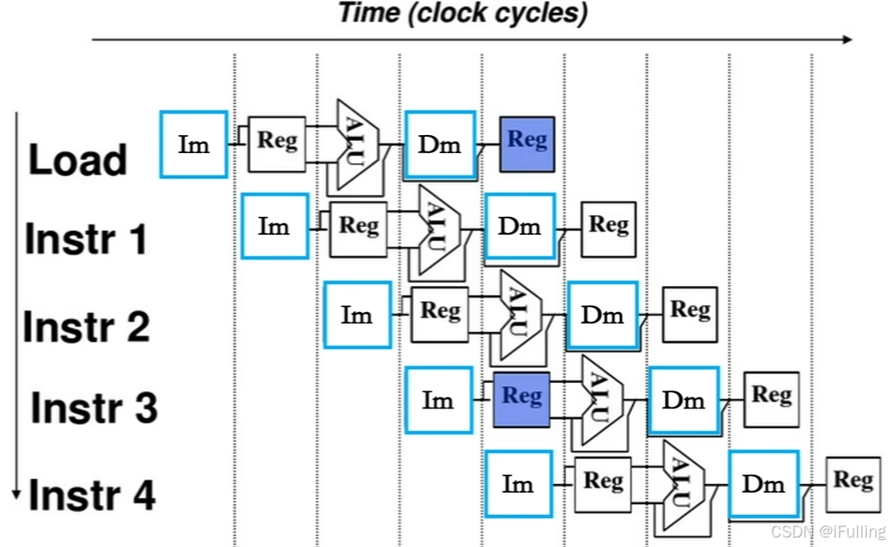{style="max-width:600px; box-sizing:content-box;"}

2. 数据相关（数据冲突）

   - 数据相关是指：在一个程序中，存在必须等前一指令执行完才能执行后一条指令的情况。类似于操作系统中的同步。

   - 解决办法：

     1. 把遇到数据相关的指令及其后续指令都暂停一至几个时钟周期，知道数据相关问题消失后再继续执行。可分为硬件阻塞（stall）和软件插入 “NOP” 两种方法。
         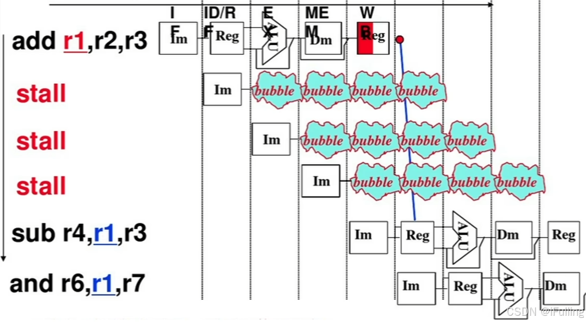{style="max-width:600px; box-sizing:content-box;"}

     2. 数据旁路技术：也称为转发机制。

     3. 编译优化：通过编译器调整指令顺序来解决数据相关。

3. 控制相关（控制冲突）

   - 当流水线遇到转移指令和其他改变 PC 值的指令而造成断流时，会引起控制相关。
      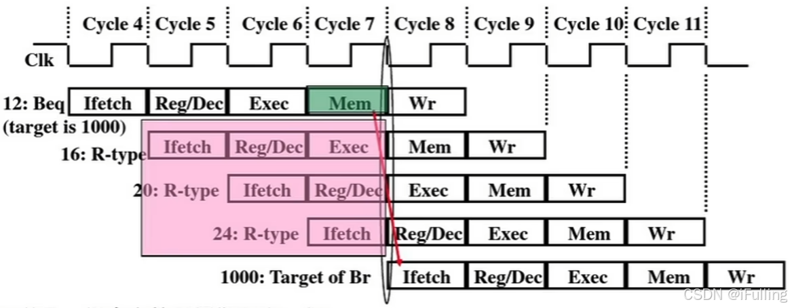{style="max-width:600px; box-sizing:content-box;"}

   - 解决办法：

     1. 转移指令分支预测：简单预测（永远猜 true 或 false）、动态预测（根据历史情况动态调整）

     2. 预取转移成功和不成功两个控制流方向上的目标指令。

     3. 加快和提前形成条件码。

     4. 提高转移方向的猜准率，是第一种方法的优化。

---

##### Ⅱ. 流水线的多发技术

1. 超标量技术

   - 每个时钟周期内可并发多条独立指令。是一种空分复用技术

   - 要配置多个功能部件

   - 不能调整指令的执行顺序

   - 通过编译优化技术，把可并行执行的指令搭配起来
      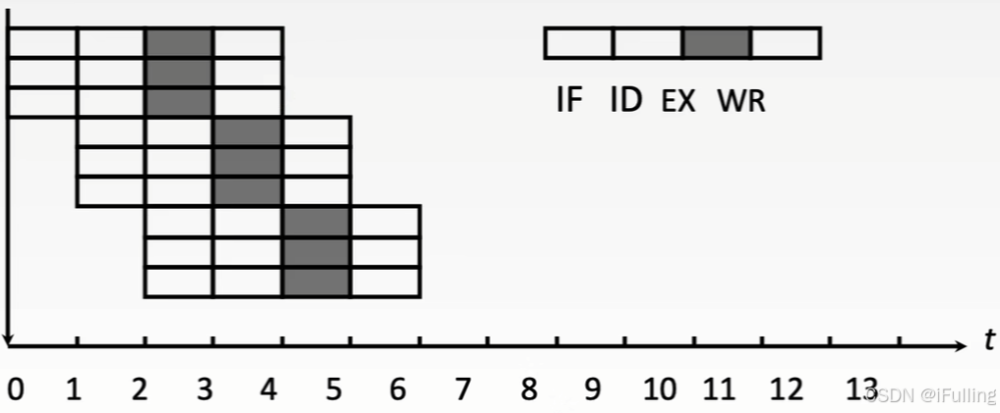{style="max-width:600px; box-sizing:content-box;"}

2. 超流水技术

   - 在一个时钟周期内再分段（如 3 段）。是一种时分复用技术

   - 再一个时钟周期内一个功能部件使用多次（如 3 次）

   - 不能调整指令的执行顺序

   - 靠编译程序解决优化问题
      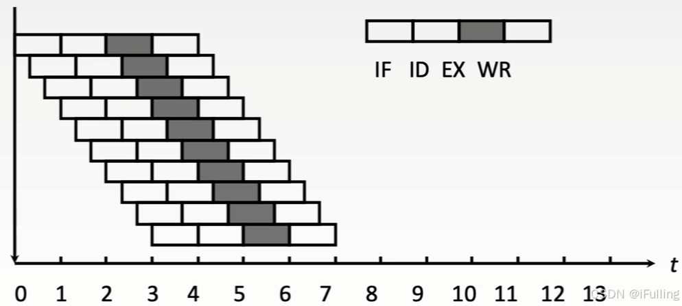{style="max-width:600px; box-sizing:content-box;"}

3. 超长指令字

   - 由编译程序挖掘出指令间潜在的并行性，会将多条能并行操作的指令组合成一条具有多个操作码字段的超长指令字（可达几百位）

   - 采用多个处理部件
      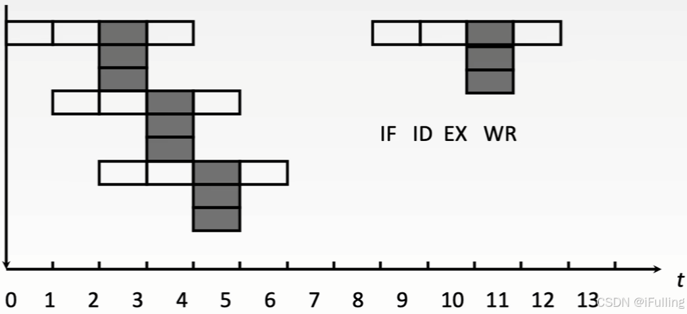{style="max-width:600px; box-sizing:content-box;"}

---

##### Ⅲ. 流水线的分类

1. 根据流水线使用的级别不同，流水线可分为【部件功能级流水线、处理机级流水线、处理机间流水线】

   - 部件功能级流水线：将复杂的算术逻辑运算组成流水线工作方式。例如：可将浮点加法操作分成求阶差、对阶、尾数相加以及结果规格化等 4 个子过程。

   - 处理机级流水线：把一条指令解释过程分成多个子过程，如五段式指令流水线。

   - 处理机间流水线：是一种宏流水，其中每一个处理机完成某一专门任务，各个处理机所得到的结果需存放在与下一个处理机所共享的存储器中。

2. 按流水线可以完成的功能，流水线可分为【单功能流水线、多功能流水线】

   - 单功能流水线：智能实现一种固定的专门功能的流水线。

   - 多功能流水线：通过各段间的不同连接方式可以同时或不同时地实现多种功能的流水线。

3. 按同一时间内各段之间的连接方式，流水线可分为【静态流水线、动态流水线】

   - 静态流水线：在同一时间内，流水线的各段只能按同一种功能的连接方式工作。

   - 动态流水线：在同一时间内，当某些段正在实现某种运算时，另一些段却正在进行另一种运算，这样对提高流水线的效率很有好处，但会使流水线控制变得很复杂。

4. 按流水线的各个功能段是否有反馈信号，流水线可分为【线性流水线、非线性流水线】

   - 线性流水线：从输入到输出，每个功能段只允许经过一次，不存在反馈回路。

   - 非线性流水线：存在反馈回路，从输入到输出过程中，某些功能段将数次通过流水线，这种流水线适合线性递归的运算。

### 六、多处理器系统

#### 1. SISD、SIMD、MIMD、向量处理机

- SISD：单指令流单数据流

  - 本课程探讨的就是 SISD。

  - 特性：

    1. 各指令序列只能并发、不能并行，每条指令处理一两个数据。

    2. 不是 数据级并行技术

  - 硬件组成：

    1. 一个处理器 + 一个主存储器。

    2. 若采用指令流水线，需设置多个功能部件，采用多模块交叉存储器
        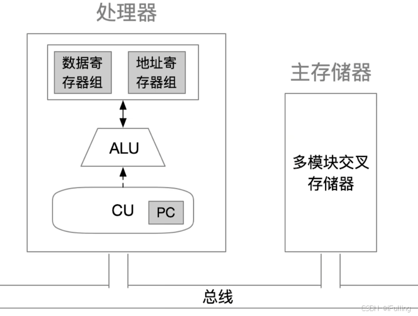{style="max-width:500px; box-sizing:content-box;"}

- SIMD：单指令流多数据流

  - 对结构类似的大量数据进行相同处理。一条指令处理很多个数据

  - 应用：

    - 某些显卡常采用 SIMD，图像处理时，常对每个像素点进行完全一样的渲染

    - 可用于优化 for 循环中对 数组元素 的重复处理

  - 特性：

    1. 各指令序列只能并发、不能并行，但每条指令可同时处理很多个具有相同特征的数据

    2. 是一种 数据级并行技术

  - 硬件组成：

    1. 一个指令控制部件（CU）+ 多个处理单元 / 执行单元（如 ALU）+ 多个局部存储器 + 一个主存储器

    2. 每个执行单元有各自的寄存器组、局部存储器、地址寄存器

    3. 不同执行单元执行同一条指令，处理不同的数据
        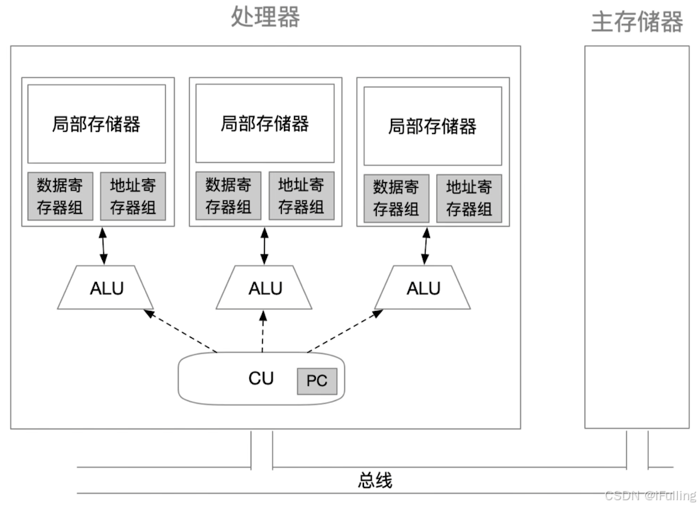{style="max-width:600px; box-sizing:content-box;"}

- MISD：多指令流单数据流

  - 多条指令并行执行，处理同一个数据。现实中不存在这种计算机

- MIMD：多指令流多数据流

  - 应用：现代个人计算机 CPU，如 Intel i5

  - 特性：

    1. 各指令序列并行执行，分别处理多个不同的数据

    2. 是一种 线程级并行、甚至是线程级以上并行技术

  - 进一步分类：多处理器系统、多计算机系统

- 向量处理机：SIMD 思想的进阶应用

  - 向量处理机的 LOAD 指令，可以将一个向量取到向量寄存器中；

  - 应用：向量计算、大量浮点数计算、空气动力学等；“银河” 超算

  - 特性：

    1. 一条指令的处理对象是“向量”

    2. 擅长对向量型数据并行计算、浮点数运算，常被用于超级计算机中，处理科学研究中巨大运算量

  - 硬件组成：

    1. 多个处理单元，多组 “向量寄存器”

    2. 主存储器采用 “多个端口同时读取” 的交叉多模块存储器

    3. 主存储器大小限定了机器的解题规模，因此要有大容量的、集中式的主存储器
        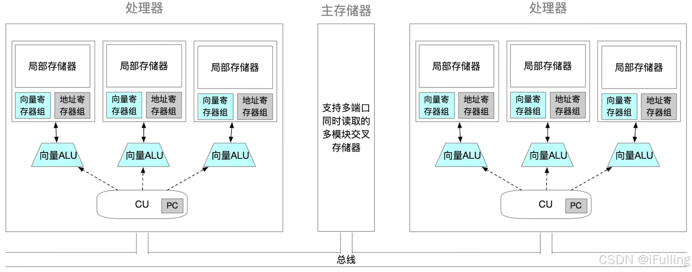{style="max-width:700px; box-sizing:content-box;"}

#### 2. 共享内存多处理器

- 共享内存多处理器（Shared Memory multiProcessor，SMP），简称 多处理器系统

- 应用：现代计算机、智能手机

- 特性：

  - 各处理器之间，可以通过 LOAD / STORE 指令，访问同一个主存储器，可通过主存相互传送数据

- 硬件组成：

  1. 一台计算机中，包含多个处理器 + 一个主存储器

  2. 多个处理器共享单一的物理地址空间

---

- 还有个名叫 多核处理器，描述的是一个东西，只是命名角度不同。

- 一个 CPU 芯片中包含了多个处理器，即多个核（Core），因此通常也称为 片级多处理器（Chip-Level MultiProcessor，CMP）

- 所有核共享一个 LLC（Last-Level Cache），并共享主存储器
   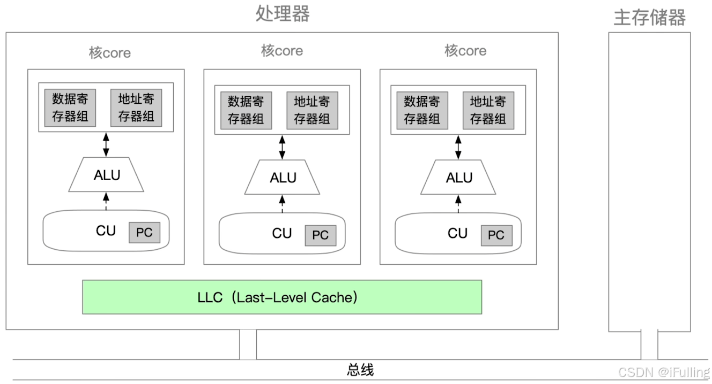{style="max-width:700px; box-sizing:content-box;"}

#### 3. 多计算机系统

- 也称为消息传递系统

- 应用：多台计算机组成的 “分布式计算系统”

- 特性：各计算机之间，不能通过 LOAD / STORE 指令直接访问对方的存储器，只能通过 “消息传递” 相互传送数据

- 硬件组成：

  - 由多台计算机组成，因此拥有多个处理器 + 多个主存储器

  - 每台计算机拥有各自的私有存储器，物理地址空间相互独立
     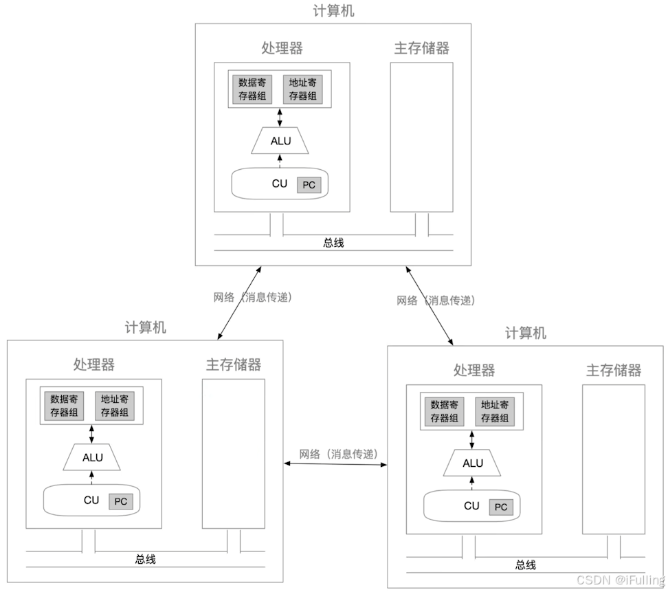{style="max-width:700px; box-sizing:content-box;"}

### 七、硬件多线程

#### 1. 处理器示意图

- 传统的单核处理器，不支持硬件多线程的处理器
   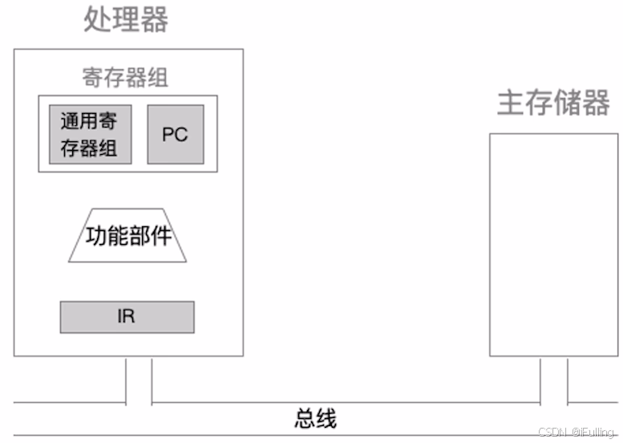{style="max-width:500px; box-sizing:content-box;"}

- 支持硬件多线程的处理器
   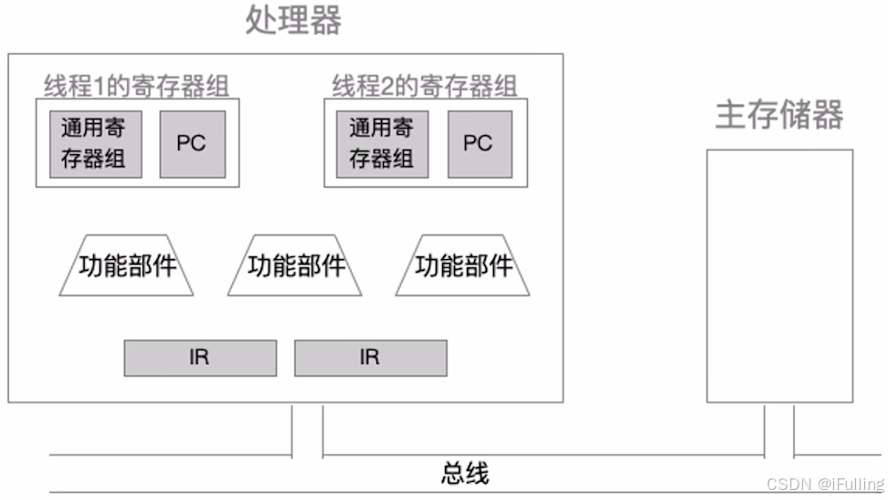{style="max-width:500px; box-sizing:content-box;"}

#### 2. 硬件多线程区别

|   | 细粒度多线程 | 粗粒度多线程 | 同时多线程（SMT） |
|:---:|:---|:---|:---|
| 指令发射 | 轮流发送各线程的指令（每个时钟周期发送一个线程） | 连续几个时钟周期，都发送同一线程的指令序列，流水线阻塞时，切换到另一个线程 | 一个时钟周期内，同时发射多个线程的指令 |
| 线程切换频率 | 每个时钟周期切换一次线程 | 只有流水线阻塞时才切换一次线程 | - |
| 线程切换代价 | 低 | 高，需要重载流水线 | - |
| 并行性 | 指令级并行，线程间不并行 | 指令级并行，线程间不并行 | 指令级并行，线程级并行 |


 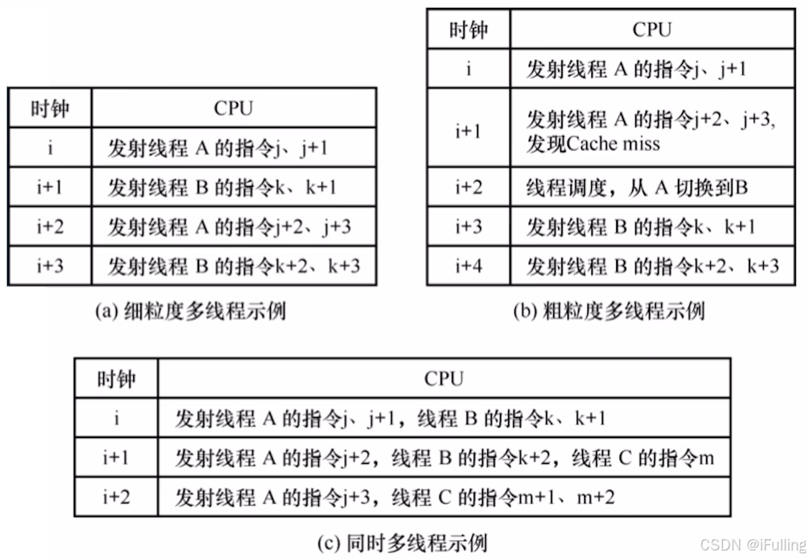{style="max-width:600px; box-sizing:content-box;"}

## 第六章：总线

### 一、总线概述

#### 1. 基本概念

- 总线：是一组能为多个部件分时共享的公告信息传送线路。

  - 共享：总线上可以挂接多个部件，各个部件之间互相交换的信息都可以通过这组线路分时共享。

  - 分时：同一时刻只允许有一个部件向总线发送信息，如果系统中有多个部件，则它们只能分时地向总线发送信息。

- 早期计算机外部设备少，大多采用分散链接方式，不易实现随时增减外部设备。为了更好地解决 IO 设备和主机之间连接的灵活性问题，计算机的结构从分散连接发展为总线连接。

- 总线的特性：

  1. 机械特性：尺寸、形状、管脚数、排列顺序

  2. 电气特性：传输方向和有效的电平范围

  3. 功能特性：每根传输线的功能（地址、数据、控制）

  4. 时间特性：信号的时序关系

> 假设某根总线由 4 根信号线组成，则可并行发送 4 bit 数据

#### 2. 总线分类

- 按数据传输格式，分为【串行总线、并行总线】

  1. 串行总线：

     - 每次只能传输 1 位数据。如 USB

     - 优点：只需要一根传输线，成本低廉，广泛应用于长距离传输。应用于计算机内部时，可以节省布线空间。

     - 缺点：再数据发送和接受的时候要进行拆卸和装配，要考虑串行-并行转换的问题。

  2. 并行总线：

     - 每次可以传多位。如数据总线

     - 优点：总线的逻辑时序比较简单，电路实现起来比较容易。

     - 缺点：信号线数量多，占用更多的布线空间；远距离传输成本高；由于工作频率较高时，并行的信号线之间会产生严重干扰，对每条线等长的要求也越高，所以无法持续提高工作频率。

- 按总线连接的部件功能，分为【片内总线、 **系统总线** 、通信总线】

  1. 片内总线：

     - 是芯片内部的总线。

     - 它是 CPU 芯片内部寄存器与寄存器之间、寄存器与 ALU 之间的公共连接线。

  2. 系统总线：

     - 是计算机系统内各功能部件（CPU、主存、IO 接口）之间相互连接的总线。

  3. 通信总线：

     - 用于计算机系统之间或计算机系统与其他系统（如远程通信设备、测试设备）之间信息传送的总线，通信总线也称为外部总线。

- 按时序控制方式，分为【同步总线、异步总线】

- 按系统总线传输信息内容的不同，又可分为三类：【地址总线、数据总线、控制总线】

  - 数据总线：传输各功能部件之间的数据信息，包括指令和操作数；位数（根数）与机器字长、存储字长有关。双向传输。

  - 地址总线：传输地址信息，包括主存单元或 IO 端口的地址；位数（根数）与主存地址空间大小及设备数量有关。单向传输。

  - 控制总线：传输控制信息；一根控制线传输一个信号；控制线是单向的，但是总线有很多根控制线，因此总线是双向的。出：CPU 送出的控制命令；入：主存或外设返回 CPU 的反馈信号。
     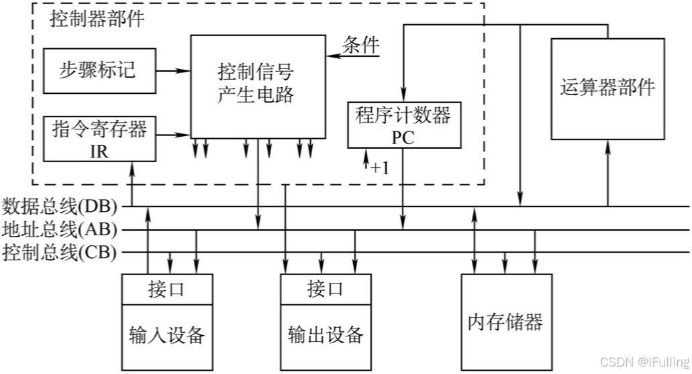{style="max-width:600px; box-sizing:content-box;"}

#### 3. 系统总线经典结构

- 单总线结构

  - CPU、主存、IO 设备（通过 IO 接口）都连接在一组总线上，允许 IO 设备之间、IO 设备和 CPU 之间、IO 设备与主存之间直接交换信息。

  - 优点：结构简单，成本低，易于接入新的设备。

  - 缺点：带宽低、负载重，多个部件只能争用唯一的总线，且不支持并发传送操作。
     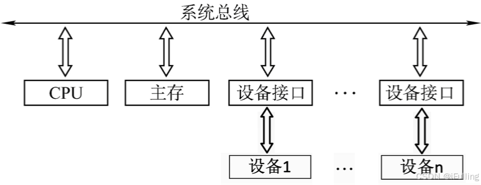{style="max-width:600px; box-sizing:content-box;"}

- 双总线结构

  - 有两条总线，一条是主存总线，用于 CPU、主存和通道之间进行数据传送；另一条是 IO 总线，用于多个外部设备与通道之间进行数据传送。

  - 通道是具有特殊功能的处理器，能对 IO 设备进行统一管理。通道程序放在主存中。

  - 主存总线支持突发（猝发）传送：送出一个地址，收到多个地址连续的数据。
     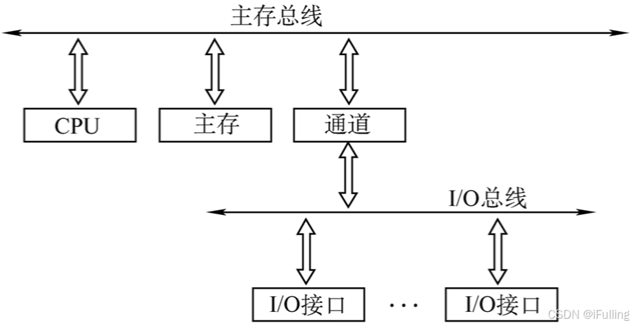{style="max-width:600px; box-sizing:content-box;"}

- 三总线结构

  - 在计算机系统各部件之间采用 3 条各自独立的总线来构成信息通路，这 3 条总线分别为主存总线、IO 总线和直接内存访问（DMA）总线。

  - 优点：提高了 IO 设备的性能，使其更快地响应命令，提高系统吞吞吐量。

  - 缺点：系统工作效率较低。
     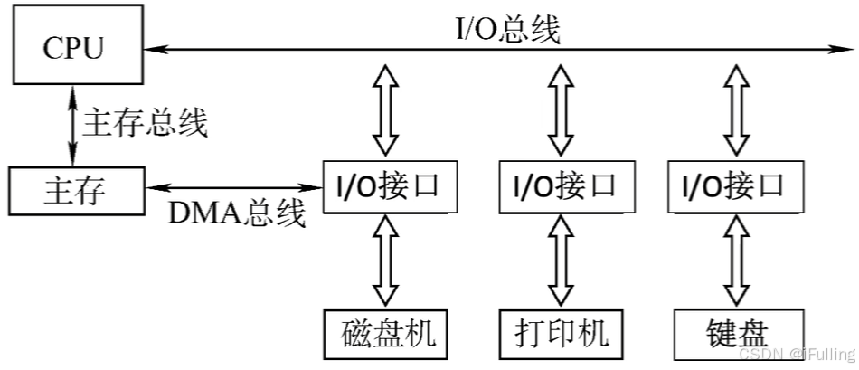{style="max-width:600px; box-sizing:content-box;"}

- 四总线结构

  - 现代计算机使用的总线结构，但了解即可。

  - 桥接器：用于连接不同总线，具有数据缓冲、转换和控制功能。如北桥、南桥。

  - 靠近 CPU 的总线速度较快。

  - 每级总线的设计遵循总线标准。
     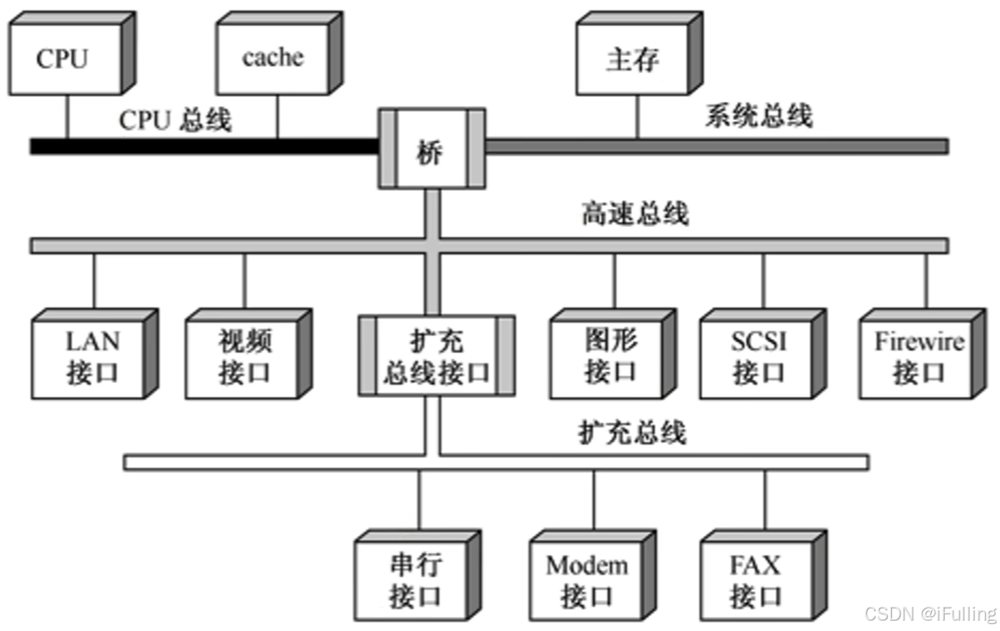{style="max-width:600px; box-sizing:content-box;"}

### 二、总线性能指标

1. 传输周期（总线周期）

   - 一个总线操作所需的时间（包括申请阶段、寻址阶段、传输阶段和结束阶段），通常由若干个总线时钟周期构成。

     1. 申请分配阶段：由需要使用总线的主模块（或主设备）提出申请，经总线仲裁机构决定将下一传输周期的总线使用权授予某一申请者。也可将此阶段细分为传输请求和总线仲裁两个阶段。

     2. 寻址阶段：获得使用权的主模块通过总线发出本次要访问的从模块的地址及有关命令，启动参与本次传输的从模块。

     3. 传输阶段：主模块和从模块进行数据交换，可单向或双向进行数据传送。

     4. 结束阶段：主模块的有关信息均从系统总线上撤除，让出总线使用权。

   > 总线周期与总线时钟周期的关系比较魔幻。
   > 
   > - 大多数情况下，一个总线周期包含多个总线时钟周期
   > 
   > - 有的时候，一个总线周期就是一个总线时钟周期
   > 
   > - 有的时候，一个总线时钟周期可包含多个总线周期
   > 
   >

2. 时钟周期

   - 即机器的时钟周期。

   - 计算机有一个统一的时钟，以控制整个计算机的各个部件，总线也要受此时钟的控制。

   - 现代计算机中，总线时钟周期也有可能由桥接器提供。

3. 工作频率

   - 总线上各种操作的频率，为总线周期的倒数。

   - 若总线周期 = $N$ 个时钟周期，则总线的 $工作频率 = \frac{时钟周期}{N}
     $

   - 实际上指一秒内传送几次数据。

4. 时钟频率

   - 即机器的时钟频率，为时钟周期的倒数。

   - 若时钟周期为 $T$ ，则时钟频率为 $\frac{1}{T}
     $

   - 实际上指一秒内有多少个时钟周期

5. 总线宽度

   - 又称为总线位宽，它是总线上同时能够传输的数据位数，通常是指 **数据总线的根数** ，如 32 根称为 32 位（bit） 总线

6. 总线带宽

   - 可理解为总线的数据传输率，即单位时间内总线上可传输数据的位数，通常用每秒钟传送信息的字节数来衡量，单位可用字节 / 秒（B/s）表示。

   - 总线带宽指总线本身所能达到的最高传输速率。

   - 在计算实际的有效数据传输率时，要用实际传输的数据量除以耗时。

     $$
     \begin{align}总线带宽 & = 总线工作频率 × 总线宽度 \tag{bit/s} \\[2ex] & = 总线工作频率 ×(总线宽度 / 8) \tag{B/s} \\[2ex] & = \frac{总线宽度}{总线周期} \tag{bit/s} \\[2ex] & = \frac{总线宽度 / 8}{总线周期} \tag{B/s} \\[2ex] \end{align}
   $$
   
   > 串行总线和并行总线的速度对比：
   > 
   > - 工作频率相同时，串行总线传输速度比并行总线慢。
   > 
   > - 并行总线的工作频率无法持续提高，而串行总线可以通过不断提高工作频率来提高传输速度，最终超过并行总线。
   > 
   >
   
7. 总线复用

   - 总线复用是指一种信号线在不同的时间传输不同的信息。

   - 可以使用较少的线传输更多的信息，从而节省了空间和成本。

8. 信号线数

   - 地址总线、数据总线、控制总线 3 种总线数的总和称为信号线数。

### 三、总线操作和定时

- 总线定时：是指总线在双方交换数据的过程中需要时间上配合关系的控制，这种控制称为总线定时，它的实质是一种协议或规则。

#### 1. 同步通信

- 也称为同步定时方式，由统一时钟控制数据传送。

- 总线控制器采用一个统一的时钟信号来协调发送和接收双方的传送定时关系。

- 若干个时钟产生相等的时间间隔，每个间隔构成一个总线周期

- 在一个总线周期种，发送方和接受方可进行一次数据传送。

- 因为采用统一的时钟，每个部件或设备发送或接收信息都在固定的总线传送周期中，一个总线的传送周期结束，下一个总线传送周期开始。

- **优点：** 传送速度快，具有较高的传输速率；总线控制逻辑简单。

- **缺点：** 主从设备属于强制性同步；不能及时进行数据通信的有效性检验，可靠性较差。

- **适用：** 总线长度较短及总线所接部件的存取时间比较接近的系统。
   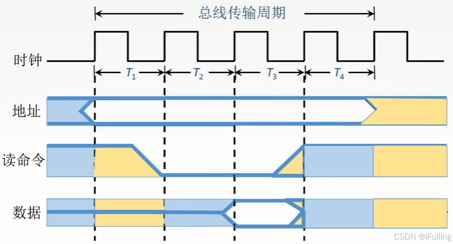{style="max-width:600px; box-sizing:content-box;"}

#### 2. 异步通信

- 也称为异步定时方式；采用应答方式，没有公共时钟标准。

- 在异步定时方式中，没有统一的时钟，也没有固定的时间间隔，完全依靠传送双方相互制约的 “握手” 信号来实现定时控制。

- 主设备提出交换信息的 “请求” 信号，经接口传送到从设备；从设备接到主设备的请求后，经过接口向主设备发出 “回答” 信号。

- 根据 “请求” 和 “回答” 信号的撤销是否互锁，分为 3 种类型：【不互锁方式、半互锁方式、全互锁方式】

  1. **不互锁方式：速度最快，可靠性最差** 。

     - 主设备发出 “请求” 信号后，不必等到接到从设备的 “回答” 信号，而是经过一段时间，便撤销 “请求” 信号。

     - 而从设备在接到 “请求” 信号后，发出 “回答” 信号，并经过一段时间，自动插销 “回答” 信号。

     - 双方不存在互锁关系。
        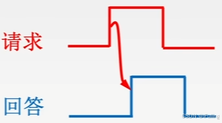 

  2. 半互锁方式

     - 主设备发出 “请求” 信号后，必须待接到从设备的 “回答” 信号后，才撤销 “请求“ 信号，有互锁的关系。

     - 而从设备在接到 ”请求“ 信号后，发出 ”回答“ 信号，但不必等待获知主设备的 ”请求“ 信号已经撤销，而是隔一段时间后自动撤销 ”回答“ 信号，不存在互锁关系。
        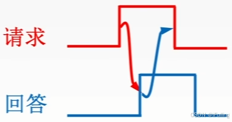 

  3. **全互锁方式：速度最慢，最可靠** 。

     - 主设备发出 “请求” 信号后，必须待从设备 “回答” 后，才撤销 “请求” 信号。

     - 从设备发出 “回答” 信号，必须待获知主设备 “请求” 信号已撤销后，再撤销其 “回答” 信号。

     - 双方存在互锁关系。（类似于三次握手）
        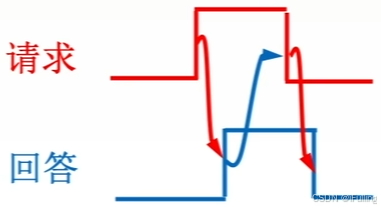 

- **优点：** 总线周期长度可变，能保证两个工作速度相差很大的部件或设备之间可靠地进行信息交换，自动适应时间的配合。

- **缺点：** 比同步控制方式稍复杂一些，速度比同步定时方式慢。

#### 3. 半同步通信

- 同步、异步结合，统一时钟的基础上，增加一个 “等待” 响应信号 $‾\overline{\text{WAIT}}$ 
   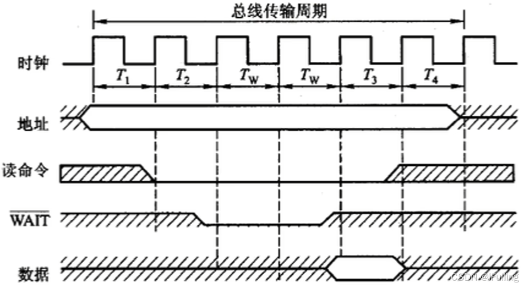{style="max-width:500px; box-sizing:content-box;"}

#### 4. 分离式通信

- 充分挖掘系统总线每瞬间的潜力。（类似于 中断）

- 一个总线传输周期分为 2 个子周期：

  1. 主模块申请占用总线，使用完后放弃总线的使用权

  2. 从模块申请占用总线，将各种信息送至总线上

- 特点：

  1. 各模块均有权申请占用总线

  2. 采用同步方式通信，不等对方回答

  3. 各模块准备数据时，不占用总线

  4. 总线利用率提高

## 第七章：输入/输出系统

### 一、I/O系统基本概念

#### 1. 输入输出系统

- IO 系统由IO 软件和IO 硬件两部分构成。

  - IO 硬件：包括外部设备、IO 接口、IO 总线等。

  - IO 软件：

    - 包括驱动程序、用户程序、管理程序、升级补丁等。

    - 通常采用 IO 指令和通道指令实现主机和 IO 设备的信息交换。

- IO 指令

  - CPU 指令的一部分，但与普通指令格式略有不同。

  - 由【操作码、命令码、设备码】组成

    - 操作码：识别 IO 指令，指明 CPU 要对 IO 接口做什么

    - 命令码：做什么工作，指明 IO 接口要对设备做什么

    - 设备码：对哪个设备进行操作

- 通道指令

  - 通道能识别的指令。

  - 通道程序提前编制好放在主存中

  - 在含有通道的计算机中，CPU 执行的 IO 指令对通道发出命令，由通道执行一系列通道指令，代替 CPU 对 IO 设备进行管理。

---

- I/O 接口：又称 I/O 控制器（I/O Controller）、设备控制器，负责协调主机与外部设备之间的数据传输。

  - IO 控制器多种多样，也会制定相应的标准，如：用于控制 USB 设备的 IO 接口、用于控制 SATA 3.0 硬盘的 IO 接口等。

  - 现在的 IO 接口（芯片）也会被集成在南桥芯片内部。

#### 2. IO 控制方式

1. 程序查询方式：CPU 不断轮询检查 IO 控制器中的 “状态寄存器”，检测到状态为 “已完成” 之后，再从数据寄存器取出输入数据。
    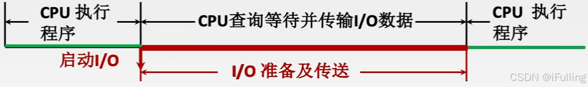{style="max-width:600px; box-sizing:content-box;"}

2. 程序中断方式：等待键盘 IO 时 CPU 可以先去执行其他程序，键盘 IO 完成后 IO 控制器向 CPU 发出中断请求，CPU 响应中断请求，并取走输入数据。
    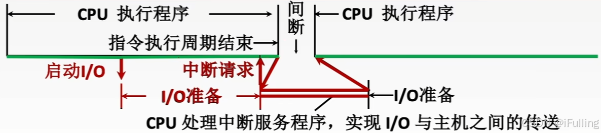{style="max-width:600px; box-sizing:content-box;"}

> 数据流：键盘 → IO 接口的数据寄存器 → 数据总线 → CPU 某寄存器 → 主存

1. DMA 控制方式

   - 直接内存访问（Direct Memory Access，DMA）接口，即 DMA 控制器，也是一种特殊的 IO 控制器。
      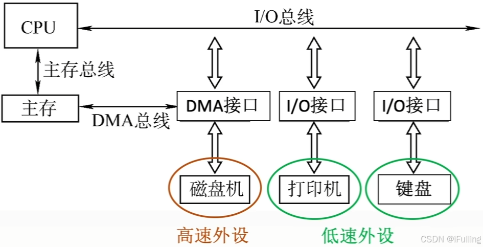{style="max-width:500px; box-sizing:content-box;"}

   - 主存与高速 IO 设备之间有一条直接数据通路（DMA 总线）。CPU 向 DMA 接口发出 “读 / 写” 命令，并指明主存地址、磁盘地址、读写数据量等参数。

   - DMA 控制器自动控制磁盘与主存的数据读写，每完成一整块数据读写（如 1KB 为一整块），才向 CPU 发出一次中断请求。
      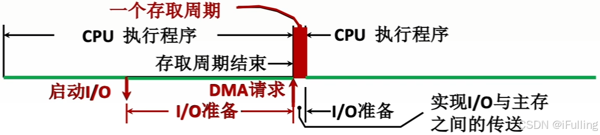{style="max-width:600px; box-sizing:content-box;"}

2. 通道控制方式

   - 通道是具有特殊功能的处理器，能对 IO 设备进行统一管理。
      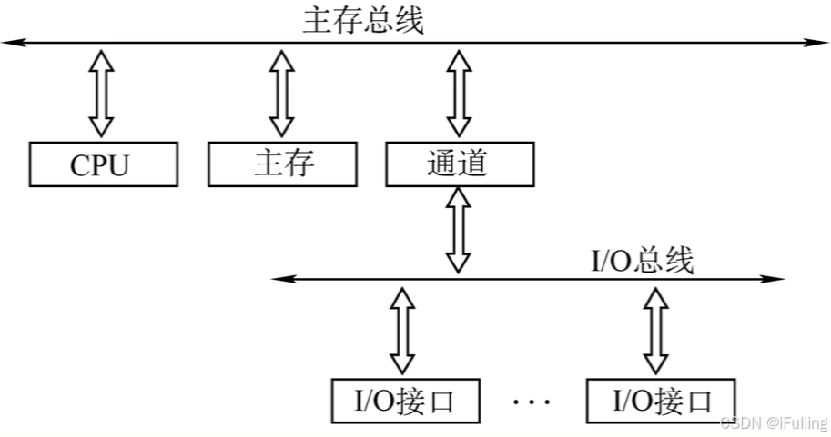{style="max-width:400px; box-sizing:content-box;"}

   - 通道可以识别并执行一系列通道指令，通道指令种类、功能通常比较单一。
      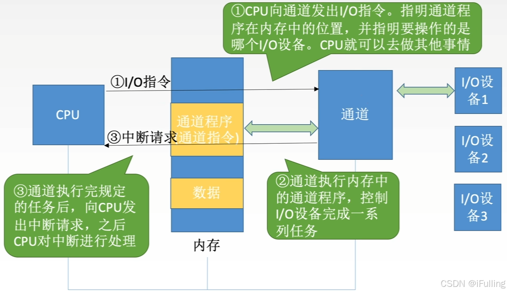{style="max-width:800px; box-sizing:content-box;"}

#### 3. 中断与DMA对比

- 先做对比，了解其区别，下面会进行详细描述

|   | 中断 | DMA |
|:---:|:---:|:---:|
| 数据传送 | 程序控制<br/>程序的切换 → 保护和恢复现场 | 硬件控制<br/>CPU 只需进行预处理和后处理 |
| 中断请求 | 传送数据 | 后处理 |
| 响应 | 指令执行周期结束后响应中断 | 每个机器周期结束均可，总线空闲时即可响应 DMA 请求 |
| 场景 | CPU 控制，低速设备 | DMAC 控制，高速设备（块设备，如磁盘） |
| 优先级 | 优先级低于 DMA | 优先级高于中断 |
| 异常处理 | 能处理异常事件 | 仅传送数据 |


### 二、IO 接口

#### 1. IO 接口的作用

1. 数据缓冲：通过数据缓冲寄存器（DBR）达到主机和外设工作速度的匹配

2. 错误或状态检测：通过状态寄存器反馈设备的各种错误、状态信息，供 CPU 查用

3. 控制和定时：接收从控制总线发来的控制信号、时钟信号

4. 数据格式转换：串-并、并-串 等格式转换

5. 与主机和设备通信：实现 主机—IO接口—IO设备之间的通信

#### 2. 结构和工作原理

- 内部接口：内部接口与系统总线相连，实质上是与内存、CPU 相连。数据的传输方式 ~~只能是并行传输。~~ （技术已经进步了）

- 外部接口：外部接口通过接口电缆与外设相连，外部接口的数据传输可能是串行方式，因此 IO 接口需具有串-并转换功能。

- 控制寄存器、状态寄存器在使用时间上是错开的，因此有的 IO 接口中可将二者合二为一。

- 系统总线

  - 数据总线：读写数据、状态字、控制字、中断类型号（完成、故障等类型）

  - 地址总线：指明 IO 端口

  - 控制总线：读写 IO 端口的信号、中断请求信号

- 如果连接了多个设备，则每个设备对应一组寄存器，操作不同的寄存器就是在操作不同的设备。
   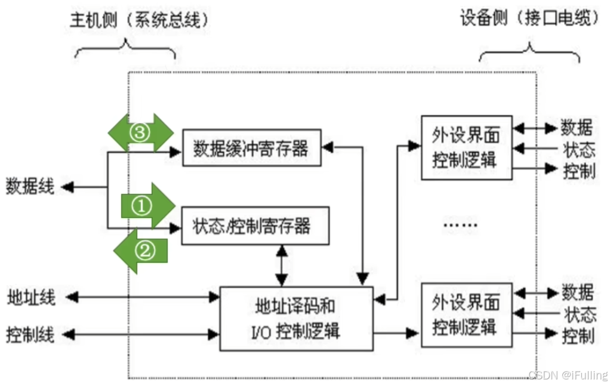{style="max-width:600px; box-sizing:content-box;"}

> 命令字 和 控制字 是一个意思。

---

- 工作原理

  1. 发命令：CPU 发送命令字到 IO 控制寄存器，向设备发出命令（需要驱动程序的协助）

  2. 读状态：从状态寄存器读取状态字，获得设备或 IO 控制器的状态信息

  3. 读写数据：从数据缓冲寄存器发送或读取数据，完成主机与外设的数据交换

#### 3. IO 端口

- IO 控制器中的各种寄存器称为IO 端口，这些寄存器可以被 CPU 直接访问。

- 统一编址：

  - 又称存储器映射方式，RISC 机器常用。

  - 把 IO 端口当作存储器的单元进行地址分配，用统一的访存指令就可以访问 IO 端口。

  - 靠不同的地址码区分内存和 IO 设备，IO 地址要求相对固定在地址的某部分。

  - 优点：不需要专门的输入/输出指令，所有访存指令都可直接访问端口，程序设计灵活性高；端口有较大的编址空间；读写控制逻辑电路简单。

  - 缺点：端口占用了主存地址空间，使主存地址空间变小；外设寻址时间长（地址位数多，地址译码速度慢）。

- 独立编址：

  - 又称 IO 映射方式，Intel 处理器常用，IN、OUT 就是 IO 指令。

  - IO 端口地址与存储器地址无关，独立编址 CPU 需要设置专门的输入/输出指令访问端口。IO 端口地址独立于内存地址。

  - 靠不同的指令区分内存和 IO 设备

  - 优点：使用专用 IO 指令，程序编址清晰；IO 端口地址位数少，地址译码速度快；IO 端口的地址不占用主存地址空间。

  - 缺点：IO 指令类型少，一般只能对端口进行传送操作，程序设计灵活性差；需要 CPU 提供存储器读写、IO设备读写两组控制信号，增加了控制逻辑电路的复杂性。

#### 4. 分类

1. 按数据传送方式可分为：

   - 并行接口：一个字节或一个字 所有位 同时传送。

   - 串行接口：一位一位传送。

2. 按主机访问 IO 设备的控制方式可分为【程序查询接口、中断接口、DMA 接口】

3. 按功能选择的灵活性可分为【可编程接口、不可变成接口】

### 四、程序查询方式

- CPU 一旦启动 IO，必须停止现行程序的运行，并在现行程序中插入一段程序。

- 查询方案：

  1. 独占查询：CPU 100% 的时间都在查询 IO 状态，完全串行

  2. 定时查询：在保证数据不丢失的情况下，每隔一段时间 CPU 就查询一次 IO 状态。查询的时间间隔内 CPU 可以执行其他程序。

- 步骤：

  1. 预置传送参数：CPU 执行初始化程序，并预置传送参数（设置计数器、设置数据首地址）

  2. 启动外设：向 IO 接口发送命令字，启动 IO 设备

  3. 取外设状态：CPU 从读口读取设备状态信息

  4. 检查外设是否准备就绪：CPU 不断查询 IO 设备状态，直到外设准备就绪

     - 是：跳转到第 4 步传送数据

     - 否：跳转到第 3 步取外设状态

  5. 传送一次数据：一般为一个字

  6. 修改传送参数：修改地址和计数器参数

  7. 检查是否传送完：判断传送是否结束

     - 是：结束

     - 否：跳转到第 3 步取外设状态
        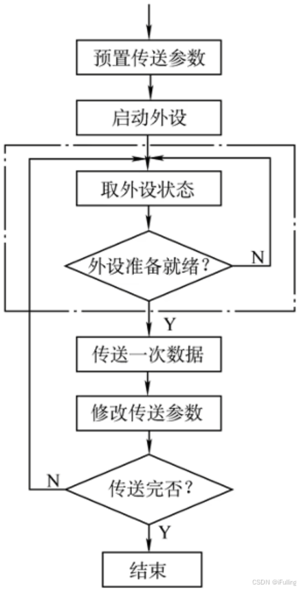 

- 主要特点：CPU 有 “踏步” 等待现象，CPU 与 IO 串行工作。

- 优点：接口设计简单、设备最少。

- 缺点：CPU 在信息传送过程中要花费很多时间用于查询和等待，而且在一段时间内只能和一台外设交换信息，效率大大降低。

### 五、程序中断方式

#### 1. 中断的作用和原理

##### Ⅰ. 中断基本概念

- 程序中断：是指在计算机执行现行程序的过程中，出现某些急需处理的异常情况或特殊请求，CPU 暂时中止现行程序，而转去对这些异常情况或特殊请求进行处理，在处理完毕后 CPU 又自动返回到现行程序的断点处，继续执行原程序。

- 工作流程：

  1. 中断请求：中断源（外设）向 CPU 发送中断请求信号。

  2. 中断响应：响应中断的条件。

     - 中断判优：多个中断源同时提出请求时通过中断判优逻辑响应一个中断源。

  3. 中断处理：通过中断隐指令把 CPU 的指令执行流转移到正确的中断服务程序。

- PSW 中存有中断标志位 IF（Interrupt Flag）

  - `IF=1` ：开中断，此时允许中断； `IF=0` ：关中断，此时不允许中断。

> 其他有关中断的概念可跳转 [【操作系统】第一章：操作系统概述 —— 中断和异常](https://blog.csdn.net/realoser/article/details/142601685#_184) 

##### Ⅱ. 中断请求标记

- 每个中断源向 CPU 发出中断请求的时间是随机的。

- 为了记录中断事件并区分不同的中断源，中断系统需对中断源设置中断请求标记触发器 INTR，当其状态为 “1” 时，表示中断源有请求。

- 这些触发器可组成中断请求标记寄存器，该寄存器可集中在 CPU 中，也可分散在各个中断源中。
   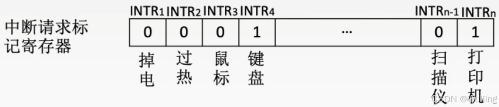{style="max-width:600px; box-sizing:content-box;"}

- 对于 **外中断，CPU** 是在统一的时刻 **（每条指令执行阶段结束前）** 向接口发出 **中断查询信号** ，以获取 IO 的中断请求。即，CPU 响应中断的时间是在每条指令执行阶段的结束时刻。

- CPU 响应中断必须满足以下 3 个条件：

  1. 中断源有中断请求

  2. CPU 允许中断（开中断）

  3. 一条指令执行完毕，且没有更紧迫的任务

##### Ⅲ. 中断判优

- 实现：

  - 中断判优既可以用硬件实现，也可用软件实现。

  - 硬件实现：通过硬件排队器实现，它既可以设置在 CPU 中，也可以分散在各个中断源中

  - 软件实现：通过查询程序实现。

- 优先级设置

  1. 硬件故障中断属于最高级（如掉电），其次是软件中断（如系统调用）

  2. 非屏蔽中断优于可屏蔽中断

  3. DMA 请求优于 IO 设备传送的中断请求

  4. 高速设备优于低速设备

  5. 输入设备优于输出设备

  6. 实时设备优于普通设备

##### Ⅳ. 中断处理过程

 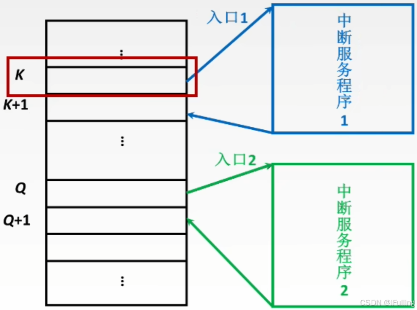{style="max-width:400px; box-sizing:content-box;"}

- 中断隐指令：是一系列任务，而不是某一条特定的指令。用于保存原程序的 PC 值，并让 PC 指向中断服务程序的第一条指令。

  1. 关中断：在中断服务程序中，为了保护中断中断现场（CPU 主要寄存器中的内容）期间不被新的中断所打断，必须关中断，从而保证被中断的程序在中断服务程序执行完毕之后能接着正确地执行下去。

  2. 保存断点：为了保证在中断服务程序执行完毕后能正确地返回到原来的程序，必须将原来程序的断电（程序计数器 PC 的内容）保存起来。可以存入堆栈，也可以存入指定单元。

  3. 引出中断服务程序：实质是取出中断服务程序的入口地址并传送给程序计数器 PC。

     - 硬件向量法：由硬件（排队器）输出产生向量地址（中断类型号，比如是哪个中断源发来的），再由向量地址找到入口地址（中断向量）。
        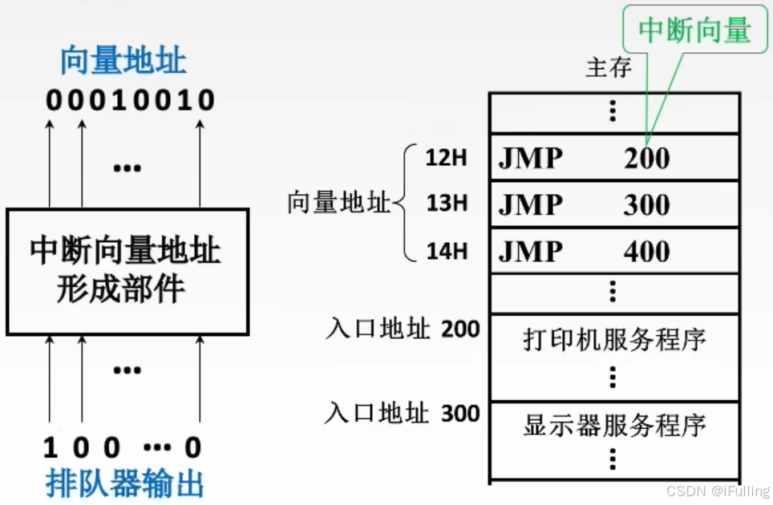{style="max-width:400px; box-sizing:content-box;"}

     - 软件查询法

- 中断服务程序主要任务：

  1. 保护现场：保存通用寄存器和状态寄存器的内容（如 ACC 寄存器的值），以便返回原程序后可以恢复 CPU 环境。可使用堆栈，也可以使用特定存储单元。

  2. 中断服务（设备服务）：主体部分，如通过程序控制需打印的字符代码送入打印机的缓冲存储器中（中断服务的过程中有可能修改 ACC 寄存器的值）

  3. 恢复现场：通过出栈指令或取数指令把之前保存的信息送回寄存器中（把原程序算到一般的 ACC 值恢复原样）

  4. 中断返回：开中断，然后通过中断返回指令回到原程序断点处。
      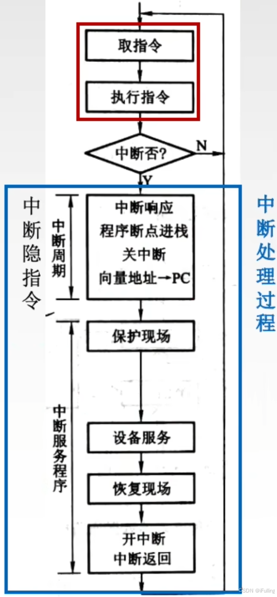 

#### 2. 单重中断和多重中断

- 单重中断：也就是上面所述的中断，执行中断服务程序时不响应新的中断请求。

- 多重中断：又称中断嵌套，执行中断服务程序时可响应新的中断请求。

- 中断屏蔽技术：主要用于多重中断，CPU 要具备多重中断的功能，须满足下列条件。

  1. 在中断服务程序中提前设置开中断指令。

  2. 优先级别高的中断源有权中断优先级别低的中断源。

- 屏蔽触发器

  - 每个中断源都有一个屏蔽触发器，所有屏蔽触发器组合在一起，便构成一个屏蔽字寄存器，屏蔽字寄存器的内容称为屏蔽字

  - 1 表示屏蔽该中断源的请求，0 表示可以正常申请。

  - 屏蔽字中 1 越多，优先级越高。每个屏蔽字中至少有一个 1（至少要能屏蔽自身中断）

> 
> 
> - 硬件排队器：收到多个中断请求时，只响应其中一个固定优先级。
> 
> - 中断屏蔽功能：调整多重中断的优先级。
> 
> 

|   | 步骤 | 单重中断 | 多重中断 |
|:---:|:---:|:---:|:---:|
| 图示 |   | 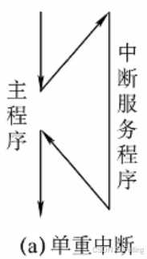 | 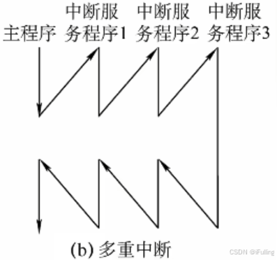 |
| 中断隐指令 | 第1步 | 关中断 | 关中断 |
|   | 第2步 | 保存断点（PC） | 保存断点（PC） |
|   | 第3步 | 送中断向量 | 送中断向量 |
|   | 第4步 | 保护现场 | 保护现场和屏蔽字 |
| 中断服务程序 | 第1步 | - | 开中断 |
|   | 第2步 | 执行中断服务程序 | 执行中断服务程序 |
|   | 第3步 | - | 关中断 |
|   | 第4步 | 恢复现场 | 恢复现场和屏蔽字 |
|   | 第5步 | 开中断 | 开中断 |
|   | 第6步 | 中断返回 | 中断返回 |


#### 3. 程序中断方式工作流程

- 以单重中断为例，过程在上面都有提到，下面贴一张工作流程图
   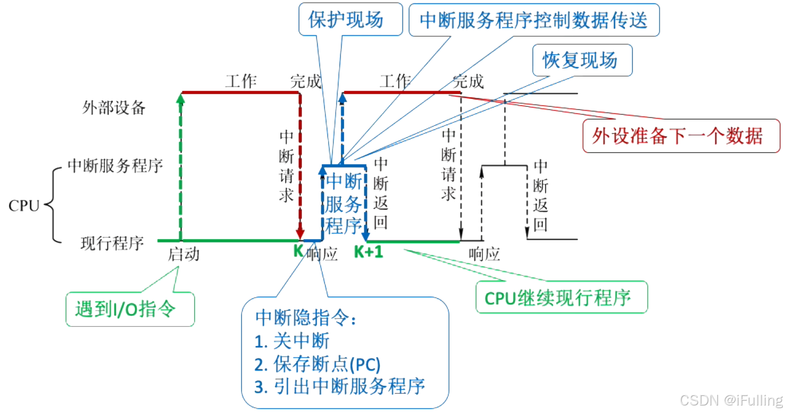{style="max-width:800px; box-sizing:content-box;"}

### 六、DMA 方式

#### 1. DMAC 组成

- 控制/状态逻辑：由控制和时序电路及状态标志组成，用于指定传送方向，修改传送参数，并对 DMA 请求信号和 CPU 响应信号进行协调和同步。

- DMA 请求触发器：每当 IO 设备准备好数据后给出一个控制信号，使 DMA 请求触发器置位。

- 主存地址计数器：简称 AR，存放要交换数据的主存地址。

- 传送长度计数器：简称 WC，用来记录传送数据的长度，计数溢出时，数据即传送完毕，自动发中断请求信号。

- 数据缓冲寄存器：用于暂存每次传送的数据。

- 中断机构：当一个数据块传送完毕后触发中断机构，向 CPU 提出中断请求。
   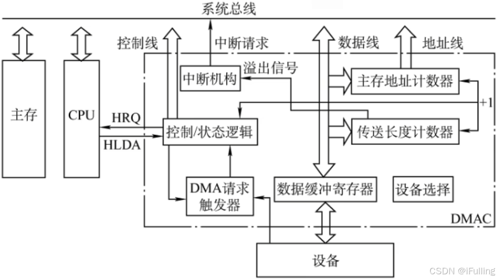{style="max-width:600px; box-sizing:content-box;"}

#### 2. DMA 传送过程

 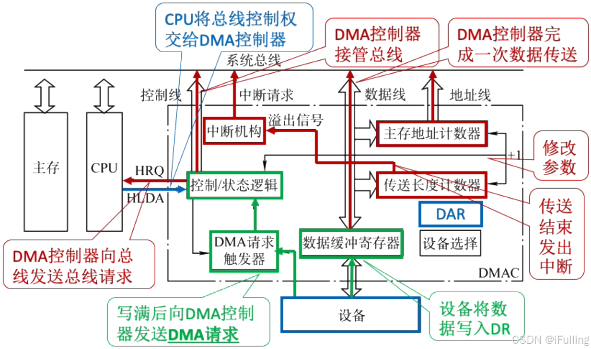{style="max-width:800px; box-sizing:content-box;"}

- CPU 向 DMA 控制器指明要输入还是输出；要传送多少个数据；数据在主存、外设中的地址。

- 预处理：

  1. 接受外设发出的 DMA 请求（外设传送一个字的请求），并向 CPU 发出总线请求

  2. CPU 响应此总线请求，发出总线响应信号，接管总线控制权，进入 DMA 操作周期

- 传送时：

  1. 确定传送数据的主存单元地址及长度，并能自动修改主存地址计数和传送长度计数

  2. 规定数据在主存和外设间的传送方向，发出读写等控制信号，执行数据传送操作

- 后处理：向 CPU 报告 DMA 操作的结束。
   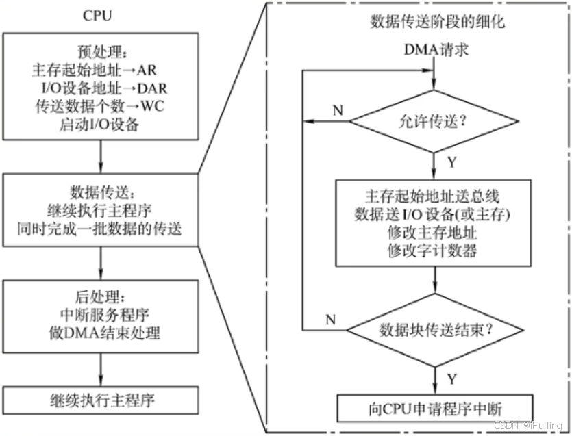{style="max-width:600px; box-sizing:content-box;"}

> 
> 
> - DMA 是否能够访问主存由 CPU 说了算。
> 
> - 在 DMA 传送过程中，DMA 控制器将接管 CPU 的地址总线、数据总线和控制总线，CPU 的主存控制信号被禁止使用。而当 DMA 传送结束后，将恢复 CPU 的一切权力并开始执行其操作。
> 
> 

#### 3. DMA 传送方式

- 为了简化对 DMA 的描述，上面提及的都是单总线结构。描述 DMA 传送方式则需要使用三总线结构，下图为三总线结构。
   {style="max-width:600px; box-sizing:content-box;"}

- 在三总线结构中，主存和 DMA 控制器之间有一条数据通路，因此主存和 IO 设备之间交换信息时，不通过 CPU。但当 IO 设备和 CPU 同时访问主存时，可能发生冲突，为了有效地使用主存，DMA 控制器与 CPU 通常采用 3 种方式使用主存：

  1. 停止 CPU 访问主存

     - 优点：控制简单

     - 缺点：为充分发挥 CPU 对主存的利用率
        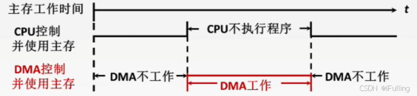{style="max-width:500px; box-sizing:content-box;"}

  2. DMA 与 CPU 交替访存

     - 一个 CPU 周期分为 C<sub>1</sub>和 C<sub>2</sub>两个周期，可让 C<sub>2</sub>专供 CPU 访存

     - 优点：不需要总线使用权的申请、建立和归还过程

     - 缺点：硬件逻辑更为复杂
        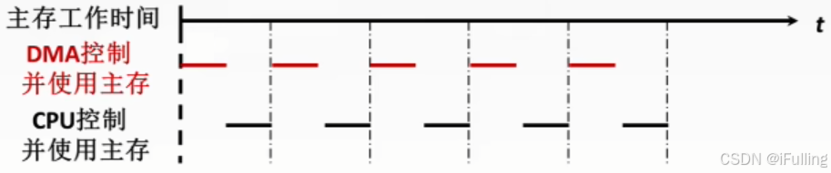{style="max-width:600px; box-sizing:content-box;"}

  3. 周期挪用（周期窃取）

     - 周期指主存的存取周期

     - DMA 访问主存有 3 种可能：CPU 此时不访存（不冲突）、CPU 正在访存（存取周期结束让出总线）、CPU 与 DMA 同时请求访存（DMA 访存优先）
        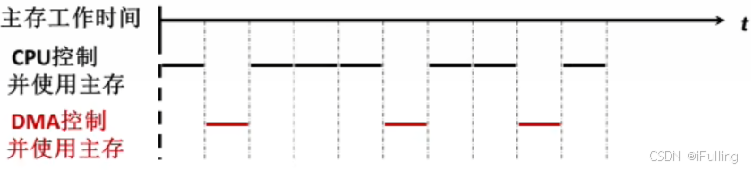{style="max-width:500px; box-sizing:content-box;"}

#### 4. DMA 方式的特点

- 由于 DMA 方式传送数据不需要经过 CPU，因此不必中断现行程序，IO 与主机并行工作，程序和传送并行工作

- DMA 方式具有下列特点：

  1. 它使主存与 CPU 的固定联系脱钩，主存即可被 CPU 访问，又可被外设访问

  2. 在数据块传送时，主存地址的确定、传送数据的计数等都由硬件电路直接实现

  3. 主存中要开辟专用缓冲区，及时供给和接收外设的数据

  4. DMA 传送速度快，CPU 和外设并行工作，提高了系统效率

  5. DMA 在传送开始前要通过程序进行预处理，结束后要通过中断方式进行后处理

